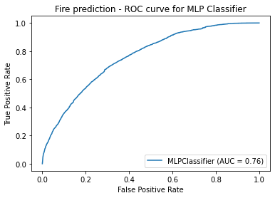
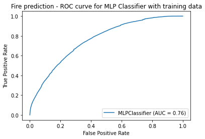
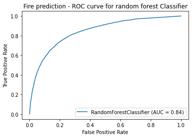
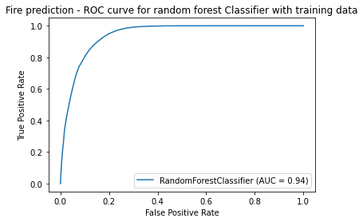

Please visit https://mhberro.github.io/ to interact with the Climate Migration tool. 

Migration due to climate change is already occurring in the U.S and around the world. This can be impacted by many factors, such as recurrent flooding, rising temperature and humidity, and repeated fire outbreaks. As the pattern of climate change continues, many cities will become uninhabitable. The goal of this project is to create an interactive visualization of the effects of climate change on the U.S. over the next 50 years and recommend better areas to move to based on predicted climate values.

Below is the model used to make wildfire predictions for the Climate Migration tool.

```python
import pandas as pd
import zipfile
import numpy as np
import random

from sklearn.model_selection import train_test_split
from sklearn.neural_network import MLPClassifier
from sklearn.metrics import confusion_matrix, roc_auc_score
from sklearn import preprocessing, metrics
from sklearn.ensemble import RandomForestClassifier
import matplotlib.pyplot as plt
```

# Content

## 1. Clean data
- 1) Clean weather data
- 2) Clean disaster data and extract fire data
- 3) Join weather and fire data

## 2. Train model
- 1) Train test split
- 2) Scale and downsample
- 3) MLP classifier
- 4) Random forest classifier

## 3. Prediction future fire
- 1) Load predicted weather data
- 2) Scale predicted weather data
- 3) Predict fire


```python

```

## Clean data

#### 1) Clean weather data


```python
zp = zipfile.ZipFile('cleaned_data/all_zip_codes_all.zip')
weather_df = pd.read_csv(zp.open("all_zip_codes.csv"), converters={'zip': lambda x: str(x)}) #include leading zeros
```


```python
weather_df.head()
#zip is same as zipcode, except that zip includes leading zeros
```

headings
<h1>Heading 1</h1>
<h2>Heading 2</h2>
<h3>Heading 3</h3>
<h4>Heading 4</h4>
<h5>Heading 5</h5>
<h6>Heading 6</h6>


<div>

<table border="1">
  <thead>
    <tr style="text-align: right;">
      <th></th>
      <th>date</th>
      <th>zipcode</th>
      <th>zip</th>
      <th>PRCP</th>
      <th>SNOW</th>
      <th>SNWD</th>
      <th>TMAX</th>
      <th>TMIN</th>
      <th>TOBS</th>
    </tr>
  </thead>
  <tbody>
    <tr>
      <th>0</th>
      <td>1950-01-01</td>
      <td>601</td>
      <td>00601</td>
      <td>18.0</td>
      <td>0.0</td>
      <td>0.0</td>
      <td>183.0</td>
      <td>128.0</td>
      <td>156.0</td>
    </tr>
    <tr>
      <th>1</th>
      <td>1950-01-02</td>
      <td>601</td>
      <td>00601</td>
      <td>18.0</td>
      <td>0.0</td>
      <td>0.0</td>
      <td>194.0</td>
      <td>122.0</td>
      <td>167.0</td>
    </tr>
    <tr>
      <th>2</th>
      <td>1950-01-03</td>
      <td>601</td>
      <td>00601</td>
      <td>0.0</td>
      <td>0.0</td>
      <td>0.0</td>
      <td>211.0</td>
      <td>133.0</td>
      <td>183.0</td>
    </tr>
    <tr>
      <th>3</th>
      <td>1950-01-04</td>
      <td>601</td>
      <td>00601</td>
      <td>0.0</td>
      <td>0.0</td>
      <td>0.0</td>
      <td>200.0</td>
      <td>144.0</td>
      <td>167.0</td>
    </tr>
    <tr>
      <th>4</th>
      <td>1950-01-05</td>
      <td>601</td>
      <td>00601</td>
      <td>0.0</td>
      <td>0.0</td>
      <td>0.0</td>
      <td>217.0</td>
      <td>139.0</td>
      <td>167.0</td>
    </tr>
  </tbody>
</table>
</div>


```python
weather_df.tail()
```


<div>
<style scoped>
    .dataframe tbody tr th:only-of-type {
        vertical-align: middle;
    }

    .dataframe tbody tr th {
        vertical-align: top;
    }

    .dataframe thead th {
        text-align: right;
    }
</style>
<table border="1" class="dataframe">
  <thead>
    <tr style="text-align: right;">
      <th></th>
      <th>date</th>
      <th>zipcode</th>
      <th>zip</th>
      <th>PRCP</th>
      <th>SNOW</th>
      <th>SNWD</th>
      <th>TMAX</th>
      <th>TMIN</th>
      <th>TOBS</th>
    </tr>
  </thead>
  <tbody>
    <tr>
      <th>10955519</th>
      <td>2020-10-22</td>
      <td>39701</td>
      <td>39701</td>
      <td>0.0</td>
      <td>0.0</td>
      <td>0.0</td>
      <td>272.0</td>
      <td>183.0</td>
      <td>233.0</td>
    </tr>
    <tr>
      <th>10955520</th>
      <td>2020-10-23</td>
      <td>39701</td>
      <td>39701</td>
      <td>0.0</td>
      <td>0.0</td>
      <td>0.0</td>
      <td>289.0</td>
      <td>206.0</td>
      <td>222.0</td>
    </tr>
    <tr>
      <th>10955521</th>
      <td>2020-10-26</td>
      <td>39701</td>
      <td>39701</td>
      <td>0.0</td>
      <td>0.0</td>
      <td>0.0</td>
      <td>206.0</td>
      <td>133.0</td>
      <td>172.0</td>
    </tr>
    <tr>
      <th>10955522</th>
      <td>2020-10-27</td>
      <td>39701</td>
      <td>39701</td>
      <td>0.0</td>
      <td>0.0</td>
      <td>0.0</td>
      <td>256.0</td>
      <td>156.0</td>
      <td>161.0</td>
    </tr>
    <tr>
      <th>10955523</th>
      <td>2020-10-28</td>
      <td>39701</td>
      <td>39701</td>
      <td>0.0</td>
      <td>0.0</td>
      <td>0.0</td>
      <td>250.0</td>
      <td>161.0</td>
      <td>228.0</td>
    </tr>
  </tbody>
</table>
</div>


```python
weather_df.columns
```


    Index(['date', 'zipcode', 'zip', 'PRCP', 'SNOW', 'SNWD', 'TMAX', 'TMIN',
           'TOBS'],
          dtype='object')


```python
len(weather_df)
```


    10955524


```python
weather_df['zipcode'].nunique()
```


    652


```python
weather_df['zipcode'].unique()[:100]
```


    array([  601,   703,   901,  1201,  1301,  1420,  1501,  1602,  1701,
            1801,  2019,  2108,  2301,  2420,  2601,  3031,  3101,  3301,
            3431,  3561,  3740,  3801,  3901,  4001,  4101,  4210,  4330,
            4401,  4530,  4605,  4730,  4841,  4901,  5001,  5101,  5201,
            5301,  5401,  5602,  5701,  5819,  6001,  6103,  6226,  6320,
            6401,  6604,  6801,  7001,  7102,  7302,  7501,  7701,  7901,
            8201,  8302,  8401,  8701,  8801,  8901, 10801, 10901, 11001,
           11101, 11501, 11701, 89001, 89101, 89301, 89701, 89801, 90401,
           90501, 90601, 90701, 90802, 91001, 91101, 91201, 91301, 91401,
           91501, 91601, 91701, 91901, 92101, 92201, 92301, 92501, 92602,
           92701, 93001, 93101, 93401, 93501, 93601, 93901, 94002, 94102,
           94301])


```python
weather_df['zip'].nunique()
```


    652


```python
weather_df['zip'].unique()[:100]
```


    array(['00601', '00703', '00901', '01201', '01301', '01420', '01501',
           '01602', '01701', '01801', '02019', '02108', '02301', '02420',
           '02601', '03031', '03101', '03301', '03431', '03561', '03740',
           '03801', '03901', '04001', '04101', '04210', '04330', '04401',
           '04530', '04605', '04730', '04841', '04901', '05001', '05101',
           '05201', '05301', '05401', '05602', '05701', '05819', '06001',
           '06103', '06226', '06320', '06401', '06604', '06801', '07001',
           '07102', '07302', '07501', '07701', '07901', '08201', '08302',
           '08401', '08701', '08801', '08901', '10801', '10901', '11001',
           '11101', '11501', '11701', '89001', '89101', '89301', '89701',
           '89801', '90401', '90501', '90601', '90701', '90802', '91001',
           '91101', '91201', '91301', '91401', '91501', '91601', '91701',
           '91901', '92101', '92201', '92301', '92501', '92602', '92701',
           '93001', '93101', '93401', '93501', '93601', '93901', '94002',
           '94102', '94301'], dtype=object)


```python
weather_df.dtypes
```


    date        object
    zipcode      int64
    zip         object
    PRCP       float64
    SNOW       float64
    SNWD       float64
    TMAX       float64
    TMIN       float64
    TOBS       float64
    dtype: object


```python
# map zip code to fips code for weather data
zip_fips_df = pd.read_csv("cleaned_data/ZIP-COUNTY-FIPS_2017-06.csv")
```


```python
zip_fips_df['ZIP'].unique()
```


    array([36003, 36006, 36067, ...,   820,   830,   802])


```python
weather_fips_df = weather_df.merge(zip_fips_df, how = 'left', left_on = 'zipcode', right_on='ZIP')
```


```python
#get weather data with fips code
weather_fips_df.head()
```


<div>
<style scoped>
    .dataframe tbody tr th:only-of-type {
        vertical-align: middle;
    }

    .dataframe tbody tr th {
        vertical-align: top;
    }

    .dataframe thead th {
        text-align: right;
    }
</style>
<table border="1" class="dataframe">
  <thead>
    <tr style="text-align: right;">
      <th></th>
      <th>date</th>
      <th>zipcode</th>
      <th>zip</th>
      <th>PRCP</th>
      <th>SNOW</th>
      <th>SNWD</th>
      <th>TMAX</th>
      <th>TMIN</th>
      <th>TOBS</th>
      <th>ZIP</th>
      <th>COUNTYNAME</th>
      <th>STATE</th>
      <th>FIPS code</th>
    </tr>
  </thead>
  <tbody>
    <tr>
      <th>0</th>
      <td>1950-01-01</td>
      <td>601</td>
      <td>00601</td>
      <td>18.0</td>
      <td>0.0</td>
      <td>0.0</td>
      <td>183.0</td>
      <td>128.0</td>
      <td>156.0</td>
      <td>601</td>
      <td>Adjuntas Municipio</td>
      <td>PR</td>
      <td>72001</td>
    </tr>
    <tr>
      <th>1</th>
      <td>1950-01-01</td>
      <td>601</td>
      <td>00601</td>
      <td>18.0</td>
      <td>0.0</td>
      <td>0.0</td>
      <td>183.0</td>
      <td>128.0</td>
      <td>156.0</td>
      <td>601</td>
      <td>Ponce Municipio</td>
      <td>PR</td>
      <td>72113</td>
    </tr>
    <tr>
      <th>2</th>
      <td>1950-01-02</td>
      <td>601</td>
      <td>00601</td>
      <td>18.0</td>
      <td>0.0</td>
      <td>0.0</td>
      <td>194.0</td>
      <td>122.0</td>
      <td>167.0</td>
      <td>601</td>
      <td>Adjuntas Municipio</td>
      <td>PR</td>
      <td>72001</td>
    </tr>
    <tr>
      <th>3</th>
      <td>1950-01-02</td>
      <td>601</td>
      <td>00601</td>
      <td>18.0</td>
      <td>0.0</td>
      <td>0.0</td>
      <td>194.0</td>
      <td>122.0</td>
      <td>167.0</td>
      <td>601</td>
      <td>Ponce Municipio</td>
      <td>PR</td>
      <td>72113</td>
    </tr>
    <tr>
      <th>4</th>
      <td>1950-01-03</td>
      <td>601</td>
      <td>00601</td>
      <td>0.0</td>
      <td>0.0</td>
      <td>0.0</td>
      <td>211.0</td>
      <td>133.0</td>
      <td>183.0</td>
      <td>601</td>
      <td>Adjuntas Municipio</td>
      <td>PR</td>
      <td>72001</td>
    </tr>
  </tbody>
</table>
</div>


```python
len(weather_fips_df)
```


    16380869


#### 2) Clean disaster data and extract fire data


```python
# data description: https://www.fema.gov/openfema-data-page/disaster-declarations-summaries-v2
disaster_df = pd.read_csv("cleaned_data/DisasterDeclarationsSummaries_1.1.csv")
```


```python
disaster_df.columns
```


    Index(['femaDeclarationString', 'disasterNumber', 'state', 'declarationType',
           'declarationDate', 'fyDeclared', 'incidentType', 'declarationTitle',
           'ihProgramDeclared', 'iaProgramDeclared', 'paProgramDeclared',
           'hmProgramDeclared', 'incidentBeginDate', 'incidentEndDate',
           'disasterCloseoutDate', 'fipsStateCode', 'helperState',
           'fipsCountyCode', 'helperCounty', 'fipscode', 'placeCode',
           'designatedArea', 'declarationRequestNumber', 'hash', 'lastRefresh',
           'id'],
          dtype='object')


```python
disaster_df.head()
```


<div>
<style scoped>
    .dataframe tbody tr th:only-of-type {
        vertical-align: middle;
    }

    .dataframe tbody tr th {
        vertical-align: top;
    }

    .dataframe thead th {
        text-align: right;
    }
</style>
<table border="1" class="dataframe">
  <thead>
    <tr style="text-align: right;">
      <th></th>
      <th>femaDeclarationString</th>
      <th>disasterNumber</th>
      <th>state</th>
      <th>declarationType</th>
      <th>declarationDate</th>
      <th>fyDeclared</th>
      <th>incidentType</th>
      <th>declarationTitle</th>
      <th>ihProgramDeclared</th>
      <th>iaProgramDeclared</th>
      <th>...</th>
      <th>helperState</th>
      <th>fipsCountyCode</th>
      <th>helperCounty</th>
      <th>fipscode</th>
      <th>placeCode</th>
      <th>designatedArea</th>
      <th>declarationRequestNumber</th>
      <th>hash</th>
      <th>lastRefresh</th>
      <th>id</th>
    </tr>
  </thead>
  <tbody>
    <tr>
      <th>0</th>
      <td>DR-1-GA</td>
      <td>1</td>
      <td>GA</td>
      <td>DR</td>
      <td>1953-05-02T04:00:00.000Z</td>
      <td>1953</td>
      <td>Tornado</td>
      <td>TORNADO</td>
      <td>0</td>
      <td>1</td>
      <td>...</td>
      <td>13</td>
      <td>0</td>
      <td>0</td>
      <td>13000</td>
      <td>0</td>
      <td>Statewide</td>
      <td>53013</td>
      <td>2f28952448e0a666d367ca3f854c81ec</td>
      <td>2020-10-05T14:21:20.694Z</td>
      <td>5f7b2be031a8c6681cfb4342</td>
    </tr>
    <tr>
      <th>1</th>
      <td>DR-2-TX</td>
      <td>2</td>
      <td>TX</td>
      <td>DR</td>
      <td>1953-05-15T04:00:00.000Z</td>
      <td>1953</td>
      <td>Tornado</td>
      <td>TORNADO &amp; HEAVY RAINFALL</td>
      <td>0</td>
      <td>1</td>
      <td>...</td>
      <td>48</td>
      <td>0</td>
      <td>0</td>
      <td>48000</td>
      <td>0</td>
      <td>Statewide</td>
      <td>53003</td>
      <td>c5a1a4a1030d6730d9c562cdbe7c830f</td>
      <td>2020-10-05T14:21:20.696Z</td>
      <td>5f7b2be031a8c6681cfb4345</td>
    </tr>
    <tr>
      <th>2</th>
      <td>DR-5-MT</td>
      <td>5</td>
      <td>MT</td>
      <td>DR</td>
      <td>1953-06-06T04:00:00.000Z</td>
      <td>1953</td>
      <td>Flood</td>
      <td>FLOODS</td>
      <td>0</td>
      <td>1</td>
      <td>...</td>
      <td>30</td>
      <td>0</td>
      <td>0</td>
      <td>30000</td>
      <td>0</td>
      <td>Statewide</td>
      <td>53006</td>
      <td>59c5483387ca13c6a3c1bc692f4860e1</td>
      <td>2020-10-05T14:21:20.698Z</td>
      <td>5f7b2be031a8c6681cfb4348</td>
    </tr>
    <tr>
      <th>3</th>
      <td>DR-7-MA</td>
      <td>7</td>
      <td>MA</td>
      <td>DR</td>
      <td>1953-06-11T04:00:00.000Z</td>
      <td>1953</td>
      <td>Tornado</td>
      <td>TORNADO</td>
      <td>0</td>
      <td>1</td>
      <td>...</td>
      <td>25</td>
      <td>0</td>
      <td>0</td>
      <td>25000</td>
      <td>0</td>
      <td>Statewide</td>
      <td>53009</td>
      <td>6bab17e16984fc75f61a8445df3e95d9</td>
      <td>2020-10-05T14:21:20.699Z</td>
      <td>5f7b2be031a8c6681cfb434b</td>
    </tr>
    <tr>
      <th>4</th>
      <td>DR-8-IA</td>
      <td>8</td>
      <td>IA</td>
      <td>DR</td>
      <td>1953-06-11T04:00:00.000Z</td>
      <td>1953</td>
      <td>Flood</td>
      <td>FLOOD</td>
      <td>0</td>
      <td>1</td>
      <td>...</td>
      <td>19</td>
      <td>0</td>
      <td>0</td>
      <td>19000</td>
      <td>0</td>
      <td>Statewide</td>
      <td>53008</td>
      <td>e258e9dd25fac73939f59c8ffb5308f5</td>
      <td>2020-10-05T14:21:20.700Z</td>
      <td>5f7b2be031a8c6681cfb434e</td>
    </tr>
  </tbody>
</table>
<p>5 rows × 26 columns</p>
</div>


```python
disaster_df['declarationDate']
```


    0        1953-05-02T04:00:00.000Z
    1        1953-05-15T04:00:00.000Z
    2        1953-06-06T04:00:00.000Z
    3        1953-06-11T04:00:00.000Z
    4        1953-06-11T04:00:00.000Z
                       ...           
    60218    2020-10-08T17:30:00.000Z
    60219    2020-10-08T17:30:00.000Z
    60220    2020-10-08T17:30:00.000Z
    60221    2020-10-08T17:30:00.000Z
    60222    2020-09-20T16:40:00.000Z
    Name: declarationDate, Length: 60223, dtype: object


```python
disaster_df['incidentType'].nunique(), disaster_df['declarationTitle'].nunique()
```


    (23, 2128)


```python
disaster_df['incidentType'].unique()
```


    array(['Tornado', 'Flood', 'Fire', 'Other', 'Earthquake', 'Hurricane',
           'Volcano', 'Severe Storm(s)', 'Toxic Substances', 'Typhoon',
           'Dam/Levee Break', 'Drought', 'Snow', 'Severe Ice Storm',
           'Freezing', 'Coastal Storm', 'Fishing Losses', 'Mud/Landslide',
           'Human Cause', 'Terrorist', 'Tsunami', 'Chemical', 'Biological'],
          dtype=object)


```python
disaster_df[disaster_df['incidentType'] == "Fire"]['declarationTitle'].unique() 
#use "incidentType"
```


    array(['FOREST FIRE', 'FIRES', 'FIRE (LOS ANGELES COUNTY)', ...,
           'ZOGG FIRE', 'SQF FIRE COMPLEX', 'SOUTH OBENCHAIN FIRE'],
          dtype=object)


```python
disaster_df['fire'] = disaster_df['incidentType'].apply(lambda x:1 if x == 'Fire' else 0)
```


```python
len(disaster_df[~(disaster_df['declarationDate'] == disaster_df['incidentBeginDate'])])
disaster_df[~(disaster_df['declarationDate'] == disaster_df['incidentBeginDate'])].head()
```


<div>
<style scoped>
    .dataframe tbody tr th:only-of-type {
        vertical-align: middle;
    }

    .dataframe tbody tr th {
        vertical-align: top;
    }

    .dataframe thead th {
        text-align: right;
    }
</style>
<table border="1" class="dataframe">
  <thead>
    <tr style="text-align: right;">
      <th></th>
      <th>femaDeclarationString</th>
      <th>disasterNumber</th>
      <th>state</th>
      <th>declarationType</th>
      <th>declarationDate</th>
      <th>fyDeclared</th>
      <th>incidentType</th>
      <th>declarationTitle</th>
      <th>ihProgramDeclared</th>
      <th>iaProgramDeclared</th>
      <th>...</th>
      <th>fipsCountyCode</th>
      <th>helperCounty</th>
      <th>fipscode</th>
      <th>placeCode</th>
      <th>designatedArea</th>
      <th>declarationRequestNumber</th>
      <th>hash</th>
      <th>lastRefresh</th>
      <th>id</th>
      <th>fire</th>
    </tr>
  </thead>
  <tbody>
    <tr>
      <th>4974</th>
      <td>DR-546-MA</td>
      <td>546</td>
      <td>MA</td>
      <td>DR</td>
      <td>1978-02-10T05:00:00.000Z</td>
      <td>1978</td>
      <td>Flood</td>
      <td>COASTAL STORMS, FLOOD, ICE &amp; SNOW</td>
      <td>0</td>
      <td>1</td>
      <td>...</td>
      <td>1</td>
      <td>1</td>
      <td>25001</td>
      <td>99001</td>
      <td>Barnstable (County)</td>
      <td>78044</td>
      <td>6b54739846a781dd5d3ac3228c12438b</td>
      <td>2020-10-05T14:21:28.411Z</td>
      <td>5f7b2be831a8c6681cfb9850</td>
      <td>0</td>
    </tr>
    <tr>
      <th>4975</th>
      <td>DR-546-MA</td>
      <td>546</td>
      <td>MA</td>
      <td>DR</td>
      <td>1978-02-10T05:00:00.000Z</td>
      <td>1978</td>
      <td>Flood</td>
      <td>COASTAL STORMS, FLOOD, ICE &amp; SNOW</td>
      <td>0</td>
      <td>1</td>
      <td>...</td>
      <td>7</td>
      <td>7</td>
      <td>25007</td>
      <td>99007</td>
      <td>Dukes (County)</td>
      <td>78044</td>
      <td>7d9e79eacde69ff26f56c6abfc41bcbe</td>
      <td>2020-10-05T14:21:28.412Z</td>
      <td>5f7b2be831a8c6681cfb9852</td>
      <td>0</td>
    </tr>
    <tr>
      <th>4976</th>
      <td>DR-546-MA</td>
      <td>546</td>
      <td>MA</td>
      <td>DR</td>
      <td>1978-02-10T05:00:00.000Z</td>
      <td>1978</td>
      <td>Flood</td>
      <td>COASTAL STORMS, FLOOD, ICE &amp; SNOW</td>
      <td>0</td>
      <td>1</td>
      <td>...</td>
      <td>5</td>
      <td>5</td>
      <td>25005</td>
      <td>99005</td>
      <td>Bristol (County)(in (P)MSA 1120,1200,2480,5400...</td>
      <td>78044</td>
      <td>44a18d427378b578ca5082f23649f90c</td>
      <td>2020-10-05T14:21:28.411Z</td>
      <td>5f7b2be831a8c6681cfb9857</td>
      <td>0</td>
    </tr>
    <tr>
      <th>4977</th>
      <td>DR-546-MA</td>
      <td>546</td>
      <td>MA</td>
      <td>DR</td>
      <td>1978-02-10T05:00:00.000Z</td>
      <td>1978</td>
      <td>Flood</td>
      <td>COASTAL STORMS, FLOOD, ICE &amp; SNOW</td>
      <td>0</td>
      <td>1</td>
      <td>...</td>
      <td>9</td>
      <td>9</td>
      <td>25009</td>
      <td>99009</td>
      <td>Essex (County)(in PMSA 1120,4160,7090)</td>
      <td>78044</td>
      <td>69e5446f5f1aa650c9dd62b132584a9d</td>
      <td>2020-10-05T14:21:28.414Z</td>
      <td>5f7b2be831a8c6681cfb985f</td>
      <td>0</td>
    </tr>
    <tr>
      <th>4979</th>
      <td>DR-546-MA</td>
      <td>546</td>
      <td>MA</td>
      <td>DR</td>
      <td>1978-02-10T05:00:00.000Z</td>
      <td>1978</td>
      <td>Flood</td>
      <td>COASTAL STORMS, FLOOD, ICE &amp; SNOW</td>
      <td>0</td>
      <td>1</td>
      <td>...</td>
      <td>19</td>
      <td>19</td>
      <td>25019</td>
      <td>99019</td>
      <td>Nantucket (County)</td>
      <td>78044</td>
      <td>d63a74daea9f57409505b4aa19b3a090</td>
      <td>2020-10-05T14:21:28.416Z</td>
      <td>5f7b2be831a8c6681cfb986b</td>
      <td>0</td>
    </tr>
  </tbody>
</table>
<p>5 rows × 27 columns</p>
</div>


```python
disaster_df.dtypes
```


    femaDeclarationString       object
    disasterNumber               int64
    state                       object
    declarationType             object
    declarationDate             object
    fyDeclared                   int64
    incidentType                object
    declarationTitle            object
    ihProgramDeclared            int64
    iaProgramDeclared            int64
    paProgramDeclared            int64
    hmProgramDeclared            int64
    incidentBeginDate           object
    incidentEndDate             object
    disasterCloseoutDate        object
    fipsStateCode                int64
    helperState                  int64
    fipsCountyCode               int64
    helperCounty                 int64
    fipscode                     int64
    placeCode                    int64
    designatedArea              object
    declarationRequestNumber     int64
    hash                        object
    lastRefresh                 object
    id                          object
    fire                         int64
    dtype: object


```python
#truncate start date from timestamp to only include yyyy-mm-dd
disaster_df['start_date'] = disaster_df['incidentBeginDate'].apply(lambda x:x[:10])
```


```python
#disaster_df['end_date'] = disaster_df['incidentEndDate'].apply(lambda x:x[:10]) #the data is not clean
```


```python
sum(disaster_df['incidentBeginDate'] == disaster_df['incidentEndDate'])
#incidentBeginData is not always same with incidentEndDate, so we need to generate one row for each date from begin to end date
```


    8398


```python
disaster_df['incidentEndDate'].head()
```


    0    1953-05-02T04:00:00.000Z
    1    1953-05-15T04:00:00.000Z
    2    1953-06-06T04:00:00.000Z
    3    1953-06-11T04:00:00.000Z
    4    1953-06-11T04:00:00.000Z
    Name: incidentEndDate, dtype: object


```python
#clean up end date from timestamp to only include yyyy-mm-dd
end_date = []
for i in disaster_df.iterrows():
    try:
        end_date.append(i[1]['incidentEndDate'][:10])
    except:
        end_date.append(i[1]['start_date'])
        
```


```python
disaster_df['end_date'] = end_date
```


```python
disaster_df.head()
```


<div>
<style scoped>
    .dataframe tbody tr th:only-of-type {
        vertical-align: middle;
    }

    .dataframe tbody tr th {
        vertical-align: top;
    }

    .dataframe thead th {
        text-align: right;
    }
</style>
<table border="1" class="dataframe">
  <thead>
    <tr style="text-align: right;">
      <th></th>
      <th>femaDeclarationString</th>
      <th>disasterNumber</th>
      <th>state</th>
      <th>declarationType</th>
      <th>declarationDate</th>
      <th>fyDeclared</th>
      <th>incidentType</th>
      <th>declarationTitle</th>
      <th>ihProgramDeclared</th>
      <th>iaProgramDeclared</th>
      <th>...</th>
      <th>fipscode</th>
      <th>placeCode</th>
      <th>designatedArea</th>
      <th>declarationRequestNumber</th>
      <th>hash</th>
      <th>lastRefresh</th>
      <th>id</th>
      <th>fire</th>
      <th>start_date</th>
      <th>end_date</th>
    </tr>
  </thead>
  <tbody>
    <tr>
      <th>0</th>
      <td>DR-1-GA</td>
      <td>1</td>
      <td>GA</td>
      <td>DR</td>
      <td>1953-05-02T04:00:00.000Z</td>
      <td>1953</td>
      <td>Tornado</td>
      <td>TORNADO</td>
      <td>0</td>
      <td>1</td>
      <td>...</td>
      <td>13000</td>
      <td>0</td>
      <td>Statewide</td>
      <td>53013</td>
      <td>2f28952448e0a666d367ca3f854c81ec</td>
      <td>2020-10-05T14:21:20.694Z</td>
      <td>5f7b2be031a8c6681cfb4342</td>
      <td>0</td>
      <td>1953-05-02</td>
      <td>1953-05-02</td>
    </tr>
    <tr>
      <th>1</th>
      <td>DR-2-TX</td>
      <td>2</td>
      <td>TX</td>
      <td>DR</td>
      <td>1953-05-15T04:00:00.000Z</td>
      <td>1953</td>
      <td>Tornado</td>
      <td>TORNADO &amp; HEAVY RAINFALL</td>
      <td>0</td>
      <td>1</td>
      <td>...</td>
      <td>48000</td>
      <td>0</td>
      <td>Statewide</td>
      <td>53003</td>
      <td>c5a1a4a1030d6730d9c562cdbe7c830f</td>
      <td>2020-10-05T14:21:20.696Z</td>
      <td>5f7b2be031a8c6681cfb4345</td>
      <td>0</td>
      <td>1953-05-15</td>
      <td>1953-05-15</td>
    </tr>
    <tr>
      <th>2</th>
      <td>DR-5-MT</td>
      <td>5</td>
      <td>MT</td>
      <td>DR</td>
      <td>1953-06-06T04:00:00.000Z</td>
      <td>1953</td>
      <td>Flood</td>
      <td>FLOODS</td>
      <td>0</td>
      <td>1</td>
      <td>...</td>
      <td>30000</td>
      <td>0</td>
      <td>Statewide</td>
      <td>53006</td>
      <td>59c5483387ca13c6a3c1bc692f4860e1</td>
      <td>2020-10-05T14:21:20.698Z</td>
      <td>5f7b2be031a8c6681cfb4348</td>
      <td>0</td>
      <td>1953-06-06</td>
      <td>1953-06-06</td>
    </tr>
    <tr>
      <th>3</th>
      <td>DR-7-MA</td>
      <td>7</td>
      <td>MA</td>
      <td>DR</td>
      <td>1953-06-11T04:00:00.000Z</td>
      <td>1953</td>
      <td>Tornado</td>
      <td>TORNADO</td>
      <td>0</td>
      <td>1</td>
      <td>...</td>
      <td>25000</td>
      <td>0</td>
      <td>Statewide</td>
      <td>53009</td>
      <td>6bab17e16984fc75f61a8445df3e95d9</td>
      <td>2020-10-05T14:21:20.699Z</td>
      <td>5f7b2be031a8c6681cfb434b</td>
      <td>0</td>
      <td>1953-06-11</td>
      <td>1953-06-11</td>
    </tr>
    <tr>
      <th>4</th>
      <td>DR-8-IA</td>
      <td>8</td>
      <td>IA</td>
      <td>DR</td>
      <td>1953-06-11T04:00:00.000Z</td>
      <td>1953</td>
      <td>Flood</td>
      <td>FLOOD</td>
      <td>0</td>
      <td>1</td>
      <td>...</td>
      <td>19000</td>
      <td>0</td>
      <td>Statewide</td>
      <td>53008</td>
      <td>e258e9dd25fac73939f59c8ffb5308f5</td>
      <td>2020-10-05T14:21:20.700Z</td>
      <td>5f7b2be031a8c6681cfb434e</td>
      <td>0</td>
      <td>1953-06-11</td>
      <td>1953-06-11</td>
    </tr>
  </tbody>
</table>
<p>5 rows × 29 columns</p>
</div>


```python
sum(disaster_df['fire']), sum(disaster_df['incidentType'] == "Fire")
```


    (3461, 3461)


```python
len(disaster_df)
```


    60223


```python
#how many unique fips code
zip_fips_df["FIPS code"].nunique()
```


    3223


```python
zip_fips_df["ZIP"].nunique() 
```


    39456


```python
disaster_df["fipscode"].nunique()
```


    3319


```python
#get all the cols we need
cols = ['fipscode', 'start_date', 'end_date', 'fire']
fire = disaster_df[cols][disaster_df['fire'] == 1]
fire.head(3)
```


<div>
<style scoped>
    .dataframe tbody tr th:only-of-type {
        vertical-align: middle;
    }

    .dataframe tbody tr th {
        vertical-align: top;
    }

    .dataframe thead th {
        text-align: right;
    }
</style>
<table border="1" class="dataframe">
  <thead>
    <tr style="text-align: right;">
      <th></th>
      <th>fipscode</th>
      <th>start_date</th>
      <th>end_date</th>
      <th>fire</th>
    </tr>
  </thead>
  <tbody>
    <tr>
      <th>9</th>
      <td>33000</td>
      <td>1953-07-02</td>
      <td>1953-07-02</td>
      <td>1</td>
    </tr>
    <tr>
      <th>63</th>
      <td>6000</td>
      <td>1956-12-29</td>
      <td>1956-12-29</td>
      <td>1</td>
    </tr>
    <tr>
      <th>107</th>
      <td>16000</td>
      <td>1960-07-22</td>
      <td>1960-07-22</td>
      <td>1</td>
    </tr>
  </tbody>
</table>
</div>


```python
fire[fire['start_date'] != fire['end_date']][:3]
```


<div>
<style scoped>
    .dataframe tbody tr th:only-of-type {
        vertical-align: middle;
    }

    .dataframe tbody tr th {
        vertical-align: top;
    }

    .dataframe thead th {
        text-align: right;
    }
</style>
<table border="1" class="dataframe">
  <thead>
    <tr style="text-align: right;">
      <th></th>
      <th>fipscode</th>
      <th>start_date</th>
      <th>end_date</th>
      <th>fire</th>
    </tr>
  </thead>
  <tbody>
    <tr>
      <th>6501</th>
      <td>6053</td>
      <td>1985-06-26</td>
      <td>1985-07-19</td>
      <td>1</td>
    </tr>
    <tr>
      <th>6502</th>
      <td>6079</td>
      <td>1985-06-26</td>
      <td>1985-07-19</td>
      <td>1</td>
    </tr>
    <tr>
      <th>6503</th>
      <td>6085</td>
      <td>1985-06-26</td>
      <td>1985-07-19</td>
      <td>1</td>
    </tr>
  </tbody>
</table>
</div>


```python
len(fire)
```


    3461


```python
#save cleaned fire data with date and fipscode
import csv

with open('cleaned_data/cleaned_fire_data.csv', 'a') as outputfile:
    writer = csv.writer(outputfile, delimiter=',')
    header = ['fipscode', 'date', 'fire']
    writer.writerow(header)
    
    for i in fire.iterrows():
        if i[1]['start_date'] == i[1]['end_date']:
            val = [i[1]['fipscode'], i[1]['start_date'], i[1]['fire']]
            writer.writerow(val)
        else:
            date_range = list(pd.date_range(start=i[1]['start_date'],end=i[1]['end_date']))
            for d in date_range:
                val = [i[1]['fipscode'], str(d)[:10], i[1]['fire']]
                writer.writerow(val)
```


```python
#exam the data
clean_fire_df = pd.read_csv("cleaned_fire_data.csv")
clean_fire_df.columns = ['fipscode', 'date', 'fire']
clean_fire_df.head()
```


<div>
<style scoped>
    .dataframe tbody tr th:only-of-type {
        vertical-align: middle;
    }

    .dataframe tbody tr th {
        vertical-align: top;
    }

    .dataframe thead th {
        text-align: right;
    }
</style>
<table border="1" class="dataframe">
  <thead>
    <tr style="text-align: right;">
      <th></th>
      <th>fipscode</th>
      <th>date</th>
      <th>fire</th>
    </tr>
  </thead>
  <tbody>
    <tr>
      <th>0</th>
      <td>6000</td>
      <td>1956-12-29</td>
      <td>1</td>
    </tr>
    <tr>
      <th>1</th>
      <td>16000</td>
      <td>1960-07-22</td>
      <td>1</td>
    </tr>
    <tr>
      <th>2</th>
      <td>6000</td>
      <td>1961-11-16</td>
      <td>1</td>
    </tr>
    <tr>
      <th>3</th>
      <td>16009</td>
      <td>1967-08-30</td>
      <td>1</td>
    </tr>
    <tr>
      <th>4</th>
      <td>16017</td>
      <td>1967-08-30</td>
      <td>1</td>
    </tr>
  </tbody>
</table>
</div>


```python
clean_fire_df.dtypes
```


    fipscode     int64
    date        object
    fire         int64
    dtype: object


#### 3) Join weather data and fire data


```python
complete_df = weather_fips_df.merge(clean_fire_df, how = 'left', left_on = ['FIPS code', 'date'], right_on=['fipscode', 'date'])
```


```python
# explore the joined data
len(complete_df) #the same zip code may
```


    16385692


```python
complete_df[~complete_df['fipscode'].isnull()][:5]
```


<div>
<style scoped>
    .dataframe tbody tr th:only-of-type {
        vertical-align: middle;
    }

    .dataframe tbody tr th {
        vertical-align: top;
    }

    .dataframe thead th {
        text-align: right;
    }
</style>
<table border="1" class="dataframe">
  <thead>
    <tr style="text-align: right;">
      <th></th>
      <th>date</th>
      <th>zipcode</th>
      <th>zip</th>
      <th>PRCP</th>
      <th>SNOW</th>
      <th>SNWD</th>
      <th>TMAX</th>
      <th>TMIN</th>
      <th>TOBS</th>
      <th>ZIP</th>
      <th>COUNTYNAME</th>
      <th>STATE</th>
      <th>FIPS code</th>
      <th>fipscode</th>
      <th>fire</th>
    </tr>
  </thead>
  <tbody>
    <tr>
      <th>118197</th>
      <td>1999-12-03</td>
      <td>1420</td>
      <td>01420</td>
      <td>0.0</td>
      <td>0.0</td>
      <td>0.0</td>
      <td>100.0</td>
      <td>11.0</td>
      <td>94.0</td>
      <td>1420</td>
      <td>Worcester County</td>
      <td>MA</td>
      <td>25027</td>
      <td>25027.0</td>
      <td>1.0</td>
    </tr>
    <tr>
      <th>118198</th>
      <td>1999-12-04</td>
      <td>1420</td>
      <td>01420</td>
      <td>10.0</td>
      <td>0.0</td>
      <td>0.0</td>
      <td>111.0</td>
      <td>28.0</td>
      <td>94.0</td>
      <td>1420</td>
      <td>Worcester County</td>
      <td>MA</td>
      <td>25027</td>
      <td>25027.0</td>
      <td>1.0</td>
    </tr>
    <tr>
      <th>118199</th>
      <td>1999-12-05</td>
      <td>1420</td>
      <td>01420</td>
      <td>0.0</td>
      <td>0.0</td>
      <td>0.0</td>
      <td>156.0</td>
      <td>-11.0</td>
      <td>94.0</td>
      <td>1420</td>
      <td>Worcester County</td>
      <td>MA</td>
      <td>25027</td>
      <td>25027.0</td>
      <td>1.0</td>
    </tr>
    <tr>
      <th>118200</th>
      <td>1999-12-06</td>
      <td>1420</td>
      <td>01420</td>
      <td>107.0</td>
      <td>0.0</td>
      <td>0.0</td>
      <td>128.0</td>
      <td>67.0</td>
      <td>94.0</td>
      <td>1420</td>
      <td>Worcester County</td>
      <td>MA</td>
      <td>25027</td>
      <td>25027.0</td>
      <td>1.0</td>
    </tr>
    <tr>
      <th>118201</th>
      <td>1999-12-07</td>
      <td>1420</td>
      <td>01420</td>
      <td>122.0</td>
      <td>0.0</td>
      <td>0.0</td>
      <td>111.0</td>
      <td>28.0</td>
      <td>94.0</td>
      <td>1420</td>
      <td>Worcester County</td>
      <td>MA</td>
      <td>25027</td>
      <td>25027.0</td>
      <td>1.0</td>
    </tr>
  </tbody>
</table>
</div>


```python
#fill in all no-matching label with zero
complete_df['fire'] = complete_df['fire'].fillna(0)
```


```python
# the percentage of positive data is around 0.3%. The data is super unbalanced

len(complete_df[complete_df['fire'] == 1])/len(complete_df)
```


    0.002887641242127583


```python
complete_df.columns
```


    Index(['date', 'zipcode', 'zip', 'PRCP', 'SNOW', 'SNWD', 'TMAX', 'TMIN',
           'TOBS', 'ZIP', 'COUNTYNAME', 'STATE', 'FIPS code', 'fipscode', 'fire'],
          dtype='object')


```python
#save clean data ready for model training
keep_cols = ['date', 'zip', 'FIPS code', 'PRCP', 'SNOW', 'SNWD', 'TMAX', 'TMIN', 'TOBS', 'fire']
complete_df[keep_cols].to_csv("cleaned_data/model_data_all.csv", index=False)

```

## Train model

#### 1) train test split


```python
# load ready-for-model data
df = pd.read_csv("cleaned_data/model_data_all.csv")
```


```python
df.head(3)
```


<div>
<style scoped>
    .dataframe tbody tr th:only-of-type {
        vertical-align: middle;
    }

    .dataframe tbody tr th {
        vertical-align: top;
    }

    .dataframe thead th {
        text-align: right;
    }
</style>
<table border="1" class="dataframe">
  <thead>
    <tr style="text-align: right;">
      <th></th>
      <th>date</th>
      <th>zip</th>
      <th>FIPS code</th>
      <th>PRCP</th>
      <th>SNOW</th>
      <th>SNWD</th>
      <th>TMAX</th>
      <th>TMIN</th>
      <th>TOBS</th>
      <th>fire</th>
    </tr>
  </thead>
  <tbody>
    <tr>
      <th>0</th>
      <td>1950-01-01</td>
      <td>601</td>
      <td>72001</td>
      <td>18.0</td>
      <td>0.0</td>
      <td>0.0</td>
      <td>183.0</td>
      <td>128.0</td>
      <td>156.0</td>
      <td>0.0</td>
    </tr>
    <tr>
      <th>1</th>
      <td>1950-01-01</td>
      <td>601</td>
      <td>72113</td>
      <td>18.0</td>
      <td>0.0</td>
      <td>0.0</td>
      <td>183.0</td>
      <td>128.0</td>
      <td>156.0</td>
      <td>0.0</td>
    </tr>
    <tr>
      <th>2</th>
      <td>1950-01-02</td>
      <td>601</td>
      <td>72001</td>
      <td>18.0</td>
      <td>0.0</td>
      <td>0.0</td>
      <td>194.0</td>
      <td>122.0</td>
      <td>167.0</td>
      <td>0.0</td>
    </tr>
  </tbody>
</table>
</div>


```python
len(df)
```


    16385692


```python
X = df[['PRCP', 'SNOW', 'SNWD', 'TMAX', 'TMIN', 'TOBS']]
y = df['fire']
X_train, X_test, y_train, y_test = train_test_split(X, y, test_size=0.1, random_state=42)
```

#### 2) scale and downsample


```python
# scale training data
scaler = preprocessing.StandardScaler().fit(X_train)
scaled_X_train = scaler.transform(X_train)
```


```python
#downsample the zero labels by 99%
mask = y_train.apply(lambda c: c>0 or random.random() > 0.99)
X_train_bal = scaled_X_train[mask]
y_train_bal = y_train[mask]
```


```python
len(X_train), len(X_train_bal), len(y_train[y_train == 1]), len(y_train_bal[y_train_bal ==1]), len(y_train[y_train == 0]), len(y_train_bal[y_train_bal ==0])
```


    (14747122, 189151, 42655, 42655, 14704467, 146496)


```python
#the ratio of positive vs. negative after downsample
len(y_train_bal[y_train_bal ==1])/len(y_train_bal[y_train_bal ==0])
```


    0.2911683595456531


```python
# scale test data 
scaled_X_test = scaler.transform(X_test)
```

#### 3) MLP classifier


```python
clf_bal = MLPClassifier(solver='lbfgs', alpha=1e-5, hidden_layer_sizes=(5, 2), random_state=1)

clf_bal.fit(X_train_bal, y_train_bal)

```

    /Users/mo-b/anaconda3/lib/python3.7/site-packages/sklearn/neural_network/_multilayer_perceptron.py:470: ConvergenceWarning: lbfgs failed to converge (status=1):
    STOP: TOTAL NO. of ITERATIONS REACHED LIMIT.
    
    Increase the number of iterations (max_iter) or scale the data as shown in:
        https://scikit-learn.org/stable/modules/preprocessing.html
      self.n_iter_ = _check_optimize_result("lbfgs", opt_res, self.max_iter)
    


    MLPClassifier(activation='relu', alpha=1e-05, batch_size='auto', beta_1=0.9,
                  beta_2=0.999, early_stopping=False, epsilon=1e-08,
                  hidden_layer_sizes=(5, 2), learning_rate='constant',
                  learning_rate_init=0.001, max_fun=15000, max_iter=200,
                  momentum=0.9, n_iter_no_change=10, nesterovs_momentum=True,
                  power_t=0.5, random_state=1, shuffle=True, solver='lbfgs',
                  tol=0.0001, validation_fraction=0.1, verbose=False,
                  warm_start=False)


```python
# accuracy
clf_bal.score(scaled_X_test, y_test)
```


    0.9735952690455703


```python
clf_bal.classes_
```


    array([0., 1.])


```python
# auc score
prob_pred = clf_bal.predict_proba(scaled_X_test)[:, 1] # only get the predicted probability for class 1
auc_score = roc_auc_score(y_test, prob_pred)
auc_score
```


    0.7337490009777365


```python
y_pred = clf_bal.predict(scaled_X_test)
confusion_matrix(y_test, y_pred)

# tn, fp
# fn, tp
```


    array([[1594599,   39310],
           [   3956,     705]])


```python
#plot roc curve
# metrics.plot_roc_curve(clf_bal, scaled_X_test, y_test)
# plt.title("Fire prediction - ROC curve for MLP Classifier")
# plt.show() 
```


```python
# fine tune model
parameters = []
auc_scores = []
hidden_layer_sizes = [(5,2), (5,5), (10,5)] #size of each hidden layer
solvers = ['adam','sgd', 'lbfgs']
alphas = [0.001, 0.0001, 0.00001] #regularization term

for hidden_layer_size in hidden_layer_sizes:
    for solver in solvers:
        for alpha in alphas:
            mlp = MLPClassifier(alpha=alpha, hidden_layer_sizes=hidden_layer_size, random_state=1, solver=solver)
            mlp.fit(X_train_bal, y_train_bal)
            prob_pred = mlp.predict_proba(scaled_X_test)[:, 1]
            auc_score = roc_auc_score(y_test, prob_pred)
            parameters.append({"hidden_layer_size":hidden_layer_size, "solver":solver, "alpha":alpha})
            auc_scores.append(auc_score)
            
```

    

```python
#get the parameters for best data
max_idx = np.argmax(auc_scores)
auc_scores[max_idx], parameters[max_idx]
```


    (0.7594437575487328,
     {'hidden_layer_size': (10, 5), 'solver': 'adam', 'alpha': 1e-05})


```python
#train model with best parameters
best_mlp = MLPClassifier(alpha=1e-05, hidden_layer_sizes=(10, 5), random_state=1, solver='adam')
best_mlp.fit(X_train_bal, y_train_bal)
```


    MLPClassifier(activation='relu', alpha=1e-05, batch_size='auto', beta_1=0.9,
                  beta_2=0.999, early_stopping=False, epsilon=1e-08,
                  hidden_layer_sizes=(10, 5), learning_rate='constant',
                  learning_rate_init=0.001, max_fun=15000, max_iter=200,
                  momentum=0.9, n_iter_no_change=10, nesterovs_momentum=True,
                  power_t=0.5, random_state=1, shuffle=True, solver='adam',
                  tol=0.0001, validation_fraction=0.1, verbose=False,
                  warm_start=False)


```python
#roc for best mlp classifier for testing data
metrics.plot_roc_curve(best_mlp, scaled_X_test, y_test)
plt.title("Fire prediction - ROC curve for MLP Classifier")
plt.show() 
```





```python
#roc for best mlp classifier for training data
metrics.plot_roc_curve(best_mlp, scaled_X_train, y_train)
plt.title("Fire prediction - ROC curve for MLP Classifier with training data")
plt.show() 
```





#### 4) random forest classifier


```python
rf = RandomForestClassifier(max_depth=10, random_state=0)
rf.fit(X_train_bal, y_train_bal)
```


    RandomForestClassifier(bootstrap=True, ccp_alpha=0.0, class_weight=None,
                           criterion='gini', max_depth=10, max_features='auto',
                           max_leaf_nodes=None, max_samples=None,
                           min_impurity_decrease=0.0, min_impurity_split=None,
                           min_samples_leaf=1, min_samples_split=2,
                           min_weight_fraction_leaf=0.0, n_estimators=100,
                           n_jobs=None, oob_score=False, random_state=0, verbose=0,
                           warm_start=False)


```python
# auc score
prob_pred = rf.predict_proba(scaled_X_test)[:, 1] # only get the predicted probability for class 1
auc_score = roc_auc_score(y_test, prob_pred)
auc_score
```


    0.797966470622066


```python
# fine tune model
rf_parameters = []
rf_auc_scores = []
n_estimators = [10, 50, 100]
criterions = ['gini','entropy']
max_depths = [10, 50, 100]
for criterion in criterions:
    for n_estimator in n_estimators:
        for max_depth in max_depths:
            rfm = RandomForestClassifier(max_depth=max_depth,n_estimators =n_estimator,criterion=criterion, random_state=1)
            rfm.fit(X_train_bal, y_train_bal)
            prob_pred = rfm.predict_proba(scaled_X_test)[:, 1]
            auc_score = roc_auc_score(y_test, prob_pred)
            rf_parameters.append({"n_estimator":n_estimator, "criterion":criterion, "max_depth":max_depth})
            rf_auc_scores.append(auc_score)
```


```python
#get best parameters for random forest classifier
max_idx = np.argmax(rf_auc_scores)
rf_auc_scores[max_idx], rf_parameters[max_idx]
```


    (0.8416267396854684,
     {'n_estimator': 100, 'criterion': 'entropy', 'max_depth': 50})


```python
#train model with best parameters
best_rf = RandomForestClassifier(n_estimators=100, criterion='entropy', max_depth=50 )
best_rf.fit(X_train_bal, y_train_bal)
```


    RandomForestClassifier(bootstrap=True, ccp_alpha=0.0, class_weight=None,
                           criterion='entropy', max_depth=50, max_features='auto',
                           max_leaf_nodes=None, max_samples=None,
                           min_impurity_decrease=0.0, min_impurity_split=None,
                           min_samples_leaf=1, min_samples_split=2,
                           min_weight_fraction_leaf=0.0, n_estimators=100,
                           n_jobs=None, oob_score=False, random_state=None,
                           verbose=0, warm_start=False)


```python
best_rf.score(scaled_X_test, y_test)
```


    0.9057342682949157


```python
best_rf.score(scaled_X_train, y_train)
```


    0.9066968456624961


```python
#plot roc curve
metrics.plot_roc_curve(best_rf, scaled_X_test, y_test)
plt.title("Fire prediction - ROC curve for random forest Classifier")
plt.show()
```





```python
#plot roc curve
metrics.plot_roc_curve(best_rf, scaled_X_train, y_train)
plt.title("Fire prediction - ROC curve for random forest Classifier with training data")
plt.show()
```





- Based on the auc scores, random forest model (0.84) is better than MLPClassifier (0.76). We will use the fine tuned random forest model to predict the probability of fire event with forecast NOAA weather data.


```python
best_rf.feature_importances_
```


    array([0.08900428, 0.0059088 , 0.02556477, 0.30069328, 0.278647  ,
           0.30018187])


## Predict future fire

#### 1) load predicted weather data


```python
pred_weather_df = pd.read_csv("cleaned_data/NOAA_weather_forecast_predictions.csv")
```


```python
pred_weather_df.head()
```


<div>
<style scoped>
    .dataframe tbody tr th:only-of-type {
        vertical-align: middle;
    }

    .dataframe tbody tr th {
        vertical-align: top;
    }

    .dataframe thead th {
        text-align: right;
    }
</style>
<table border="1" class="dataframe">
  <thead>
    <tr style="text-align: right;">
      <th></th>
      <th>zipcode</th>
      <th>year</th>
      <th>PRCP</th>
      <th>SNOW</th>
      <th>SNWD</th>
      <th>TMAX</th>
      <th>TMIN</th>
      <th>TOBS</th>
    </tr>
  </thead>
  <tbody>
    <tr>
      <th>0</th>
      <td>16601</td>
      <td>2030</td>
      <td>36.704178</td>
      <td>6.832971</td>
      <td>5.034125</td>
      <td>155.709286</td>
      <td>57.087498</td>
      <td>79.935546</td>
    </tr>
    <tr>
      <th>1</th>
      <td>16601</td>
      <td>2040</td>
      <td>38.987804</td>
      <td>8.066879</td>
      <td>-0.581523</td>
      <td>157.545249</td>
      <td>60.140693</td>
      <td>78.845724</td>
    </tr>
    <tr>
      <th>2</th>
      <td>16601</td>
      <td>2050</td>
      <td>41.276487</td>
      <td>9.303487</td>
      <td>-6.195984</td>
      <td>159.381684</td>
      <td>63.195606</td>
      <td>77.752849</td>
    </tr>
    <tr>
      <th>3</th>
      <td>16601</td>
      <td>2060</td>
      <td>43.571408</td>
      <td>10.541236</td>
      <td>-11.812570</td>
      <td>161.216156</td>
      <td>66.252145</td>
      <td>76.652903</td>
    </tr>
    <tr>
      <th>4</th>
      <td>16601</td>
      <td>2070</td>
      <td>45.849895</td>
      <td>11.775522</td>
      <td>-17.431140</td>
      <td>163.057915</td>
      <td>69.306966</td>
      <td>75.563086</td>
    </tr>
  </tbody>
</table>
</div>


#### 2) scale predicted weather data


```python
weather_forecast = pred_weather_df[['PRCP', 'SNOW', 'SNWD', 'TMAX', 'TMIN', 'TOBS']]
scaled_weather_forecast = scaler.transform(weather_forecast)
```

#### 3) predict fire


```python
fire_prob_pred = best_rf.predict_proba(scaled_weather_forecast)[:, 1]
```


```python
pred_weather_df['Fire'] = fire_prob_pred
```


```python
pred_weather_df.head()
```


<div>
<style scoped>
    .dataframe tbody tr th:only-of-type {
        vertical-align: middle;
    }

    .dataframe tbody tr th {
        vertical-align: top;
    }

    .dataframe thead th {
        text-align: right;
    }
</style>
<table border="1" class="dataframe">
  <thead>
    <tr style="text-align: right;">
      <th></th>
      <th>zipcode</th>
      <th>year</th>
      <th>PRCP</th>
      <th>SNOW</th>
      <th>SNWD</th>
      <th>TMAX</th>
      <th>TMIN</th>
      <th>TOBS</th>
      <th>Fire</th>
    </tr>
  </thead>
  <tbody>
    <tr>
      <th>0</th>
      <td>16601</td>
      <td>2030</td>
      <td>36.704178</td>
      <td>6.832971</td>
      <td>5.034125</td>
      <td>155.709286</td>
      <td>57.087498</td>
      <td>79.935546</td>
      <td>0.22</td>
    </tr>
    <tr>
      <th>1</th>
      <td>16601</td>
      <td>2040</td>
      <td>38.987804</td>
      <td>8.066879</td>
      <td>-0.581523</td>
      <td>157.545249</td>
      <td>60.140693</td>
      <td>78.845724</td>
      <td>0.00</td>
    </tr>
    <tr>
      <th>2</th>
      <td>16601</td>
      <td>2050</td>
      <td>41.276487</td>
      <td>9.303487</td>
      <td>-6.195984</td>
      <td>159.381684</td>
      <td>63.195606</td>
      <td>77.752849</td>
      <td>0.01</td>
    </tr>
    <tr>
      <th>3</th>
      <td>16601</td>
      <td>2060</td>
      <td>43.571408</td>
      <td>10.541236</td>
      <td>-11.812570</td>
      <td>161.216156</td>
      <td>66.252145</td>
      <td>76.652903</td>
      <td>0.00</td>
    </tr>
    <tr>
      <th>4</th>
      <td>16601</td>
      <td>2070</td>
      <td>45.849895</td>
      <td>11.775522</td>
      <td>-17.431140</td>
      <td>163.057915</td>
      <td>69.306966</td>
      <td>75.563086</td>
      <td>0.05</td>
    </tr>
  </tbody>
</table>
</div>


```python
#save fire prediction to csv file
pred_weather_df.to_csv('cleaned_data/fire_prediction_w_noaa_weather_forecast.csv', index=False)
```


```python
len(pred_weather_df)
```


    3260


```python
check = pd.read_csv('cleaned_data/fire_prediction_w_noaa_weather_forecast.csv')
```


```python
check.head()
```


<div>
<style scoped>
    .dataframe tbody tr th:only-of-type {
        vertical-align: middle;
    }

    .dataframe tbody tr th {
        vertical-align: top;
    }

    .dataframe thead th {
        text-align: right;
    }
</style>
<table border="1" class="dataframe">
  <thead>
    <tr style="text-align: right;">
      <th></th>
      <th>zipcode</th>
      <th>year</th>
      <th>PRCP</th>
      <th>SNOW</th>
      <th>SNWD</th>
      <th>TMAX</th>
      <th>TMIN</th>
      <th>TOBS</th>
      <th>Fire</th>
    </tr>
  </thead>
  <tbody>
    <tr>
      <th>0</th>
      <td>16601</td>
      <td>2030</td>
      <td>36.704178</td>
      <td>6.832971</td>
      <td>5.034125</td>
      <td>155.709286</td>
      <td>57.087498</td>
      <td>79.935546</td>
      <td>0.22</td>
    </tr>
    <tr>
      <th>1</th>
      <td>16601</td>
      <td>2040</td>
      <td>38.987804</td>
      <td>8.066879</td>
      <td>-0.581523</td>
      <td>157.545249</td>
      <td>60.140693</td>
      <td>78.845724</td>
      <td>0.00</td>
    </tr>
    <tr>
      <th>2</th>
      <td>16601</td>
      <td>2050</td>
      <td>41.276487</td>
      <td>9.303487</td>
      <td>-6.195984</td>
      <td>159.381684</td>
      <td>63.195606</td>
      <td>77.752849</td>
      <td>0.01</td>
    </tr>
    <tr>
      <th>3</th>
      <td>16601</td>
      <td>2060</td>
      <td>43.571408</td>
      <td>10.541236</td>
      <td>-11.812570</td>
      <td>161.216156</td>
      <td>66.252145</td>
      <td>76.652903</td>
      <td>0.00</td>
    </tr>
    <tr>
      <th>4</th>
      <td>16601</td>
      <td>2070</td>
      <td>45.849895</td>
      <td>11.775522</td>
      <td>-17.431140</td>
      <td>163.057915</td>
      <td>69.306966</td>
      <td>75.563086</td>
      <td>0.05</td>
    </tr>
  </tbody>
</table>
</div>


