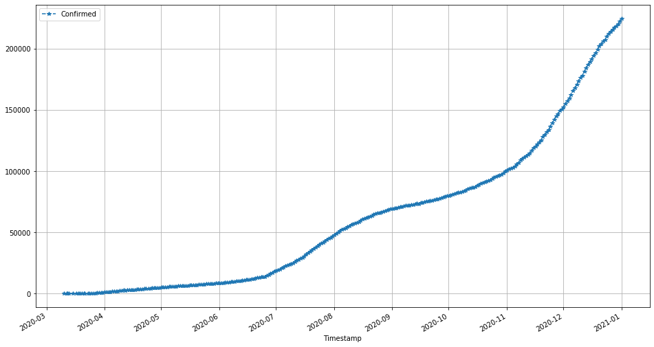
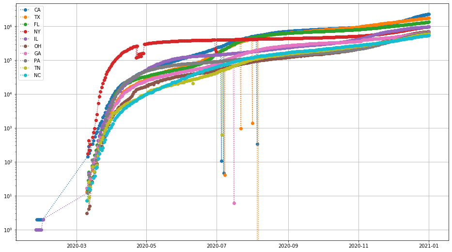

# USA transportation networks and COVID-19 
One major factor in the spread of infectious diseases like COVID-19 is the connectivity of our transportation networks. Therefore, let's ask the following question in this problem: to what extent does the connectivity of the airport network help explain in which regions we have seen the most confirmed cases of COVID-19?

I'll focus on the United States network and analyze data at the level of US states (e.g., Washington state, California, New York state). The analysis will have three main steps.

1. I'll start by inspecting some recent COVID-19 data on the number of confirmed cases over time, to see which states are seeing the most cases.
2. Next, I'll analyze the airport network to rank the states by their likelihood of seeing air traffic.
3. Finally, I'll compare the state ranking by incidence of COVID-19 with those by airport traffic, to see if there is any "correlation" between the two. I don't expect perfect overlap in these rankings, but if there is substantial overlap, it would provide evidence for the role that air transportation networks play in the spread of the disease.


```python

```


```python
import sys
print(sys.version)

import pandas as pd
print(f"Pandas version: {pd.__version__}")

from matplotlib.pyplot import figure, plot, semilogy, grid, legend
%matplotlib inline
```

    3.7.6 (default, Jan  8 2020, 20:23:39) [MSC v.1916 64 bit (AMD64)]
    Pandas version: 1.0.1
    

## Step 1: Inspecting COVID-19 incidence data by state
Researchers at Johns Hopkins University have been tallying the number of confirmed cases of COVID-19 over time. Let's start by assembling the raw data for analysis.

Provenance of these data. JHU made these data available in [this repo on GitHub](https://github.com/CSSEGISandData/COVID-19). The data are stored in files, one for each day since January 22, 2020.


```python
df0 = pd.read_csv('./data/01-22-2020.csv')
df0.head(5)
```


<div>
<style scoped>
    .dataframe tbody tr th:only-of-type {
        vertical-align: middle;
    }

    .dataframe tbody tr th {
        vertical-align: top;
    }

    .dataframe thead th {
        text-align: right;
    }
</style>
<table border="1" class="dataframe">
  <thead>
    <tr style="text-align: right;">
      <th></th>
      <th>Province/State</th>
      <th>Country/Region</th>
      <th>Last Update</th>
      <th>Confirmed</th>
      <th>Deaths</th>
      <th>Recovered</th>
    </tr>
  </thead>
  <tbody>
    <tr>
      <th>0</th>
      <td>Anhui</td>
      <td>Mainland China</td>
      <td>1/22/2020 17:00</td>
      <td>1.0</td>
      <td>NaN</td>
      <td>NaN</td>
    </tr>
    <tr>
      <th>1</th>
      <td>Beijing</td>
      <td>Mainland China</td>
      <td>1/22/2020 17:00</td>
      <td>14.0</td>
      <td>NaN</td>
      <td>NaN</td>
    </tr>
    <tr>
      <th>2</th>
      <td>Chongqing</td>
      <td>Mainland China</td>
      <td>1/22/2020 17:00</td>
      <td>6.0</td>
      <td>NaN</td>
      <td>NaN</td>
    </tr>
    <tr>
      <th>3</th>
      <td>Fujian</td>
      <td>Mainland China</td>
      <td>1/22/2020 17:00</td>
      <td>1.0</td>
      <td>NaN</td>
      <td>NaN</td>
    </tr>
    <tr>
      <th>4</th>
      <td>Gansu</td>
      <td>Mainland China</td>
      <td>1/22/2020 17:00</td>
      <td>NaN</td>
      <td>NaN</td>
      <td>NaN</td>
    </tr>
  </tbody>
</table>
</div>


```python
df1 = pd.read_csv('./data/03-11-2020.csv')
df1.head(5)
```


<div>
<style scoped>
    .dataframe tbody tr th:only-of-type {
        vertical-align: middle;
    }

    .dataframe tbody tr th {
        vertical-align: top;
    }

    .dataframe thead th {
        text-align: right;
    }
</style>
<table border="1" class="dataframe">
  <thead>
    <tr style="text-align: right;">
      <th></th>
      <th>Province/State</th>
      <th>Country/Region</th>
      <th>Last Update</th>
      <th>Confirmed</th>
      <th>Deaths</th>
      <th>Recovered</th>
      <th>Latitude</th>
      <th>Longitude</th>
    </tr>
  </thead>
  <tbody>
    <tr>
      <th>0</th>
      <td>Hubei</td>
      <td>China</td>
      <td>2020-03-11T10:53:02</td>
      <td>67773</td>
      <td>3046</td>
      <td>49134</td>
      <td>30.9756</td>
      <td>112.2707</td>
    </tr>
    <tr>
      <th>1</th>
      <td>NaN</td>
      <td>Italy</td>
      <td>2020-03-11T21:33:02</td>
      <td>12462</td>
      <td>827</td>
      <td>1045</td>
      <td>43.0000</td>
      <td>12.0000</td>
    </tr>
    <tr>
      <th>2</th>
      <td>NaN</td>
      <td>Iran</td>
      <td>2020-03-11T18:52:03</td>
      <td>9000</td>
      <td>354</td>
      <td>2959</td>
      <td>32.0000</td>
      <td>53.0000</td>
    </tr>
    <tr>
      <th>3</th>
      <td>NaN</td>
      <td>Korea, South</td>
      <td>2020-03-11T21:13:18</td>
      <td>7755</td>
      <td>60</td>
      <td>288</td>
      <td>36.0000</td>
      <td>128.0000</td>
    </tr>
    <tr>
      <th>4</th>
      <td>France</td>
      <td>France</td>
      <td>2020-03-11T22:53:03</td>
      <td>2281</td>
      <td>48</td>
      <td>12</td>
      <td>46.2276</td>
      <td>2.2137</td>
    </tr>
  </tbody>
</table>
</div>


```python
df2 = pd.read_csv('./data/03-22-2020.csv')
df2.head(5)
```


<div>
<style scoped>
    .dataframe tbody tr th:only-of-type {
        vertical-align: middle;
    }

    .dataframe tbody tr th {
        vertical-align: top;
    }

    .dataframe thead th {
        text-align: right;
    }
</style>
<table border="1" class="dataframe">
  <thead>
    <tr style="text-align: right;">
      <th></th>
      <th>FIPS</th>
      <th>Admin2</th>
      <th>Province_State</th>
      <th>Country_Region</th>
      <th>Last_Update</th>
      <th>Lat</th>
      <th>Long_</th>
      <th>Confirmed</th>
      <th>Deaths</th>
      <th>Recovered</th>
      <th>Active</th>
      <th>Combined_Key</th>
    </tr>
  </thead>
  <tbody>
    <tr>
      <th>0</th>
      <td>36061.0</td>
      <td>New York City</td>
      <td>New York</td>
      <td>US</td>
      <td>3/22/20 23:45</td>
      <td>40.767273</td>
      <td>-73.971526</td>
      <td>9654</td>
      <td>63</td>
      <td>0</td>
      <td>0</td>
      <td>New York City, New York, US</td>
    </tr>
    <tr>
      <th>1</th>
      <td>36059.0</td>
      <td>Nassau</td>
      <td>New York</td>
      <td>US</td>
      <td>3/22/20 23:45</td>
      <td>40.740665</td>
      <td>-73.589419</td>
      <td>1900</td>
      <td>4</td>
      <td>0</td>
      <td>0</td>
      <td>Nassau, New York, US</td>
    </tr>
    <tr>
      <th>2</th>
      <td>36119.0</td>
      <td>Westchester</td>
      <td>New York</td>
      <td>US</td>
      <td>3/22/20 23:45</td>
      <td>41.162784</td>
      <td>-73.757417</td>
      <td>1873</td>
      <td>0</td>
      <td>0</td>
      <td>0</td>
      <td>Westchester, New York, US</td>
    </tr>
    <tr>
      <th>3</th>
      <td>36103.0</td>
      <td>Suffolk</td>
      <td>New York</td>
      <td>US</td>
      <td>3/22/20 23:45</td>
      <td>40.883201</td>
      <td>-72.801217</td>
      <td>1034</td>
      <td>9</td>
      <td>0</td>
      <td>0</td>
      <td>Suffolk, New York, US</td>
    </tr>
    <tr>
      <th>4</th>
      <td>36087.0</td>
      <td>Rockland</td>
      <td>New York</td>
      <td>US</td>
      <td>3/22/20 23:45</td>
      <td>41.150279</td>
      <td>-74.025605</td>
      <td>455</td>
      <td>1</td>
      <td>0</td>
      <td>0</td>
      <td>Rockland, New York, US</td>
    </tr>
  </tbody>
</table>
</div>


Observe that the column conventions are changing over time, which will make working with this data quite messy if they're not dealt with.

I'm only interested in the following four columns:

* "Province/State" 
* "Country/Region" 
* "Last Update"
* "Confirmed"

There may be missing values, which read_csv() converts by default to NaN values. I'll deal with this situation later in the notebook.

Also notice that each dataframe has a column named "Last Update", which contain date and time values stored as strings. Moreover, they appear to use different formats. Later, I'll standardize these, and use pandas's to_datetime() to convert these into Python datetime objects. That makes them easier to compare (in code) and do simple arithmetic on them (e.g., calculate the number of days in-between). The following code cells demonstrate these features.


```python
print(type(df1['Last Update'].loc[0])) # Confirm that these values are strings

df0['Timestamp'] = pd.to_datetime(df0['Last Update'])
df1['Timestamp'] = pd.to_datetime(df1['Last Update'])
df1.head(5)
```

    <class 'str'>
    


<div>
<style scoped>
    .dataframe tbody tr th:only-of-type {
        vertical-align: middle;
    }

    .dataframe tbody tr th {
        vertical-align: top;
    }

    .dataframe thead th {
        text-align: right;
    }
</style>
<table border="1" class="dataframe">
  <thead>
    <tr style="text-align: right;">
      <th></th>
      <th>Province/State</th>
      <th>Country/Region</th>
      <th>Last Update</th>
      <th>Confirmed</th>
      <th>Deaths</th>
      <th>Recovered</th>
      <th>Latitude</th>
      <th>Longitude</th>
      <th>Timestamp</th>
    </tr>
  </thead>
  <tbody>
    <tr>
      <th>0</th>
      <td>Hubei</td>
      <td>China</td>
      <td>2020-03-11T10:53:02</td>
      <td>67773</td>
      <td>3046</td>
      <td>49134</td>
      <td>30.9756</td>
      <td>112.2707</td>
      <td>2020-03-11 10:53:02</td>
    </tr>
    <tr>
      <th>1</th>
      <td>NaN</td>
      <td>Italy</td>
      <td>2020-03-11T21:33:02</td>
      <td>12462</td>
      <td>827</td>
      <td>1045</td>
      <td>43.0000</td>
      <td>12.0000</td>
      <td>2020-03-11 21:33:02</td>
    </tr>
    <tr>
      <th>2</th>
      <td>NaN</td>
      <td>Iran</td>
      <td>2020-03-11T18:52:03</td>
      <td>9000</td>
      <td>354</td>
      <td>2959</td>
      <td>32.0000</td>
      <td>53.0000</td>
      <td>2020-03-11 18:52:03</td>
    </tr>
    <tr>
      <th>3</th>
      <td>NaN</td>
      <td>Korea, South</td>
      <td>2020-03-11T21:13:18</td>
      <td>7755</td>
      <td>60</td>
      <td>288</td>
      <td>36.0000</td>
      <td>128.0000</td>
      <td>2020-03-11 21:13:18</td>
    </tr>
    <tr>
      <th>4</th>
      <td>France</td>
      <td>France</td>
      <td>2020-03-11T22:53:03</td>
      <td>2281</td>
      <td>48</td>
      <td>12</td>
      <td>46.2276</td>
      <td>2.2137</td>
      <td>2020-03-11 22:53:03</td>
    </tr>
  </tbody>
</table>
</div>


Here is a function to get a list of available daily data files by filename. 


```python
def get_path(filebase=""):
    DATA_PATH = ""
    return f"{DATA_PATH}{filebase}"

def get_covid19_daily_filenames(root=get_path("data/")):
    """
    Returns a list of file paths corresponding to JHU's
    daily tallies of COVID-19 cases.
    """
    from os import listdir
    from os.path import isfile
    from re import match
    
    def covid19_filepath(filebase, root):
        return f"{root}{filebase}"
    
    def is_covid19_daily_file(filebase, root):
        file_path = covid19_filepath(filebase, root)
        return isfile(file_path) and match('^\d\d-\d\d-2020.csv$', filebase)
    
    filenames = []
    for b in listdir(root):
        if is_covid19_daily_file(b, root):
            filenames.append(covid19_filepath(b, root))
    return sorted(filenames)

print(repr(get_covid19_daily_filenames()))
```

    ['data/01-22-2020.csv', 'data/01-23-2020.csv', 'data/01-24-2020.csv', 'data/01-25-2020.csv', 'data/01-26-2020.csv', 'data/01-27-2020.csv', 'data/01-28-2020.csv', 'data/01-29-2020.csv', 'data/01-30-2020.csv', 'data/01-31-2020.csv', 'data/02-01-2020.csv', 'data/02-02-2020.csv', 'data/02-03-2020.csv', 'data/02-04-2020.csv', 'data/02-05-2020.csv', 'data/02-06-2020.csv', 'data/02-07-2020.csv', 'data/02-08-2020.csv', 'data/02-09-2020.csv', 'data/02-10-2020.csv', 'data/02-11-2020.csv', 'data/02-12-2020.csv', 'data/02-13-2020.csv', 'data/02-14-2020.csv', 'data/02-15-2020.csv', 'data/02-16-2020.csv', 'data/02-17-2020.csv', 'data/02-18-2020.csv', 'data/02-19-2020.csv', 'data/02-20-2020.csv', 'data/02-21-2020.csv', 'data/02-22-2020.csv', 'data/02-23-2020.csv', 'data/02-24-2020.csv', 'data/02-25-2020.csv', 'data/02-26-2020.csv', 'data/02-27-2020.csv', 'data/02-28-2020.csv', 'data/02-29-2020.csv', 'data/03-01-2020.csv', 'data/03-02-2020.csv', 'data/03-03-2020.csv', 'data/03-04-2020.csv', 'data/03-05-2020.csv', 'data/03-06-2020.csv', 'data/03-07-2020.csv', 'data/03-08-2020.csv', 'data/03-09-2020.csv', 'data/03-10-2020.csv', 'data/03-11-2020.csv', 'data/03-12-2020.csv', 'data/03-13-2020.csv', 'data/03-14-2020.csv', 'data/03-15-2020.csv', 'data/03-16-2020.csv', 'data/03-17-2020.csv', 'data/03-18-2020.csv', 'data/03-19-2020.csv', 'data/03-20-2020.csv', 'data/03-21-2020.csv', 'data/03-22-2020.csv', 'data/03-23-2020.csv', 'data/03-24-2020.csv', 'data/03-25-2020.csv', 'data/03-26-2020.csv', 'data/03-27-2020.csv', 'data/03-28-2020.csv', 'data/03-29-2020.csv', 'data/03-30-2020.csv', 'data/03-31-2020.csv', 'data/04-01-2020.csv', 'data/04-02-2020.csv', 'data/04-03-2020.csv', 'data/04-04-2020.csv', 'data/04-05-2020.csv', 'data/04-06-2020.csv', 'data/04-07-2020.csv', 'data/04-08-2020.csv', 'data/04-09-2020.csv', 'data/04-10-2020.csv', 'data/04-11-2020.csv', 'data/04-12-2020.csv', 'data/04-13-2020.csv', 'data/04-14-2020.csv', 'data/04-15-2020.csv', 'data/04-16-2020.csv', 'data/04-17-2020.csv', 'data/04-18-2020.csv', 'data/04-19-2020.csv', 'data/04-20-2020.csv', 'data/04-21-2020.csv', 'data/04-22-2020.csv', 'data/04-23-2020.csv', 'data/04-24-2020.csv', 'data/04-25-2020.csv', 'data/04-26-2020.csv', 'data/04-27-2020.csv', 'data/04-28-2020.csv', 'data/04-29-2020.csv', 'data/04-30-2020.csv', 'data/05-01-2020.csv', 'data/05-02-2020.csv', 'data/05-03-2020.csv', 'data/05-04-2020.csv', 'data/05-05-2020.csv', 'data/05-06-2020.csv', 'data/05-07-2020.csv', 'data/05-08-2020.csv', 'data/05-09-2020.csv', 'data/05-10-2020.csv', 'data/05-11-2020.csv', 'data/05-12-2020.csv', 'data/05-13-2020.csv', 'data/05-14-2020.csv', 'data/05-15-2020.csv', 'data/05-16-2020.csv', 'data/05-17-2020.csv', 'data/05-18-2020.csv', 'data/05-19-2020.csv', 'data/05-20-2020.csv', 'data/05-21-2020.csv', 'data/05-22-2020.csv', 'data/05-23-2020.csv', 'data/05-24-2020.csv', 'data/05-25-2020.csv', 'data/05-26-2020.csv', 'data/05-27-2020.csv', 'data/05-28-2020.csv', 'data/05-29-2020.csv', 'data/05-30-2020.csv', 'data/05-31-2020.csv', 'data/06-01-2020.csv', 'data/06-02-2020.csv', 'data/06-03-2020.csv', 'data/06-04-2020.csv', 'data/06-05-2020.csv', 'data/06-06-2020.csv', 'data/06-07-2020.csv', 'data/06-08-2020.csv', 'data/06-09-2020.csv', 'data/06-10-2020.csv', 'data/06-11-2020.csv', 'data/06-12-2020.csv', 'data/06-13-2020.csv', 'data/06-14-2020.csv', 'data/06-15-2020.csv', 'data/06-16-2020.csv', 'data/06-17-2020.csv', 'data/06-18-2020.csv', 'data/06-19-2020.csv', 'data/06-20-2020.csv', 'data/06-21-2020.csv', 'data/06-22-2020.csv', 'data/06-23-2020.csv', 'data/06-24-2020.csv', 'data/06-25-2020.csv', 'data/06-26-2020.csv', 'data/06-27-2020.csv', 'data/06-28-2020.csv', 'data/06-29-2020.csv', 'data/06-30-2020.csv', 'data/07-01-2020.csv', 'data/07-02-2020.csv', 'data/07-03-2020.csv', 'data/07-04-2020.csv', 'data/07-05-2020.csv', 'data/07-06-2020.csv', 'data/07-07-2020.csv', 'data/07-08-2020.csv', 'data/07-09-2020.csv', 'data/07-10-2020.csv', 'data/07-11-2020.csv', 'data/07-12-2020.csv', 'data/07-13-2020.csv', 'data/07-14-2020.csv', 'data/07-15-2020.csv', 'data/07-16-2020.csv', 'data/07-17-2020.csv', 'data/07-18-2020.csv', 'data/07-19-2020.csv', 'data/07-20-2020.csv', 'data/07-21-2020.csv', 'data/07-22-2020.csv', 'data/07-23-2020.csv', 'data/07-24-2020.csv', 'data/07-25-2020.csv', 'data/07-26-2020.csv', 'data/07-27-2020.csv', 'data/07-28-2020.csv', 'data/07-29-2020.csv', 'data/07-30-2020.csv', 'data/07-31-2020.csv', 'data/08-01-2020.csv', 'data/08-02-2020.csv', 'data/08-03-2020.csv', 'data/08-04-2020.csv', 'data/08-05-2020.csv', 'data/08-06-2020.csv', 'data/08-07-2020.csv', 'data/08-08-2020.csv', 'data/08-09-2020.csv', 'data/08-10-2020.csv', 'data/08-11-2020.csv', 'data/08-12-2020.csv', 'data/08-13-2020.csv', 'data/08-14-2020.csv', 'data/08-15-2020.csv', 'data/08-16-2020.csv', 'data/08-17-2020.csv', 'data/08-18-2020.csv', 'data/08-19-2020.csv', 'data/08-20-2020.csv', 'data/08-21-2020.csv', 'data/08-22-2020.csv', 'data/08-23-2020.csv', 'data/08-24-2020.csv', 'data/08-25-2020.csv', 'data/08-26-2020.csv', 'data/08-27-2020.csv', 'data/08-28-2020.csv', 'data/08-29-2020.csv', 'data/08-30-2020.csv', 'data/08-31-2020.csv', 'data/09-01-2020.csv', 'data/09-02-2020.csv', 'data/09-03-2020.csv', 'data/09-04-2020.csv', 'data/09-05-2020.csv', 'data/09-06-2020.csv', 'data/09-07-2020.csv', 'data/09-08-2020.csv', 'data/09-09-2020.csv', 'data/09-10-2020.csv', 'data/09-11-2020.csv', 'data/09-12-2020.csv', 'data/09-13-2020.csv', 'data/09-14-2020.csv', 'data/09-15-2020.csv', 'data/09-16-2020.csv', 'data/09-17-2020.csv', 'data/09-18-2020.csv', 'data/09-19-2020.csv', 'data/09-20-2020.csv', 'data/09-21-2020.csv', 'data/09-22-2020.csv', 'data/09-23-2020.csv', 'data/09-24-2020.csv', 'data/09-25-2020.csv', 'data/09-26-2020.csv', 'data/09-27-2020.csv', 'data/09-28-2020.csv', 'data/09-29-2020.csv', 'data/09-30-2020.csv', 'data/10-01-2020.csv', 'data/10-02-2020.csv', 'data/10-03-2020.csv', 'data/10-04-2020.csv', 'data/10-05-2020.csv', 'data/10-06-2020.csv', 'data/10-07-2020.csv', 'data/10-08-2020.csv', 'data/10-09-2020.csv', 'data/10-10-2020.csv', 'data/10-11-2020.csv', 'data/10-12-2020.csv', 'data/10-13-2020.csv', 'data/10-14-2020.csv', 'data/10-15-2020.csv', 'data/10-16-2020.csv', 'data/10-17-2020.csv', 'data/10-18-2020.csv', 'data/10-19-2020.csv', 'data/10-20-2020.csv', 'data/10-21-2020.csv', 'data/10-22-2020.csv', 'data/10-23-2020.csv', 'data/10-24-2020.csv', 'data/10-25-2020.csv', 'data/10-26-2020.csv', 'data/10-27-2020.csv', 'data/10-28-2020.csv', 'data/10-29-2020.csv', 'data/10-30-2020.csv', 'data/10-31-2020.csv', 'data/11-01-2020.csv', 'data/11-02-2020.csv', 'data/11-03-2020.csv', 'data/11-04-2020.csv', 'data/11-05-2020.csv', 'data/11-06-2020.csv', 'data/11-07-2020.csv', 'data/11-08-2020.csv', 'data/11-09-2020.csv', 'data/11-10-2020.csv', 'data/11-11-2020.csv', 'data/11-12-2020.csv', 'data/11-13-2020.csv', 'data/11-14-2020.csv', 'data/11-15-2020.csv', 'data/11-16-2020.csv', 'data/11-17-2020.csv', 'data/11-18-2020.csv', 'data/11-19-2020.csv', 'data/11-20-2020.csv', 'data/11-21-2020.csv', 'data/11-22-2020.csv', 'data/11-23-2020.csv', 'data/11-24-2020.csv', 'data/11-25-2020.csv', 'data/11-26-2020.csv', 'data/11-27-2020.csv', 'data/11-28-2020.csv', 'data/11-29-2020.csv', 'data/11-30-2020.csv', 'data/12-01-2020.csv', 'data/12-02-2020.csv', 'data/12-03-2020.csv', 'data/12-04-2020.csv', 'data/12-05-2020.csv', 'data/12-06-2020.csv', 'data/12-07-2020.csv', 'data/12-08-2020.csv', 'data/12-09-2020.csv', 'data/12-10-2020.csv', 'data/12-11-2020.csv', 'data/12-12-2020.csv', 'data/12-13-2020.csv', 'data/12-14-2020.csv', 'data/12-15-2020.csv', 'data/12-16-2020.csv', 'data/12-17-2020.csv', 'data/12-18-2020.csv', 'data/12-19-2020.csv', 'data/12-20-2020.csv', 'data/12-21-2020.csv', 'data/12-22-2020.csv', 'data/12-23-2020.csv', 'data/12-24-2020.csv', 'data/12-25-2020.csv', 'data/12-26-2020.csv', 'data/12-27-2020.csv', 'data/12-28-2020.csv', 'data/12-29-2020.csv', 'data/12-30-2020.csv', 'data/12-31-2020.csv']
    

### Data loading and cleaning
Given filenames, a list of filenames that might be generated by get_covid19_filenames() above, the function load_covid19_daily_data(filenames) reads all of this data and combines it into a single pandas DataFrame containing only the following columns:

"Province/State": Same contents as the original data frames.
"Country/Region": Same contents as the original data frames.
"Confirmed": Same contents as the original data frames.
"Timestamp": The values from the "Last Update" columns, but converted to datetime objects per the demonstration discussed previously.
In addition, the code also does the following:

1. If there are any duplicate rows, only one of the rows should be retained.
2. In the "Confirmed" column, any missing values will be replaced by (0). Also, this column will be converted to have an integer type.


```python
def load_covid19_daily_data(filenames):
    from pandas import read_csv, concat, to_datetime
    df_list = []
    for filename in filenames:
        df = read_csv(filename).rename(columns={"Province_State": "Province/State",
                                                "Country_Region": "Country/Region",
                                                "Last_Update": "Last Update"})
        df = df[["Province/State", "Country/Region", "Confirmed", "Last Update"]]
        df["Last Update"] = to_datetime(df["Last Update"])
        df['Confirmed'] = df['Confirmed'].fillna(0).astype(int)
        df_list.append(df)
    df_combined = concat(df_list)
    df_combined.rename(columns={"Last Update": "Timestamp"}, inplace=True)
    df_combined.drop_duplicates(inplace=True)
    return df_combined.reset_index(drop=True)

```


```python
# Demo of the function:
df_covid19 = load_covid19_daily_data(get_covid19_daily_filenames())

print(f"There are {len(df_covid19)} rows in your data frame.")
print("The first five are:")
display(df_covid19.head(5))

print("A random sample of five additional rows:")
df_covid19.sample(5).sort_index()
```

    There are 923171 rows in your data frame.
    The first five are:
    


<div>
<style scoped>
    .dataframe tbody tr th:only-of-type {
        vertical-align: middle;
    }

    .dataframe tbody tr th {
        vertical-align: top;
    }

    .dataframe thead th {
        text-align: right;
    }
</style>
<table border="1" class="dataframe">
  <thead>
    <tr style="text-align: right;">
      <th></th>
      <th>Province/State</th>
      <th>Country/Region</th>
      <th>Confirmed</th>
      <th>Timestamp</th>
    </tr>
  </thead>
  <tbody>
    <tr>
      <th>0</th>
      <td>Anhui</td>
      <td>Mainland China</td>
      <td>1</td>
      <td>2020-01-22 17:00:00</td>
    </tr>
    <tr>
      <th>1</th>
      <td>Beijing</td>
      <td>Mainland China</td>
      <td>14</td>
      <td>2020-01-22 17:00:00</td>
    </tr>
    <tr>
      <th>2</th>
      <td>Chongqing</td>
      <td>Mainland China</td>
      <td>6</td>
      <td>2020-01-22 17:00:00</td>
    </tr>
    <tr>
      <th>3</th>
      <td>Fujian</td>
      <td>Mainland China</td>
      <td>1</td>
      <td>2020-01-22 17:00:00</td>
    </tr>
    <tr>
      <th>4</th>
      <td>Gansu</td>
      <td>Mainland China</td>
      <td>0</td>
      <td>2020-01-22 17:00:00</td>
    </tr>
  </tbody>
</table>
</div>


    A random sample of five additional rows:
    


<div>
<style scoped>
    .dataframe tbody tr th:only-of-type {
        vertical-align: middle;
    }

    .dataframe tbody tr th {
        vertical-align: top;
    }

    .dataframe thead th {
        text-align: right;
    }
</style>
<table border="1" class="dataframe">
  <thead>
    <tr style="text-align: right;">
      <th></th>
      <th>Province/State</th>
      <th>Country/Region</th>
      <th>Confirmed</th>
      <th>Timestamp</th>
    </tr>
  </thead>
  <tbody>
    <tr>
      <th>31548</th>
      <td>Georgia</td>
      <td>US</td>
      <td>275</td>
      <td>2020-04-11 22:45:33</td>
    </tr>
    <tr>
      <th>53473</th>
      <td>Georgia</td>
      <td>US</td>
      <td>82</td>
      <td>2020-04-24 03:30:50</td>
    </tr>
    <tr>
      <th>220029</th>
      <td>Himachal Pradesh</td>
      <td>India</td>
      <td>839</td>
      <td>2020-06-26 04:33:43</td>
    </tr>
    <tr>
      <th>291538</th>
      <td>Texas</td>
      <td>US</td>
      <td>220</td>
      <td>2020-07-18 04:34:45</td>
    </tr>
    <tr>
      <th>294935</th>
      <td>Oklahoma</td>
      <td>US</td>
      <td>13</td>
      <td>2020-07-19 04:34:58</td>
    </tr>
  </tbody>
</table>
</div>


```python
df_covid19 = df_covid19.groupby(["Province/State", "Country/Region", "Timestamp"], as_index=False).sum()
             # ^^^ Above `.groupby()` needed because of a change in US reporting on March 22, 2020
df_covid19.sample(5)
```


<div>
<style scoped>
    .dataframe tbody tr th:only-of-type {
        vertical-align: middle;
    }

    .dataframe tbody tr th {
        vertical-align: top;
    }

    .dataframe thead th {
        text-align: right;
    }
</style>
<table border="1" class="dataframe">
  <thead>
    <tr style="text-align: right;">
      <th></th>
      <th>Province/State</th>
      <th>Country/Region</th>
      <th>Timestamp</th>
      <th>Confirmed</th>
    </tr>
  </thead>
  <tbody>
    <tr>
      <th>25840</th>
      <td>Colorado</td>
      <td>US</td>
      <td>2020-04-29 02:32:29</td>
      <td>14253</td>
    </tr>
    <tr>
      <th>45884</th>
      <td>Huila</td>
      <td>Colombia</td>
      <td>2020-11-28 05:25:50</td>
      <td>29357</td>
    </tr>
    <tr>
      <th>5966</th>
      <td>Aomori</td>
      <td>Japan</td>
      <td>2020-07-10 04:34:24</td>
      <td>31</td>
    </tr>
    <tr>
      <th>40927</th>
      <td>Gujarat</td>
      <td>India</td>
      <td>2020-10-30 04:24:49</td>
      <td>170878</td>
    </tr>
    <tr>
      <th>27100</th>
      <td>Cundinamarca</td>
      <td>Colombia</td>
      <td>2020-07-18 04:34:45</td>
      <td>5358</td>
    </tr>
  </tbody>
</table>
</div>


### US state-by-state data
From now on we're going to be focusing on confirmed cases in the US. 


```python
is_us = (df_covid19["Country/Region"] == "US")
df_covid19[is_us].sample(5)
```


<div>
<style scoped>
    .dataframe tbody tr th:only-of-type {
        vertical-align: middle;
    }

    .dataframe tbody tr th {
        vertical-align: top;
    }

    .dataframe thead th {
        text-align: right;
    }
</style>
<table border="1" class="dataframe">
  <thead>
    <tr style="text-align: right;">
      <th></th>
      <th>Province/State</th>
      <th>Country/Region</th>
      <th>Timestamp</th>
      <th>Confirmed</th>
    </tr>
  </thead>
  <tbody>
    <tr>
      <th>96082</th>
      <td>Puerto Rico</td>
      <td>US</td>
      <td>2020-09-26 04:23:00</td>
      <td>43587</td>
    </tr>
    <tr>
      <th>129598</th>
      <td>Virginia</td>
      <td>US</td>
      <td>2020-08-09 04:34:54</td>
      <td>98041</td>
    </tr>
    <tr>
      <th>71903</th>
      <td>Michigan</td>
      <td>US</td>
      <td>2020-07-05 04:33:46</td>
      <td>72200</td>
    </tr>
    <tr>
      <th>81222</th>
      <td>New York</td>
      <td>US</td>
      <td>2020-09-10 04:29:01</td>
      <td>443078</td>
    </tr>
    <tr>
      <th>54787</th>
      <td>Kansas</td>
      <td>US</td>
      <td>2020-12-09 05:28:01</td>
      <td>174945</td>
    </tr>
  </tbody>
</table>
</div>


Using Nevada as an example here are all the rows associated with "Nevada".


```python
is_nevada = (df_covid19["Province/State"] == "Nevada")
df_covid19[is_us & is_nevada]
```


<div>
<style scoped>
    .dataframe tbody tr th:only-of-type {
        vertical-align: middle;
    }

    .dataframe tbody tr th {
        vertical-align: top;
    }

    .dataframe thead th {
        text-align: right;
    }
</style>
<table border="1" class="dataframe">
  <thead>
    <tr style="text-align: right;">
      <th></th>
      <th>Province/State</th>
      <th>Country/Region</th>
      <th>Timestamp</th>
      <th>Confirmed</th>
    </tr>
  </thead>
  <tbody>
    <tr>
      <th>78957</th>
      <td>Nevada</td>
      <td>US</td>
      <td>2020-03-10 02:33:04</td>
      <td>4</td>
    </tr>
    <tr>
      <th>78958</th>
      <td>Nevada</td>
      <td>US</td>
      <td>2020-03-11 20:00:00</td>
      <td>17</td>
    </tr>
    <tr>
      <th>78959</th>
      <td>Nevada</td>
      <td>US</td>
      <td>2020-03-11 22:53:03</td>
      <td>7</td>
    </tr>
    <tr>
      <th>78960</th>
      <td>Nevada</td>
      <td>US</td>
      <td>2020-03-12 23:44:33</td>
      <td>14</td>
    </tr>
    <tr>
      <th>78961</th>
      <td>Nevada</td>
      <td>US</td>
      <td>2020-03-14 22:33:03</td>
      <td>45</td>
    </tr>
    <tr>
      <th>...</th>
      <td>...</td>
      <td>...</td>
      <td>...</td>
      <td>...</td>
    </tr>
    <tr>
      <th>79248</th>
      <td>Nevada</td>
      <td>US</td>
      <td>2020-12-28 05:22:06</td>
      <td>217509</td>
    </tr>
    <tr>
      <th>79249</th>
      <td>Nevada</td>
      <td>US</td>
      <td>2020-12-29 05:22:37</td>
      <td>218377</td>
    </tr>
    <tr>
      <th>79250</th>
      <td>Nevada</td>
      <td>US</td>
      <td>2020-12-30 05:22:34</td>
      <td>220124</td>
    </tr>
    <tr>
      <th>79251</th>
      <td>Nevada</td>
      <td>US</td>
      <td>2020-12-31 05:22:49</td>
      <td>222595</td>
    </tr>
    <tr>
      <th>79252</th>
      <td>Nevada</td>
      <td>US</td>
      <td>2021-01-01 05:23:07</td>
      <td>224731</td>
    </tr>
  </tbody>
</table>
<p>296 rows × 4 columns</p>
</div>


Given these data, we can order by timestamp and plot confirmed cases over time.


```python
df_covid19[is_us & is_nevada] \
    .sort_values(by="Timestamp") \
    .plot(x="Timestamp", y="Confirmed", figsize=(16, 9), style='*--')
grid()
```





```python
STATE_NAMES = pd.read_csv(get_path('data/us_states.csv'))
print(f"There are {len(STATE_NAMES)} US states. The first and last three, along with their two-letter postal code abbreviations, are as follows (in alphabetical order):")
display(STATE_NAMES.head(3))
print("...")
display(STATE_NAMES.tail(3))
```

    There are 50 US states. The first and last three, along with their two-letter postal code abbreviations, are as follows (in alphabetical order):
    


<div>
<style scoped>
    .dataframe tbody tr th:only-of-type {
        vertical-align: middle;
    }

    .dataframe tbody tr th {
        vertical-align: top;
    }

    .dataframe thead th {
        text-align: right;
    }
</style>
<table border="1" class="dataframe">
  <thead>
    <tr style="text-align: right;">
      <th></th>
      <th>Name</th>
      <th>Abbrv</th>
    </tr>
  </thead>
  <tbody>
    <tr>
      <th>0</th>
      <td>Alabama</td>
      <td>AL</td>
    </tr>
    <tr>
      <th>1</th>
      <td>Alaska</td>
      <td>AK</td>
    </tr>
    <tr>
      <th>2</th>
      <td>Arizona</td>
      <td>AZ</td>
    </tr>
  </tbody>
</table>
</div>


    ...
    


<div>
<style scoped>
    .dataframe tbody tr th:only-of-type {
        vertical-align: middle;
    }

    .dataframe tbody tr th {
        vertical-align: top;
    }

    .dataframe thead th {
        text-align: right;
    }
</style>
<table border="1" class="dataframe">
  <thead>
    <tr style="text-align: right;">
      <th></th>
      <th>Name</th>
      <th>Abbrv</th>
    </tr>
  </thead>
  <tbody>
    <tr>
      <th>47</th>
      <td>West Virginia</td>
      <td>WV</td>
    </tr>
    <tr>
      <th>48</th>
      <td>Wisconsin</td>
      <td>WI</td>
    </tr>
    <tr>
      <th>49</th>
      <td>Wyoming</td>
      <td>WY</td>
    </tr>
  </tbody>
</table>
</div>


The below function, get_us_states(df), does the following:
* takes in as its input a data frame structured like the combined COVID-19 data frame (df_covid19), having the columns "Province/State", "Country/Region", "Confirmed", "Timestamp";
* and returns a tibble containing only those rows of df that are from the United States where the "Province/State" field is exactly the name of any one of the US states.

The tibble returned by the function should only have these three columns:

"Confirmed": The number of confirmed cases, taken from the input df.
"Timestamp": The timestamp taken from the input df.
"ST": The two-letter abbreviation for the state's name.


```python
def get_us_states__2(df):
    is_us = df['Country/Region'] == 'US'
    names = STATE_NAMES["Name"]
    is_us_state = is_us & df['Province/State'].isin(names)
    abbrvs = STATE_NAMES["Abbrv"]
    name2abbrv = {name: st for name, st in zip(names, abbrvs)}
    df_us = df[is_us_state].copy()
    df_us['ST'] = df_us['Province/State'].map(name2abbrv)
    del df_us["Province/State"]
    del df_us["Country/Region"]
    return df_us
```


```python
df_covid19_us = get_us_states__2(df_covid19)
df_covid19_us.sample(5).sort_values(by=["ST", "Timestamp"])
```


<div>
<style scoped>
    .dataframe tbody tr th:only-of-type {
        vertical-align: middle;
    }

    .dataframe tbody tr th {
        vertical-align: top;
    }

    .dataframe thead th {
        text-align: right;
    }
</style>
<table border="1" class="dataframe">
  <thead>
    <tr style="text-align: right;">
      <th></th>
      <th>Timestamp</th>
      <th>Confirmed</th>
      <th>ST</th>
    </tr>
  </thead>
  <tbody>
    <tr>
      <th>47202</th>
      <td>2020-03-30 22:52:00</td>
      <td>4959</td>
      <td>IL</td>
    </tr>
    <tr>
      <th>71886</th>
      <td>2020-06-18 04:33:18</td>
      <td>66088</td>
      <td>MI</td>
    </tr>
    <tr>
      <th>73276</th>
      <td>2020-10-20 04:24:22</td>
      <td>110592</td>
      <td>MS</td>
    </tr>
    <tr>
      <th>89795</th>
      <td>2020-04-16 23:30:51</td>
      <td>1691</td>
      <td>OR</td>
    </tr>
    <tr>
      <th>128226</th>
      <td>2020-06-22 04:33:20</td>
      <td>1159</td>
      <td>VT</td>
    </tr>
  </tbody>
</table>
</div>


### Ranking by confirmed cases
The function rank_states_by_cases(df) takes a data frame like df_covid19_us and returns a Python list of states in decreasing order of the maximum number of confirmed cases in that state.


```python
def rank_states_by_cases(df):
    return df.groupby("ST").max().sort_values(by="Confirmed", ascending=False).index.tolist()

covid19_rankings = rank_states_by_cases(df_covid19_us)

print(f"Computed ranking:\n==> {repr(covid19_rankings)}\n")
```

    Computed ranking:
    ==> ['CA', 'TX', 'FL', 'NY', 'IL', 'OH', 'GA', 'PA', 'TN', 'NC', 'NJ', 'MI', 'WI', 'AZ', 'IN', 'MN', 'MO', 'MA', 'AL', 'VA', 'CO', 'LA', 'SC', 'OK', 'IA', 'MD', 'UT', 'KY', 'WA', 'AR', 'NV', 'KS', 'MS', 'CT', 'NE', 'NM', 'ID', 'OR', 'SD', 'ND', 'RI', 'WV', 'MT', 'DE', 'AK', 'WY', 'NH', 'ME', 'HI', 'VT']
    
    


```python
df_covid19_us.head()
```


<div>
<style scoped>
    .dataframe tbody tr th:only-of-type {
        vertical-align: middle;
    }

    .dataframe tbody tr th {
        vertical-align: top;
    }

    .dataframe thead th {
        text-align: right;
    }
</style>
<table border="1" class="dataframe">
  <thead>
    <tr style="text-align: right;">
      <th></th>
      <th>Timestamp</th>
      <th>Confirmed</th>
      <th>ST</th>
    </tr>
  </thead>
  <tbody>
    <tr>
      <th>1340</th>
      <td>2020-03-11 20:00:00</td>
      <td>5</td>
      <td>AL</td>
    </tr>
    <tr>
      <th>1341</th>
      <td>2020-03-14 16:53:03</td>
      <td>6</td>
      <td>AL</td>
    </tr>
    <tr>
      <th>1342</th>
      <td>2020-03-15 18:20:19</td>
      <td>12</td>
      <td>AL</td>
    </tr>
    <tr>
      <th>1343</th>
      <td>2020-03-16 22:33:03</td>
      <td>29</td>
      <td>AL</td>
    </tr>
    <tr>
      <th>1344</th>
      <td>2020-03-17 23:13:10</td>
      <td>39</td>
      <td>AL</td>
    </tr>
  </tbody>
</table>
</div>


### Visualization
Let's plot the 10 states by number of confirmed cases. The y-axis uses a logarithmic scale in this plot.


```python
def viz_by_state(col, df, states, figsize=(16, 9), logy=False):
    from matplotlib.pyplot import figure, plot, semilogy, legend, grid
    figure(figsize=figsize)
    plotter = plot if not logy else semilogy
    for s in states:
        df0 = df[df["ST"] == s].sort_values(by="Timestamp")
        plotter(df0["Timestamp"], df0[col], "o:")
    legend(states)
    grid()
    
TOP_K = 10
```


```python
viz_by_state("Confirmed", df_covid19_us, covid19_rankings[:TOP_K], logy=True)
```





Observe that this data is irregularly sampled and noisy. For instance, the updates do not occur every day in every state, and there are spikes due to reporting errors. Below I will try to smooth out the data before plotting it, to help discern the overall trends better. 

### Filling-in missing values
First I'm going to impute the missing daily values, so that there is at least one value per day. To see the issue more clearly, consider the data for the state of Nevada:


```python
df_covid19_us[df_covid19_us["ST"] == "NV"].sort_values(by="Timestamp")
```


<div>
<style scoped>
    .dataframe tbody tr th:only-of-type {
        vertical-align: middle;
    }

    .dataframe tbody tr th {
        vertical-align: top;
    }

    .dataframe thead th {
        text-align: right;
    }
</style>
<table border="1" class="dataframe">
  <thead>
    <tr style="text-align: right;">
      <th></th>
      <th>Timestamp</th>
      <th>Confirmed</th>
      <th>ST</th>
    </tr>
  </thead>
  <tbody>
    <tr>
      <th>78957</th>
      <td>2020-03-10 02:33:04</td>
      <td>4</td>
      <td>NV</td>
    </tr>
    <tr>
      <th>78958</th>
      <td>2020-03-11 20:00:00</td>
      <td>17</td>
      <td>NV</td>
    </tr>
    <tr>
      <th>78959</th>
      <td>2020-03-11 22:53:03</td>
      <td>7</td>
      <td>NV</td>
    </tr>
    <tr>
      <th>78960</th>
      <td>2020-03-12 23:44:33</td>
      <td>14</td>
      <td>NV</td>
    </tr>
    <tr>
      <th>78961</th>
      <td>2020-03-14 22:33:03</td>
      <td>45</td>
      <td>NV</td>
    </tr>
    <tr>
      <th>...</th>
      <td>...</td>
      <td>...</td>
      <td>...</td>
    </tr>
    <tr>
      <th>79248</th>
      <td>2020-12-28 05:22:06</td>
      <td>217509</td>
      <td>NV</td>
    </tr>
    <tr>
      <th>79249</th>
      <td>2020-12-29 05:22:37</td>
      <td>218377</td>
      <td>NV</td>
    </tr>
    <tr>
      <th>79250</th>
      <td>2020-12-30 05:22:34</td>
      <td>220124</td>
      <td>NV</td>
    </tr>
    <tr>
      <th>79251</th>
      <td>2020-12-31 05:22:49</td>
      <td>222595</td>
      <td>NV</td>
    </tr>
    <tr>
      <th>79252</th>
      <td>2021-01-01 05:23:07</td>
      <td>224731</td>
      <td>NV</td>
    </tr>
  </tbody>
</table>
<p>296 rows × 3 columns</p>
</div>


There are two observations on March 11 and no observations on March 13. I would like want one value per day for every state. I'm going to resample the values, using pandas built-in resample, a standard cleaning method when dealing with irregularly sampled time-series data. The function below implements it, storing the results in a data frame called df_us_daily.


```python
def resample_daily(df):
    # This implementation is a bit weird, due to a known issue: https://github.com/pandas-dev/pandas/issues/28313
    df_r = df.sort_values(by=["ST", "Timestamp"]) \
             .set_index("Timestamp") \
             .groupby("ST", group_keys=False) \
             .resample("1D", closed="right") \
             .ffill() \
             .reset_index()
    return df_r.sort_values(by=["ST", "Timestamp"]).reset_index(drop=True)
    
df_us_daily = resample_daily(df_covid19_us)
df_us_daily[df_us_daily["ST"] == "NV"]
```


<div>
<style scoped>
    .dataframe tbody tr th:only-of-type {
        vertical-align: middle;
    }

    .dataframe tbody tr th {
        vertical-align: top;
    }

    .dataframe thead th {
        text-align: right;
    }
</style>
<table border="1" class="dataframe">
  <thead>
    <tr style="text-align: right;">
      <th></th>
      <th>Timestamp</th>
      <th>Confirmed</th>
      <th>ST</th>
    </tr>
  </thead>
  <tbody>
    <tr>
      <th>9668</th>
      <td>2020-03-11</td>
      <td>4</td>
      <td>NV</td>
    </tr>
    <tr>
      <th>9669</th>
      <td>2020-03-12</td>
      <td>7</td>
      <td>NV</td>
    </tr>
    <tr>
      <th>9670</th>
      <td>2020-03-13</td>
      <td>14</td>
      <td>NV</td>
    </tr>
    <tr>
      <th>9671</th>
      <td>2020-03-14</td>
      <td>14</td>
      <td>NV</td>
    </tr>
    <tr>
      <th>9672</th>
      <td>2020-03-15</td>
      <td>45</td>
      <td>NV</td>
    </tr>
    <tr>
      <th>...</th>
      <td>...</td>
      <td>...</td>
      <td>...</td>
    </tr>
    <tr>
      <th>9961</th>
      <td>2020-12-29</td>
      <td>217509</td>
      <td>NV</td>
    </tr>
    <tr>
      <th>9962</th>
      <td>2020-12-30</td>
      <td>218377</td>
      <td>NV</td>
    </tr>
    <tr>
      <th>9963</th>
      <td>2020-12-31</td>
      <td>220124</td>
      <td>NV</td>
    </tr>
    <tr>
      <th>9964</th>
      <td>2021-01-01</td>
      <td>222595</td>
      <td>NV</td>
    </tr>
    <tr>
      <th>9965</th>
      <td>2021-01-02</td>
      <td>224731</td>
      <td>NV</td>
    </tr>
  </tbody>
</table>
<p>298 rows × 3 columns</p>
</div>


Observe how there are now samples on every consecutive day beginning on March 11.

### Windowed daily averages
Armed with regularly sampled data, next I would like to smooth out the data using windowed daily averages.

The function daily_windowed_avg(df, days) takes in a data frame df like df_us_daily, which resample_daily() computed. It then calculates the windowed daily average using windows of size days. The function then returns a copy of df with a new column named Avg containing this average. For days with no defined average, the function simply omits those days from the output.


```python
def daily_window_one_df(df, days):
    from numpy import nan
    df_new = df.sort_values(by="Timestamp")
    df_new["Sums"] = df_new["Confirmed"]
    for k in range(1, days):
        df_new["Sums"].iloc[k:] += df_new["Confirmed"].iloc[:-k].values
    df_new["Sums"] /= days
    df_new.rename(columns={"Sums": "Avg"}, inplace=True)
    return df_new.iloc[days-1:]

def daily_windowed_avg(df, days):
    df_avg = df.sort_values(by="Timestamp") \
               .set_index("Timestamp") \
               .groupby("ST") \
               .rolling(days) \
               .mean() \
               .reset_index() \
               .rename(columns={"Confirmed": "Avg"}) \
               .dropna()
    return df_avg.merge(df, on=["ST", "Timestamp"])
```


```python
# Demo of the function:
print('=== Two states: "AK" and "GA" ===')
is_ak_ga_before = df_us_daily["ST"].isin(["AK", "GA"])
display(df_us_daily[is_ak_ga_before])

print('=== Your results (days=3) ===')
df_us_daily_avg = daily_windowed_avg(df_us_daily, 3)
is_ak_ga_after = df_us_daily_avg["ST"].isin(["AK", "GA"])
display(df_us_daily_avg[is_ak_ga_after])
```

    === Two states: "AK" and "GA" ===
    


<div>
<style scoped>
    .dataframe tbody tr th:only-of-type {
        vertical-align: middle;
    }

    .dataframe tbody tr th {
        vertical-align: top;
    }

    .dataframe thead th {
        text-align: right;
    }
</style>
<table border="1" class="dataframe">
  <thead>
    <tr style="text-align: right;">
      <th></th>
      <th>Timestamp</th>
      <th>Confirmed</th>
      <th>ST</th>
    </tr>
  </thead>
  <tbody>
    <tr>
      <th>0</th>
      <td>2020-03-11</td>
      <td>0</td>
      <td>AK</td>
    </tr>
    <tr>
      <th>1</th>
      <td>2020-03-12</td>
      <td>1</td>
      <td>AK</td>
    </tr>
    <tr>
      <th>2</th>
      <td>2020-03-13</td>
      <td>1</td>
      <td>AK</td>
    </tr>
    <tr>
      <th>3</th>
      <td>2020-03-14</td>
      <td>1</td>
      <td>AK</td>
    </tr>
    <tr>
      <th>4</th>
      <td>2020-03-15</td>
      <td>1</td>
      <td>AK</td>
    </tr>
    <tr>
      <th>...</th>
      <td>...</td>
      <td>...</td>
      <td>...</td>
    </tr>
    <tr>
      <th>3062</th>
      <td>2020-12-29</td>
      <td>632299</td>
      <td>GA</td>
    </tr>
    <tr>
      <th>3063</th>
      <td>2020-12-30</td>
      <td>630981</td>
      <td>GA</td>
    </tr>
    <tr>
      <th>3064</th>
      <td>2020-12-31</td>
      <td>640062</td>
      <td>GA</td>
    </tr>
    <tr>
      <th>3065</th>
      <td>2021-01-01</td>
      <td>651221</td>
      <td>GA</td>
    </tr>
    <tr>
      <th>3066</th>
      <td>2021-01-02</td>
      <td>665781</td>
      <td>GA</td>
    </tr>
  </tbody>
</table>
<p>596 rows × 3 columns</p>
</div>


    === Your results (days=3) ===
    


<div>
<style scoped>
    .dataframe tbody tr th:only-of-type {
        vertical-align: middle;
    }

    .dataframe tbody tr th {
        vertical-align: top;
    }

    .dataframe thead th {
        text-align: right;
    }
</style>
<table border="1" class="dataframe">
  <thead>
    <tr style="text-align: right;">
      <th></th>
      <th>ST</th>
      <th>Timestamp</th>
      <th>Avg</th>
      <th>Confirmed</th>
    </tr>
  </thead>
  <tbody>
    <tr>
      <th>0</th>
      <td>AK</td>
      <td>2020-03-13</td>
      <td>0.666667</td>
      <td>1</td>
    </tr>
    <tr>
      <th>1</th>
      <td>AK</td>
      <td>2020-03-14</td>
      <td>1.000000</td>
      <td>1</td>
    </tr>
    <tr>
      <th>2</th>
      <td>AK</td>
      <td>2020-03-15</td>
      <td>1.000000</td>
      <td>1</td>
    </tr>
    <tr>
      <th>3</th>
      <td>AK</td>
      <td>2020-03-16</td>
      <td>1.000000</td>
      <td>1</td>
    </tr>
    <tr>
      <th>4</th>
      <td>AK</td>
      <td>2020-03-17</td>
      <td>1.000000</td>
      <td>1</td>
    </tr>
    <tr>
      <th>...</th>
      <td>...</td>
      <td>...</td>
      <td>...</td>
      <td>...</td>
    </tr>
    <tr>
      <th>3042</th>
      <td>GA</td>
      <td>2020-12-29</td>
      <td>627727.666667</td>
      <td>632299</td>
    </tr>
    <tr>
      <th>3043</th>
      <td>GA</td>
      <td>2020-12-30</td>
      <td>630489.000000</td>
      <td>630981</td>
    </tr>
    <tr>
      <th>3044</th>
      <td>GA</td>
      <td>2020-12-31</td>
      <td>634447.333333</td>
      <td>640062</td>
    </tr>
    <tr>
      <th>3045</th>
      <td>GA</td>
      <td>2021-01-01</td>
      <td>640754.666667</td>
      <td>651221</td>
    </tr>
    <tr>
      <th>3046</th>
      <td>GA</td>
      <td>2021-01-02</td>
      <td>652354.666667</td>
      <td>665781</td>
    </tr>
  </tbody>
</table>
<p>592 rows × 4 columns</p>
</div>


Here is a visualization of the daily averages, which should appear smoother. As such, the trends should be a little more clear as well.


```python
viz_by_state("Avg", df_us_daily_avg, covid19_rankings[:TOP_K], logy=True)
```


## Step 2: Flights analysis
In this final step of this analysis, I'll apply a Markov chain-based model to rank airport networks, and see how well it correlates with the state-by-state numbers of confirmed COVID-19 cases.

First, I'm going to load flights data from 2020 into a DataFrame called flights. 

Sources: As it happens, the US Bureau of Transportation Statistics collects data on all flights originating or arriving in the United States. The dataset is available here: https://www.transtats.bts.gov/DL_SelectFields.asp?Table_ID=236


```python
def load_flights(infile=get_path('data/764404810_T_ONTIME_REPORTING.csv')):
    keep_cols = ["FL_DATE", "ORIGIN_STATE_ABR", "DEST_STATE_ABR", "OP_UNIQUE_CARRIER", "OP_CARRIER_FL_NUM"]
    flights = pd.read_csv(infile)[keep_cols]
    us_sts = set(STATE_NAMES["Abbrv"])
    origin_is_state = flights['ORIGIN_STATE_ABR'].isin(us_sts)
    dest_is_state = flights['DEST_STATE_ABR'].isin(us_sts)
    return flights.loc[origin_is_state & dest_is_state].copy()

flights = load_flights()
print(f"There are {len(flights):,} direct flight segments in the `flights` data frame.")
print("Here are the first few:")
flights.head()
```

    There are 600,349 direct flight segments in the `flights` data frame.
    Here are the first few:
    


<div>
<style scoped>
    .dataframe tbody tr th:only-of-type {
        vertical-align: middle;
    }

    .dataframe tbody tr th {
        vertical-align: top;
    }

    .dataframe thead th {
        text-align: right;
    }
</style>
<table border="1" class="dataframe">
  <thead>
    <tr style="text-align: right;">
      <th></th>
      <th>FL_DATE</th>
      <th>ORIGIN_STATE_ABR</th>
      <th>DEST_STATE_ABR</th>
      <th>OP_UNIQUE_CARRIER</th>
      <th>OP_CARRIER_FL_NUM</th>
    </tr>
  </thead>
  <tbody>
    <tr>
      <th>0</th>
      <td>2020-01-01</td>
      <td>CA</td>
      <td>CA</td>
      <td>WN</td>
      <td>5888</td>
    </tr>
    <tr>
      <th>1</th>
      <td>2020-01-01</td>
      <td>CA</td>
      <td>CA</td>
      <td>WN</td>
      <td>6276</td>
    </tr>
    <tr>
      <th>2</th>
      <td>2020-01-01</td>
      <td>CA</td>
      <td>CA</td>
      <td>WN</td>
      <td>4598</td>
    </tr>
    <tr>
      <th>3</th>
      <td>2020-01-01</td>
      <td>CA</td>
      <td>CA</td>
      <td>WN</td>
      <td>4761</td>
    </tr>
    <tr>
      <th>4</th>
      <td>2020-01-01</td>
      <td>CA</td>
      <td>CA</td>
      <td>WN</td>
      <td>5162</td>
    </tr>
  </tbody>
</table>
</div>


Here I'm going to define the outdegree of a state (e.g., the state of Nevada, the state of California) to be the total number of direct flight segments from that state to all other states. I'm going to use pandas group-by-count aggregation to compute these outdegrees. The following funtion will produce a data frame named outdegrees with two columns, the origin state ("Origin") and outdegree value ("Outdegree"), sorted in descending order of outdegree.


```python
def calc_outdegrees(flights):
    outdegrees = flights[['ORIGIN_STATE_ABR', 'DEST_STATE_ABR']] \
                 .groupby(['ORIGIN_STATE_ABR']) \
                 .count() \
                 .reset_index() \
                 .rename(columns={'ORIGIN_STATE_ABR': 'Origin',
                                  'DEST_STATE_ABR': 'Outdegree'}) \
                 .sort_values(by='Outdegree', ascending=False) \
                 .reset_index(drop=True)
    return outdegrees

# Demo:
outdegrees = calc_outdegrees(flights)
print(f"There are {len(outdegrees)} states with a non-zero outdegree.")
print("Here are the first ten:")
outdegrees.head(10)
```

    There are 49 states with a non-zero outdegree.
    Here are the first ten:
    


<div>
<style scoped>
    .dataframe tbody tr th:only-of-type {
        vertical-align: middle;
    }

    .dataframe tbody tr th {
        vertical-align: top;
    }

    .dataframe thead th {
        text-align: right;
    }
</style>
<table border="1" class="dataframe">
  <thead>
    <tr style="text-align: right;">
      <th></th>
      <th>Origin</th>
      <th>Outdegree</th>
    </tr>
  </thead>
  <tbody>
    <tr>
      <th>0</th>
      <td>CA</td>
      <td>66748</td>
    </tr>
    <tr>
      <th>1</th>
      <td>TX</td>
      <td>64966</td>
    </tr>
    <tr>
      <th>2</th>
      <td>FL</td>
      <td>52241</td>
    </tr>
    <tr>
      <th>3</th>
      <td>GA</td>
      <td>33947</td>
    </tr>
    <tr>
      <th>4</th>
      <td>IL</td>
      <td>33250</td>
    </tr>
    <tr>
      <th>5</th>
      <td>NY</td>
      <td>30721</td>
    </tr>
    <tr>
      <th>6</th>
      <td>NC</td>
      <td>28349</td>
    </tr>
    <tr>
      <th>7</th>
      <td>CO</td>
      <td>23859</td>
    </tr>
    <tr>
      <th>8</th>
      <td>VA</td>
      <td>21582</td>
    </tr>
    <tr>
      <th>9</th>
      <td>AZ</td>
      <td>17921</td>
    </tr>
  </tbody>
</table>
</div>


### State transition probabilities
To run the ranking analysis, I'm going to need to construct a probability transition matrix. For the state-to-state analysis, I wish to estimate the probability of going from state i to state j. Let's define that probability to be the number of direct flight segments from state i to state j divided by the outdegree of state i.

The calc_state_trans_probs(flights, outdegrees) function below computes these state-to-state transition probabilities. The function accepts two data frames like flights and outdegrees as defined above and returns a new data frame with exactly these columns:

* "Origin": The origin state, i.e., state  i , as a two-letter abbreviation.
* "Dest": The destination state, i.e., state  j , as a two-letter abbreviation.
* "Count": The number of direct flight segments from state  i  to state  j .
* "TransProb": The transition probability of going from state  i  to state  j , i.e., the count divided by the outdegree.


```python
def calc_state_trans_probs(flights, outdegrees):
    probs = flights[['ORIGIN_STATE_ABR', 'DEST_STATE_ABR', 'FL_DATE']] \
            .groupby(['ORIGIN_STATE_ABR', 'DEST_STATE_ABR']) \
            .count() \
            .reset_index() \
            .rename(columns={'ORIGIN_STATE_ABR': 'Origin',
                             'DEST_STATE_ABR': 'Dest',
                             'FL_DATE': 'Count'}) \
            .merge(outdegrees, on='Origin', how='inner')
    probs['TransProb'] = probs['Count'] / probs['Outdegree']
    del probs['Outdegree']
    return probs
```


```python
probs = calc_state_trans_probs(flights, outdegrees)
print(f"There are {len(probs)} state-to-state transition probabilities in your result.")
print("Here are ten with the largest transition probabilities:")
display(probs.sort_values(by="TransProb", ascending=False).head(10))
```

    There are 1200 state-to-state transition probabilities in your result.
    Here are ten with the largest transition probabilities:
    


<div>
<style scoped>
    .dataframe tbody tr th:only-of-type {
        vertical-align: middle;
    }

    .dataframe tbody tr th {
        vertical-align: top;
    }

    .dataframe thead th {
        text-align: right;
    }
</style>
<table border="1" class="dataframe">
  <thead>
    <tr style="text-align: right;">
      <th></th>
      <th>Origin</th>
      <th>Dest</th>
      <th>Count</th>
      <th>TransProb</th>
    </tr>
  </thead>
  <tbody>
    <tr>
      <th>0</th>
      <td>AK</td>
      <td>AK</td>
      <td>1872</td>
      <td>0.631579</td>
    </tr>
    <tr>
      <th>263</th>
      <td>HI</td>
      <td>HI</td>
      <td>6064</td>
      <td>0.601707</td>
    </tr>
    <tr>
      <th>677</th>
      <td>ND</td>
      <td>MN</td>
      <td>693</td>
      <td>0.444516</td>
    </tr>
    <tr>
      <th>618</th>
      <td>MS</td>
      <td>TX</td>
      <td>587</td>
      <td>0.438714</td>
    </tr>
    <tr>
      <th>878</th>
      <td>OR</td>
      <td>CA</td>
      <td>2717</td>
      <td>0.437238</td>
    </tr>
    <tr>
      <th>872</th>
      <td>OK</td>
      <td>TX</td>
      <td>1457</td>
      <td>0.432216</td>
    </tr>
    <tr>
      <th>1190</th>
      <td>WY</td>
      <td>CO</td>
      <td>368</td>
      <td>0.428904</td>
    </tr>
    <tr>
      <th>34</th>
      <td>AR</td>
      <td>TX</td>
      <td>1058</td>
      <td>0.426785</td>
    </tr>
    <tr>
      <th>753</th>
      <td>NM</td>
      <td>TX</td>
      <td>825</td>
      <td>0.375854</td>
    </tr>
    <tr>
      <th>425</th>
      <td>LA</td>
      <td>TX</td>
      <td>2509</td>
      <td>0.361527</td>
    </tr>
  </tbody>
</table>
</div>


The next code cell runs the PageRank-style algorithm on the state-to-state airport network and produces a ranking. 


```python
def eval_markov_chain(P, x0, t_max):
    x = x0
    for t in range(t_max):
        x = P.T.dot(x)
    return x

def rank_states_by_air_network(probs, t_max=100):
    from numpy import array, zeros, ones, argsort, arange
    from scipy.sparse import coo_matrix
    from pandas import DataFrame

    # Create transition matrix
    unique_origins = set(probs['Origin'])
    unique_dests = set(probs['Dest'])
    unique_states = array(sorted(unique_origins | unique_dests))
    state_ids = {st: i for i, st in enumerate(unique_states)}
    num_states = max(state_ids.values()) + 1
    
    s2s = probs.copy()
    s2s['OriginID'] = s2s['Origin'].map(state_ids)
    s2s['DestID'] = s2s['Dest'].map(state_ids)
    
    P = coo_matrix((s2s['TransProb'], (s2s['OriginID'], s2s['DestID'])),
                   shape=(num_states, num_states))

    # Run ranking algorithm
    x0 = zeros(num_states)
    x0[state_ids['WA']] = 1.0 # First state to report confirmed COVID-19 cases

    x = eval_markov_chain(P, x0, t_max)

    # Produce a results table of rank-ordered states
    ranks = argsort(-x)
    df_ranks = DataFrame({'Rank': arange(1, len(ranks)+1),
                          'State': unique_states[ranks],
                          'x(t)': x[ranks]})
    df_ranks['ID'] = df_ranks['State'].map(state_ids)
        
    return df_ranks

print("Running the ranking algorithm...")
airnet_rankings = rank_states_by_air_network(probs)

print(f"==> Here are the top-{TOP_K} states:")
display(airnet_rankings.head(TOP_K))
```

    Running the ranking algorithm...
    ==> Here are the top-10 states:
    


<div>
<style scoped>
    .dataframe tbody tr th:only-of-type {
        vertical-align: middle;
    }

    .dataframe tbody tr th {
        vertical-align: top;
    }

    .dataframe thead th {
        text-align: right;
    }
</style>
<table border="1" class="dataframe">
  <thead>
    <tr style="text-align: right;">
      <th></th>
      <th>Rank</th>
      <th>State</th>
      <th>x(t)</th>
      <th>ID</th>
    </tr>
  </thead>
  <tbody>
    <tr>
      <th>0</th>
      <td>1</td>
      <td>CA</td>
      <td>0.111133</td>
      <td>4</td>
    </tr>
    <tr>
      <th>1</th>
      <td>2</td>
      <td>TX</td>
      <td>0.108272</td>
      <td>41</td>
    </tr>
    <tr>
      <th>2</th>
      <td>3</td>
      <td>FL</td>
      <td>0.086968</td>
      <td>7</td>
    </tr>
    <tr>
      <th>3</th>
      <td>4</td>
      <td>GA</td>
      <td>0.056547</td>
      <td>8</td>
    </tr>
    <tr>
      <th>4</th>
      <td>5</td>
      <td>IL</td>
      <td>0.055431</td>
      <td>12</td>
    </tr>
    <tr>
      <th>5</th>
      <td>6</td>
      <td>NY</td>
      <td>0.051167</td>
      <td>32</td>
    </tr>
    <tr>
      <th>6</th>
      <td>7</td>
      <td>NC</td>
      <td>0.047241</td>
      <td>25</td>
    </tr>
    <tr>
      <th>7</th>
      <td>8</td>
      <td>CO</td>
      <td>0.039737</td>
      <td>5</td>
    </tr>
    <tr>
      <th>8</th>
      <td>9</td>
      <td>VA</td>
      <td>0.035947</td>
      <td>43</td>
    </tr>
    <tr>
      <th>9</th>
      <td>10</td>
      <td>AZ</td>
      <td>0.029857</td>
      <td>3</td>
    </tr>
  </tbody>
</table>
</div>


We now have a ranking of states by number of confirmed COVID-19 cases, as well as a separate ranking of states by air-network connectivity. To compare them, I'll use a measure called rank-biased overlap (RBO). Very roughly speaking, this measure is an estimate of the probability that a reader comparing the top few entries of two rankings tends to encounter the same items, so a value closer to 1 means the top entries of the two rankings are more similar.

Note that I say "top few" above because RBO is parameterized by a "patience" parameter, which is related to how many of the top entries the reader will inspect before stopping. The reason for this parameter originates in the motivation for RBO, which was to measure the similarity between search engine results. The code I am using to calculate RBO uses this implementation.


```python
from rbo import rbo

compare_rankings = rbo(covid19_rankings, # ranking by confirmed COVID-19 cases
                           airnet_rankings['State'].values, # ranking by air-network connectivity
                           0.95) # "patience" parameter
print(f"Raw RBO result: {compare_rankings}\n\n==> RBO score is {compare_rankings.ext:.3}")
```

    Raw RBO result: RBO(min=0.8121261555176027, res=0.02058258852563008, ext=0.8325850950430913)
    
    ==> RBO score is 0.833
    

We see an RBO score of 0.833, which suggests that the connectivity of the airport network may help explain the number of confirmed COVID-19 cases we are seeing in each state.
