# Problem Statement

American Football is well-known to be a team sport, requiring the skills of a wide
variety of players and careful coordination of all teammates. The ultimate
goal of the team is to win as many games as possible, hopefully becoming
the top team in all of college football. But how do the stats associated with
each player contribute to the odds of reaching the top 25 by the end of the
year?

In this project, I dive into how different players' stats predict the ranking
a team will have at the end of the season. Can I forecast a top 25 finish
with just the quarterback's rating or perhaps a few offensive statistics? Or,
as is the case on the field, will I need the full team's effort to accurately
predict the outcome for the season?

This problem is one of interest and significance for a number of reasons. For
one, it was an intellectual curiosity for me, simply to determine if I
could determine a top 25 finish. There is additionally a market for this among
gamblers - being able to model the likelihood of a team performing well could
be a lucrative opportunity in Vegas. Finally, with all the crazy things going
on in 2020 and the very real possibility that the 2020 football season will be 
a very unusual one, it was nice to have see how predicted outcomes match actual
outcomes.

```python
import numpy as np
import pandas as pd
import seaborn as sns
import matplotlib.pyplot as plt
from scipy.stats import chi2_contingency
from scipy.stats import shapiro
from statsmodels.graphics.gofplots import qqplot
```
# Data Source

The metrics used in this analysis are the result of significant screen scraping
from espn.com using C# and storing the data in my local MSSQL instance. I pulled 
statistics for 5 key players from all NCAA FCS division football teams across the 
2018 and 2019 seasons, along with the team's conference and whether they finished 
in the AP Top 25 that year.

The player stats used were for the players with the most:
- passing yards
- receiving yards
- rushing yards
- tackles
- interceptions

This yielded a data set of approximately 130 teams (teams do occasionally
come into or move out of the division) and 44 predictors with which to predict
the season's final outcome.

# Content

## 1. Clean data
- 1) Clean ESPN NCAAF Team Leader data
- 2) Group teams into respective conferences

## 2. Exploratory Data Analysis
- 1) Conference top 25 vs non 25 breakdown 
- 2) Feature distribution and significance 
- 3) Feature correlation
- 4) Exploratory data analysis summary

## 3. Create and train models


```python

```

## Clean data

#### 1) Clean ESPN NCAAF Team Leader data


```python
conferencedata = pd.read_csv('NCAAF Team Leaders_2018.csv')
rawdata2018 = pd.read_csv('2018.csv')
rawdata2018 = pd.concat([rawdata2018, conferencedata['conference']], axis=1)
display(rawdata2018.head())

csq=chi2_contingency(pd.crosstab(rawdata2018['AP_top_25'], rawdata2018['conference_categorical']))
print("Relationship between top 25 and conference P-value: ",csq[1])

#print(ncaaf['FumblesTouchdowns'].sum())
#ncaaf = ncaaf.drop(columns=['FumblesRecovered', 'FumblesTouchdowns', 'fumblesrecovered2', 'fumblestouchdowns2'])
cols = [c for c in rawdata2018.columns if c.lower()[:4] != 'team' and c.lower()[:4] != 'play' and c.lower()[:4] != 'espn' and c.lower()[:4] != 'conf' and c != 'r']
data2018 = rawdata2018[cols]
data2018 = data2018.rename(columns = {data2018.columns[43]: "y"})
display(data2018.head()) #all numerical
print(data2018.columns)
print(data2018['y'].describe())
print(data2018['QBRating'].describe())
```


<div>
<style scoped>
    .dataframe tbody tr th:only-of-type {
        vertical-align: middle;
    }

    .dataframe tbody tr th {
        vertical-align: top;
    }

    .dataframe thead th {
        text-align: right;
    }
</style>
<table border="1" class="dataframe">
  <thead>
    <tr style="text-align: right;">
      <th></th>
      <th>team</th>
      <th>Completions</th>
      <th>Attempts</th>
      <th>PassingYards</th>
      <th>CompletionPercentage</th>
      <th>AverageCompletion</th>
      <th>LongestCompletion</th>
      <th>QBTouchdowns</th>
      <th>Interceptions</th>
      <th>Sacks</th>
      <th>...</th>
      <th>sacksyardslost2</th>
      <th>passesdefended2</th>
      <th>interceptions2</th>
      <th>interceptionyards2</th>
      <th>longestinterception2</th>
      <th>interceptiontouchdowns2</th>
      <th>fumblesforced2</th>
      <th>conference_categorical</th>
      <th>AP_top_25</th>
      <th>conference</th>
    </tr>
  </thead>
  <tbody>
    <tr>
      <th>0</th>
      <td>Air Force</td>
      <td>48</td>
      <td>78</td>
      <td>844</td>
      <td>61.537998</td>
      <td>10.821</td>
      <td>69</td>
      <td>4</td>
      <td>3</td>
      <td>5</td>
      <td>...</td>
      <td>5</td>
      <td>1</td>
      <td>3</td>
      <td>0</td>
      <td>0</td>
      <td>0</td>
      <td>0</td>
      <td>9</td>
      <td>0</td>
      <td>Mountain West Conference</td>
    </tr>
    <tr>
      <th>1</th>
      <td>Akron</td>
      <td>178</td>
      <td>342</td>
      <td>2329</td>
      <td>52.047001</td>
      <td>6.810</td>
      <td>56</td>
      <td>15</td>
      <td>8</td>
      <td>31</td>
      <td>...</td>
      <td>0</td>
      <td>3</td>
      <td>4</td>
      <td>149</td>
      <td>147</td>
      <td>2</td>
      <td>1</td>
      <td>8</td>
      <td>0</td>
      <td>Mid-American Conference</td>
    </tr>
    <tr>
      <th>2</th>
      <td>Alabama</td>
      <td>245</td>
      <td>355</td>
      <td>3966</td>
      <td>69.014000</td>
      <td>11.172</td>
      <td>81</td>
      <td>43</td>
      <td>6</td>
      <td>13</td>
      <td>...</td>
      <td>0</td>
      <td>5</td>
      <td>3</td>
      <td>71</td>
      <td>38</td>
      <td>1</td>
      <td>1</td>
      <td>11</td>
      <td>1</td>
      <td>Southeastern Conference</td>
    </tr>
    <tr>
      <th>3</th>
      <td>Appalachian State</td>
      <td>159</td>
      <td>254</td>
      <td>2039</td>
      <td>62.598000</td>
      <td>8.028</td>
      <td>90</td>
      <td>21</td>
      <td>6</td>
      <td>14</td>
      <td>...</td>
      <td>0</td>
      <td>5</td>
      <td>4</td>
      <td>113</td>
      <td>64</td>
      <td>1</td>
      <td>0</td>
      <td>12</td>
      <td>0</td>
      <td>Sun Belt Conference</td>
    </tr>
    <tr>
      <th>4</th>
      <td>Arizona</td>
      <td>170</td>
      <td>302</td>
      <td>2530</td>
      <td>56.291000</td>
      <td>8.377</td>
      <td>75</td>
      <td>26</td>
      <td>8</td>
      <td>14</td>
      <td>...</td>
      <td>0</td>
      <td>3</td>
      <td>3</td>
      <td>63</td>
      <td>62</td>
      <td>1</td>
      <td>0</td>
      <td>10</td>
      <td>0</td>
      <td>Pac-12 Conference</td>
    </tr>
  </tbody>
</table>
<p>5 rows × 47 columns</p>
</div>


    Relationship between top 25 and conference P-value:  0.061018655720283685
    


<div>
<style scoped>
    .dataframe tbody tr th:only-of-type {
        vertical-align: middle;
    }

    .dataframe tbody tr th {
        vertical-align: top;
    }

    .dataframe thead th {
        text-align: right;
    }
</style>
<table border="1" class="dataframe">
  <thead>
    <tr style="text-align: right;">
      <th></th>
      <th>Completions</th>
      <th>Attempts</th>
      <th>PassingYards</th>
      <th>CompletionPercentage</th>
      <th>AverageCompletion</th>
      <th>LongestCompletion</th>
      <th>QBTouchdowns</th>
      <th>Interceptions</th>
      <th>Sacks</th>
      <th>SackYardsLost</th>
      <th>...</th>
      <th>totaltackles2</th>
      <th>sacks2</th>
      <th>sacksyardslost2</th>
      <th>passesdefended2</th>
      <th>interceptions2</th>
      <th>interceptionyards2</th>
      <th>longestinterception2</th>
      <th>interceptiontouchdowns2</th>
      <th>fumblesforced2</th>
      <th>y</th>
    </tr>
  </thead>
  <tbody>
    <tr>
      <th>0</th>
      <td>48</td>
      <td>78</td>
      <td>844</td>
      <td>61.537998</td>
      <td>10.821</td>
      <td>69</td>
      <td>4</td>
      <td>3</td>
      <td>5</td>
      <td>-32</td>
      <td>...</td>
      <td>104</td>
      <td>1</td>
      <td>5</td>
      <td>1</td>
      <td>3</td>
      <td>0</td>
      <td>0</td>
      <td>0</td>
      <td>0</td>
      <td>0</td>
    </tr>
    <tr>
      <th>1</th>
      <td>178</td>
      <td>342</td>
      <td>2329</td>
      <td>52.047001</td>
      <td>6.810</td>
      <td>56</td>
      <td>15</td>
      <td>8</td>
      <td>31</td>
      <td>-199</td>
      <td>...</td>
      <td>75</td>
      <td>0</td>
      <td>0</td>
      <td>3</td>
      <td>4</td>
      <td>149</td>
      <td>147</td>
      <td>2</td>
      <td>1</td>
      <td>0</td>
    </tr>
    <tr>
      <th>2</th>
      <td>245</td>
      <td>355</td>
      <td>3966</td>
      <td>69.014000</td>
      <td>11.172</td>
      <td>81</td>
      <td>43</td>
      <td>6</td>
      <td>13</td>
      <td>-110</td>
      <td>...</td>
      <td>60</td>
      <td>0</td>
      <td>0</td>
      <td>5</td>
      <td>3</td>
      <td>71</td>
      <td>38</td>
      <td>1</td>
      <td>1</td>
      <td>1</td>
    </tr>
    <tr>
      <th>3</th>
      <td>159</td>
      <td>254</td>
      <td>2039</td>
      <td>62.598000</td>
      <td>8.028</td>
      <td>90</td>
      <td>21</td>
      <td>6</td>
      <td>14</td>
      <td>-78</td>
      <td>...</td>
      <td>51</td>
      <td>0</td>
      <td>0</td>
      <td>5</td>
      <td>4</td>
      <td>113</td>
      <td>64</td>
      <td>1</td>
      <td>0</td>
      <td>0</td>
    </tr>
    <tr>
      <th>4</th>
      <td>170</td>
      <td>302</td>
      <td>2530</td>
      <td>56.291000</td>
      <td>8.377</td>
      <td>75</td>
      <td>26</td>
      <td>8</td>
      <td>14</td>
      <td>-108</td>
      <td>...</td>
      <td>38</td>
      <td>0</td>
      <td>0</td>
      <td>3</td>
      <td>3</td>
      <td>63</td>
      <td>62</td>
      <td>1</td>
      <td>0</td>
      <td>0</td>
    </tr>
  </tbody>
</table>
<p>5 rows × 44 columns</p>
</div>


    Index(['Completions', 'Attempts', 'PassingYards', 'CompletionPercentage',
           'AverageCompletion', 'LongestCompletion', 'QBTouchdowns',
           'Interceptions', 'Sacks', 'SackYardsLost', 'QBRating', 'Receptions',
           'ReceivingYards', 'AverageReceivingYards', 'LongestReception',
           'ReceivingTouchdowns', 'RushingAttempts', 'RushingYards',
           'AverageRushingYards', 'LongestRush', 'RushingTouchdowns',
           'SoloTackles', 'AssistedTackles', 'TotalTackles', 'Sacks.1',
           'SacksYardsLost', 'PassesDefended', 'Interceptions.1',
           'InterceptionYards', 'LongestInterception', 'InterceptionTouchdowns',
           'FumblesForced', 'solotackles2', 'assistedtackles2', 'totaltackles2',
           'sacks2', 'sacksyardslost2', 'passesdefended2', 'interceptions2',
           'interceptionyards2', 'longestinterception2', 'interceptiontouchdowns2',
           'fumblesforced2', 'y'],
          dtype='object')
    count    130.000000
    mean       0.192308
    std        0.395638
    min        0.000000
    25%        0.000000
    50%        0.000000
    75%        0.000000
    max        1.000000
    Name: y, dtype: float64
    count    130.000000
    mean     136.015916
    std       19.700496
    min       76.365967
    25%      122.536299
    50%      136.583679
    75%      147.605255
    max      199.450623
    Name: QBRating, dtype: float64
    
## Exploratory Data Analysis

#### 1) Conference top 25 vs non 25 breakdown

```python
conf = pd.concat([data2018['y'], rawdata2018['conference']], axis=1).groupby('conference').sum()
conf['non25'] = rawdata2018.groupby('conference')['AP_top_25'].count() - conf['y']
conf = conf.rename(columns={"y": "top25"})
#display(conf)
conf.plot.bar(stacked=True)
```

The below bar plot shows how each conference compares in terms of number of top 25 teams in regards to other conferences. Of particular note, Clemson, which consistently makes the playoffs, belongs to a conference that has only one other team that's a top 25 team.


    <matplotlib.axes._subplots.AxesSubplot at 0x1a190e5e90>


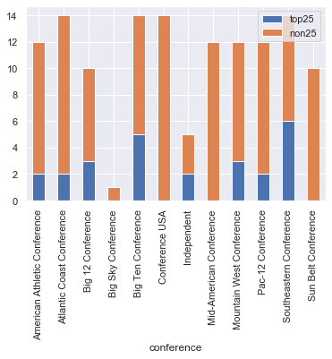

#### 2) Feature distribution and significance

```python
#sns.distplot(data['CompletionPercentage'])
sns.distplot(data2018['QBRating'])
print(shapiro(data2018['QBRating']))
qqplot(data2018['QBRating'], line='s')
plt.show()
print(shapiro(data2018['AverageCompletion']))
qqplot(data2018['AverageCompletion'], line='s')
plt.show()
print(shapiro(data2018['QBTouchdowns']))
qqplot(data2018['QBTouchdowns'], line='s')
plt.show()
data2018.plot.scatter(x='CompletionPercentage', y='y');
data2018.plot.scatter(x='QBRating', y='CompletionPercentage');
data2018.plot.scatter(x='QBRating', y='PassingYards');
data2018.plot.scatter(x='QBRating', y='y');
```

The W-statistic for QBRating, AverageCompletion, and QBTouchdowns, shows that it is highly likely the data is drawn from a Gaussian distribution. Additionally, the p-value is slightly higher or significantly lower than the alpha threshold of .1, indicating that it is unlikely that these results would be observed under the null hypothesis and the null hypothesis can be rejected.

    (0.9831368327140808, 0.10715162754058838)
    


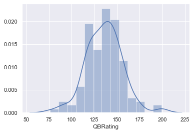


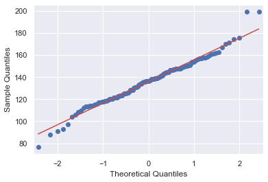


    (0.9665281772613525, 0.002681687707081437)
    


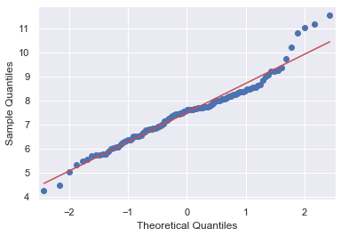


    (0.9542575478553772, 0.0002441542746964842)
    


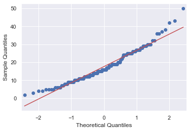
   
#### 3) Feature correlation

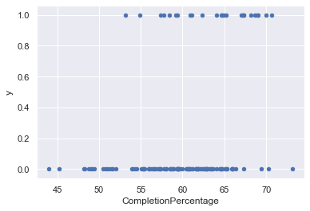


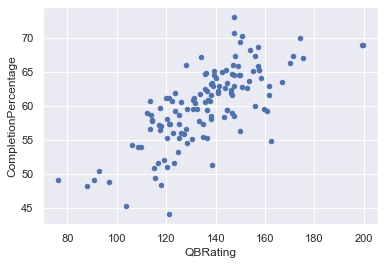


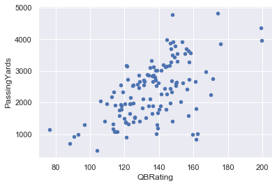


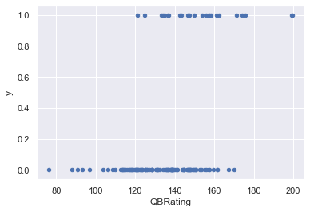


```python
corrmat2018 = data2018.corr()
#display(corrmat)
#average passing yards (46.4%) and qbrating (48.8%) are the most correlated with whether or not making it to top25
```


```python
f, ax = plt.subplots(figsize=(12, 12))
sns.heatmap(corrmat2018, vmax=.8, square=True);
```

Below is a heat map to see the correlation of the predictors with each other and
the target field. While much of the broad heat map is true red (indicating nearly 
0 correlation), there is a distinct pattern of squares, indicating significant 
correlation between fields. This tends to indicate a single player's statistics, 
which are highly correlated with each other. Additionally, the top left contains 
a larger square, where the quarterback and primary receiver's statistics show high 
levels of correlation. Finally there are two diagonal patterns above and below the 
center diagonal in the bottom right of the chart. These are high correlations in the 
same stats between the two defensive stats leaders evaluated; in some cases, these
could be the same player, leading to high correlation.

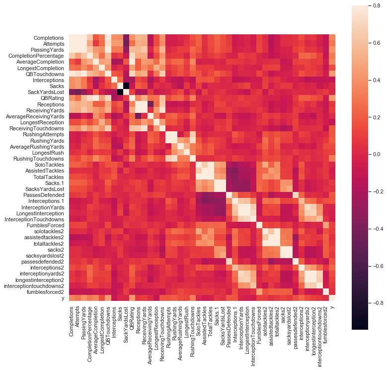


```python
pairs2018 = corrmat2018['y'].abs().sort_values(ascending=False)
pairs2018 = pairs2018[pairs2018!=1]
print(pairs2018[0:5])
print(pairs2018)
```

Here we can see the top five features that have the highest correlation to top 25 teams. This shows evidence that have a very good passing game is important to a teams ranking.

    QBTouchdowns         0.439608
    QBRating             0.420781
    PassingYards         0.408534
    AverageCompletion    0.360998
    Completions          0.344052

    Name: y, dtype: float64
    QBTouchdowns               0.439608
    QBRating                   0.420781
    PassingYards               0.408534
    AverageCompletion          0.360998
    Completions                0.344052
    RushingTouchdowns          0.325614
    CompletionPercentage       0.315978
    Attempts                   0.297411
    interceptions2             0.231004
    RushingYards               0.203099
    ReceivingTouchdowns        0.183028
    PassesDefended             0.182274
    Interceptions.1            0.175058
    RushingAttempts            0.173930
    passesdefended2            0.156667
    AverageRushingYards        0.144478
    interceptionyards2         0.140950
    LongestCompletion          0.139173
    LongestRush                0.123929
    FumblesForced              0.117996
    sacks2                     0.117728
    longestinterception2       0.117477
    Interceptions              0.102940
    LongestReception           0.099535
    ReceivingYards             0.093496
    solotackles2               0.087416
    sacksyardslost2            0.075888
    Sacks.1                    0.075836
    interceptiontouchdowns2    0.074948
    totaltackles2              0.072841
    Receptions                 0.064869
    InterceptionTouchdowns     0.058030
    AssistedTackles            0.054361
    SacksYardsLost             0.049912
    assistedtackles2           0.042727
    fumblesforced2             0.039301
    LongestInterception        0.033558
    TotalTackles               0.030793
    AverageReceivingYards      0.023466
    InterceptionYards          0.017590
    SackYardsLost              0.005622
    Sacks                      0.003528
    SoloTackles                0.001159
    Name: y, dtype: float64
    


```python
sns.set()
cols = pairs2018[0:5].index
sns.pairplot(data2018[cols], height = 2.5)
plt.show();
```

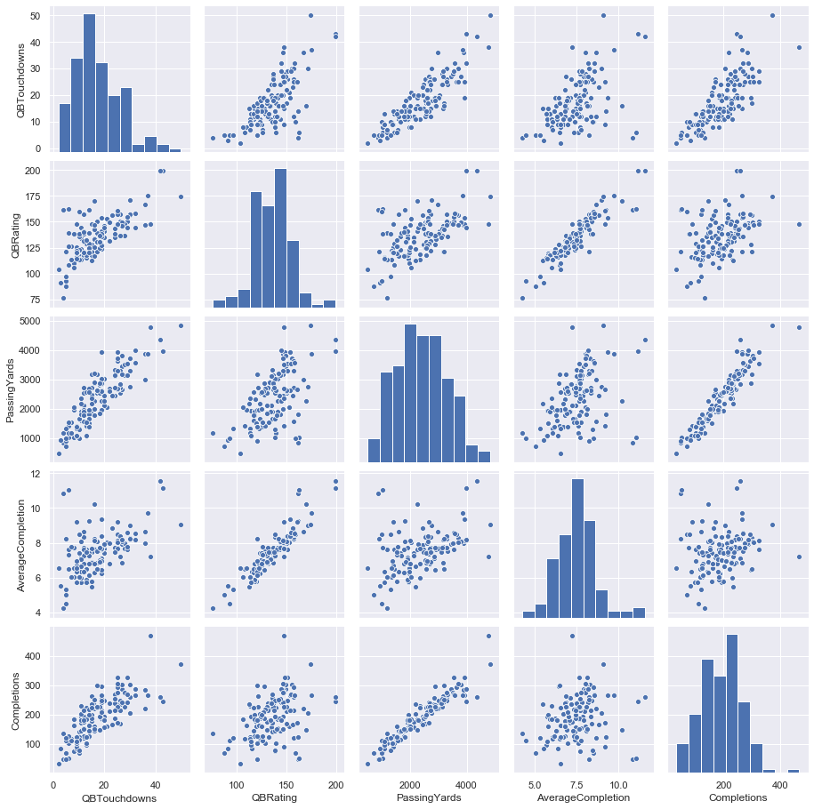


```python
box = pd.concat([data2018['QBRating'], data2018['y']], axis=1)
box = box.rename(columns={"y": "top 25"})
box.loc[(box["top 25"] == 0),"top 25"]='non-top 25'
box.loc[(box["top 25"] == 1),"top 25"]='top 25'
fig = sns.catplot(x="top 25", y='QBRating', kind='box', data=box)
```

#### 4) Exploratory data analysis summary

It quickly became evident that QBrating, itself an aggregated score based
on other factors, is a nice summary field and quite predictive. In the box
plots below, we see that the 25th percentile QB rating for a top 25 team was
still higher than the 50th percentile for a non-top 25 team, showing the dif-
ferentiation strength in this field.

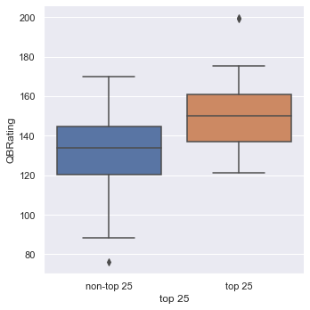


```python
box = pd.concat([data2018['QBRating'], rawdata2018['conference']], axis=1)
display(box)
f, ax = plt.subplots(figsize=(8, 6))
fig = sns.boxplot(x='QBRating', y="conference", data=box)
```


<div>
<style scoped>
    .dataframe tbody tr th:only-of-type {
        vertical-align: middle;
    }

    .dataframe tbody tr th {
        vertical-align: top;
    }

    .dataframe thead th {
        text-align: right;
    }
</style>
<table border="1" class="dataframe">
  <thead>
    <tr style="text-align: right;">
      <th></th>
      <th>QBRating</th>
      <th>conference</th>
    </tr>
  </thead>
  <tbody>
    <tr>
      <th>0</th>
      <td>161.665482</td>
      <td>Mountain West Conference</td>
    </tr>
    <tr>
      <th>1</th>
      <td>119.046684</td>
      <td>Mid-American Conference</td>
    </tr>
    <tr>
      <th>2</th>
      <td>199.450623</td>
      <td>Southeastern Conference</td>
    </tr>
    <tr>
      <th>3</th>
      <td>152.592667</td>
      <td>Sun Belt Conference</td>
    </tr>
    <tr>
      <th>4</th>
      <td>149.770386</td>
      <td>Pac-12 Conference</td>
    </tr>
    <tr>
      <th>...</th>
      <td>...</td>
      <td>...</td>
    </tr>
    <tr>
      <th>125</th>
      <td>175.485870</td>
      <td>Big 12 Conference</td>
    </tr>
    <tr>
      <th>126</th>
      <td>114.257156</td>
      <td>Conference USA</td>
    </tr>
    <tr>
      <th>127</th>
      <td>146.653625</td>
      <td>Mid-American Conference</td>
    </tr>
    <tr>
      <th>128</th>
      <td>132.480041</td>
      <td>Big Ten Conference</td>
    </tr>
    <tr>
      <th>129</th>
      <td>96.965309</td>
      <td>Mountain West Conference</td>
    </tr>
  </tbody>
</table>
<p>130 rows × 2 columns</p>
</div>

To understand the combined strength of the QB rating and conference, I
have done a combined box plot. When compared with the team's conference,
we see the wide variation in skill level that some conferences have. The Big
12 and Big Ten, for example, have nearly 100 point ranges for the rating,
while Pac-12 and Sun Belt Conferences are quite compact.

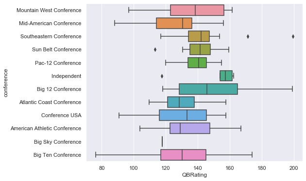


```python
rawdata2019 = pd.read_csv('2019.csv')
display(rawdata2019.head())

csq=chi2_contingency(pd.crosstab(rawdata2019['AP_top_25'], rawdata2019['conference_categorical']))
print("Relationship between top 25 and conference P-value: ",csq[1])

#print(ncaaf['FumblesTouchdowns'].sum())
#ncaaf = ncaaf.drop(columns=['FumblesRecovered', 'FumblesTouchdowns', 'fumblesrecovered2', 'fumblestouchdowns2'])
cols = [c for c in rawdata2019.columns if c.lower()[:4] != 'team' and c.lower()[:4] != 'play' and c.lower()[:4] != 'espn' and c.lower()[:4] != 'conf' and c != 'r']
data2019 = rawdata2019[cols]
data2019 = data2019.rename(columns = {data2019.columns[43]: "y"})
display(data2019.head()) #all numerical
print(data2019.columns)
print(data2019['y'].describe())
print(data2019['QBRating'].describe())
```


<div>
<style scoped>
    .dataframe tbody tr th:only-of-type {
        vertical-align: middle;
    }

    .dataframe tbody tr th {
        vertical-align: top;
    }

    .dataframe thead th {
        text-align: right;
    }
</style>
<table border="1" class="dataframe">
  <thead>
    <tr style="text-align: right;">
      <th></th>
      <th>team</th>
      <th>Completions</th>
      <th>Attempts</th>
      <th>PassingYards</th>
      <th>CompletionPercentage</th>
      <th>AverageCompletion</th>
      <th>LongestCompletion</th>
      <th>QBTouchdowns</th>
      <th>Interceptions</th>
      <th>Sacks</th>
      <th>...</th>
      <th>sacks2</th>
      <th>sacksyardslost2</th>
      <th>passesdefended2</th>
      <th>interceptions2</th>
      <th>interceptionyards2</th>
      <th>longestinterception2</th>
      <th>interceptiontouchdowns2</th>
      <th>fumblesforced2</th>
      <th>conference_categorical</th>
      <th>AP_top_25</th>
    </tr>
  </thead>
  <tbody>
    <tr>
      <th>0</th>
      <td>Air Force</td>
      <td>56</td>
      <td>111</td>
      <td>1316</td>
      <td>50.450001</td>
      <td>11.856</td>
      <td>81</td>
      <td>13</td>
      <td>6</td>
      <td>4</td>
      <td>...</td>
      <td>0</td>
      <td>0</td>
      <td>4</td>
      <td>3</td>
      <td>99</td>
      <td>92</td>
      <td>1</td>
      <td>0</td>
      <td>9</td>
      <td>1</td>
    </tr>
    <tr>
      <th>1</th>
      <td>Akron</td>
      <td>150</td>
      <td>279</td>
      <td>1822</td>
      <td>53.763000</td>
      <td>6.530</td>
      <td>87</td>
      <td>11</td>
      <td>6</td>
      <td>43</td>
      <td>...</td>
      <td>1</td>
      <td>8</td>
      <td>2</td>
      <td>1</td>
      <td>64</td>
      <td>64</td>
      <td>1</td>
      <td>0</td>
      <td>8</td>
      <td>0</td>
    </tr>
    <tr>
      <th>2</th>
      <td>Alabama</td>
      <td>180</td>
      <td>252</td>
      <td>2840</td>
      <td>71.429001</td>
      <td>11.270</td>
      <td>85</td>
      <td>33</td>
      <td>3</td>
      <td>10</td>
      <td>...</td>
      <td>0</td>
      <td>0</td>
      <td>3</td>
      <td>4</td>
      <td>54</td>
      <td>36</td>
      <td>0</td>
      <td>0</td>
      <td>11</td>
      <td>1</td>
    </tr>
    <tr>
      <th>3</th>
      <td>Appalachian State</td>
      <td>225</td>
      <td>359</td>
      <td>2718</td>
      <td>62.674000</td>
      <td>7.571</td>
      <td>73</td>
      <td>28</td>
      <td>6</td>
      <td>18</td>
      <td>...</td>
      <td>0</td>
      <td>0</td>
      <td>8</td>
      <td>5</td>
      <td>54</td>
      <td>30</td>
      <td>2</td>
      <td>1</td>
      <td>12</td>
      <td>1</td>
    </tr>
    <tr>
      <th>4</th>
      <td>Arizona</td>
      <td>160</td>
      <td>266</td>
      <td>1954</td>
      <td>60.150002</td>
      <td>7.346</td>
      <td>75</td>
      <td>14</td>
      <td>11</td>
      <td>19</td>
      <td>...</td>
      <td>0</td>
      <td>0</td>
      <td>7</td>
      <td>4</td>
      <td>29</td>
      <td>14</td>
      <td>0</td>
      <td>0</td>
      <td>10</td>
      <td>0</td>
    </tr>
  </tbody>
</table>
<p>5 rows × 46 columns</p>
</div>


    Relationship between top 25 and conference P-value:  0.07510413466966305
    


<div>
<style scoped>
    .dataframe tbody tr th:only-of-type {
        vertical-align: middle;
    }

    .dataframe tbody tr th {
        vertical-align: top;
    }

    .dataframe thead th {
        text-align: right;
    }
</style>
<table border="1" class="dataframe">
  <thead>
    <tr style="text-align: right;">
      <th></th>
      <th>Completions</th>
      <th>Attempts</th>
      <th>PassingYards</th>
      <th>CompletionPercentage</th>
      <th>AverageCompletion</th>
      <th>LongestCompletion</th>
      <th>QBTouchdowns</th>
      <th>Interceptions</th>
      <th>Sacks</th>
      <th>SackYardsLost</th>
      <th>...</th>
      <th>totaltackles2</th>
      <th>sacks2</th>
      <th>sacksyardslost2</th>
      <th>passesdefended2</th>
      <th>interceptions2</th>
      <th>interceptionyards2</th>
      <th>longestinterception2</th>
      <th>interceptiontouchdowns2</th>
      <th>fumblesforced2</th>
      <th>y</th>
    </tr>
  </thead>
  <tbody>
    <tr>
      <th>0</th>
      <td>56</td>
      <td>111</td>
      <td>1316</td>
      <td>50.450001</td>
      <td>11.856</td>
      <td>81</td>
      <td>13</td>
      <td>6</td>
      <td>4</td>
      <td>-22</td>
      <td>...</td>
      <td>18</td>
      <td>0</td>
      <td>0</td>
      <td>4</td>
      <td>3</td>
      <td>99</td>
      <td>92</td>
      <td>1</td>
      <td>0</td>
      <td>1</td>
    </tr>
    <tr>
      <th>1</th>
      <td>150</td>
      <td>279</td>
      <td>1822</td>
      <td>53.763000</td>
      <td>6.530</td>
      <td>87</td>
      <td>11</td>
      <td>6</td>
      <td>43</td>
      <td>-219</td>
      <td>...</td>
      <td>138</td>
      <td>1</td>
      <td>8</td>
      <td>2</td>
      <td>1</td>
      <td>64</td>
      <td>64</td>
      <td>1</td>
      <td>0</td>
      <td>0</td>
    </tr>
    <tr>
      <th>2</th>
      <td>180</td>
      <td>252</td>
      <td>2840</td>
      <td>71.429001</td>
      <td>11.270</td>
      <td>85</td>
      <td>33</td>
      <td>3</td>
      <td>10</td>
      <td>-63</td>
      <td>...</td>
      <td>59</td>
      <td>0</td>
      <td>0</td>
      <td>3</td>
      <td>4</td>
      <td>54</td>
      <td>36</td>
      <td>0</td>
      <td>0</td>
      <td>1</td>
    </tr>
    <tr>
      <th>3</th>
      <td>225</td>
      <td>359</td>
      <td>2718</td>
      <td>62.674000</td>
      <td>7.571</td>
      <td>73</td>
      <td>28</td>
      <td>6</td>
      <td>18</td>
      <td>-107</td>
      <td>...</td>
      <td>45</td>
      <td>0</td>
      <td>0</td>
      <td>8</td>
      <td>5</td>
      <td>54</td>
      <td>30</td>
      <td>2</td>
      <td>1</td>
      <td>1</td>
    </tr>
    <tr>
      <th>4</th>
      <td>160</td>
      <td>266</td>
      <td>1954</td>
      <td>60.150002</td>
      <td>7.346</td>
      <td>75</td>
      <td>14</td>
      <td>11</td>
      <td>19</td>
      <td>-120</td>
      <td>...</td>
      <td>47</td>
      <td>0</td>
      <td>0</td>
      <td>7</td>
      <td>4</td>
      <td>29</td>
      <td>14</td>
      <td>0</td>
      <td>0</td>
      <td>0</td>
    </tr>
  </tbody>
</table>
<p>5 rows × 44 columns</p>
</div>


    Index(['Completions', 'Attempts', 'PassingYards', 'CompletionPercentage',
           'AverageCompletion', 'LongestCompletion', 'QBTouchdowns',
           'Interceptions', 'Sacks', 'SackYardsLost', 'QBRating', 'Receptions',
           'ReceivingYards', 'AverageReceivingYards', 'LongestReception',
           'ReceivingTouchdowns', 'RushingAttempts', 'RushingYards',
           'AverageRushingYards', 'LongestRush', 'RushingTouchdowns',
           'SoloTackles', 'AssistedTackles', 'TotalTackles', 'Sacks.1',
           'SacksYardsLost', 'PassesDefended', 'Interceptions.1',
           'InterceptionYards', 'LongestInterception', 'InterceptionTouchdowns',
           'FumblesForced', 'solotackles2', 'assistedtackles2', 'totaltackles2',
           'sacks2', 'sacksyardslost2', 'passesdefended2', 'interceptions2',
           'interceptionyards2', 'longestinterception2', 'interceptiontouchdowns2',
           'fumblesforced2', 'y'],
          dtype='object')
    count    131.000000
    mean       0.190840
    std        0.394471
    min        0.000000
    25%        0.000000
    50%        0.000000
    75%        0.000000
    max        1.000000
    Name: y, dtype: float64
    count    131.000000
    mean     138.697629
    std       21.322280
    min       82.885071
    25%      125.215012
    50%      138.550446
    75%      148.743362
    max      206.931274
    Name: QBRating, dtype: float64
    
## Create and train models

I applied a variety of techniques to the data set to determine which was the
best differentiator of the 0/1 target, inclusion in the AP Top 25. Modeling
techniques attempted include:

- adaboost
- decision tree
- k nearest neighbors clustering
- logistic regression
- naive Bayes algorithm
- neural network
- random forest
- support vector machine

I set the data up such that the 2018 season was the training data set and
the 2019 was our out of time validation. Predictive accuracy shown below is
on the 2019 predictions, based on models created with the prior season.
One point that I would like to make clear - I am examining correlation
and not implying causation in this analysis. The statistics credited to any
given player are not achieved by that player alone; a quarterback cannot put
up large passing yardage numbers without an effective offensive line blocking
or a wide receiver who can get open and make the play. As such, I am seeking to
understand the ability of these statistics to predict the team's ranking, but
am not suggesting that, absent the remaining team members, these metrics
and therefore the team outcomes are possible.

```python
from sklearn.neural_network import MLPClassifier
from sklearn.metrics import accuracy_score, confusion_matrix, classification_report
from sklearn.model_selection import cross_val_score, GridSearchCV, cross_validate, train_test_split
from sklearn import preprocessing

np.random.seed(1)

x_train = data2018.iloc[:,:-1]
#x_data = preprocessing.normalize(x_data, norm='l2')
x_train = preprocessing.scale(x_train)
y_train = data2018.iloc[:,-1]

x_test = data2019.iloc[:,:-1]
x_test = preprocessing.scale(x_test)
y_test = data2019.iloc[:,-1]

#x_train, x_test, y_train, y_test = train_test_split(x_data, y_data, test_size = 0.2, shuffle = True)

neuralnet = MLPClassifier(hidden_layer_sizes=(4,2), learning_rate_init=0.01, max_iter=100000).fit(x_train, y_train)
print(confusion_matrix(y_test, neuralnet.predict(x_test)))
print("neural networks accuracy on test:",neuralnet.score(x_test, y_test))

from sklearn.svm import SVC
svm = SVC()
svm.fit(x_train, y_train)
print("pre-tune svm accuracy on training:",svm.score(x_train, y_train))
print("pre-tune svm accuracy on test:",svm.score(x_test, y_test))

from sklearn.linear_model import LogisticRegression

logitmodel = LogisticRegression(penalty='elasticnet',solver='saga',l1_ratio = 0.5, max_iter=1000000).fit(x_train,y_train)
logitpred = logitmodel.predict(x_test)
print(logitpred)
logitacc = accuracy_score(y_test,logitpred)
print("Logistic Regression Accuracy:",logitacc)
confusion_matrix(y_test,logitpred)

from sklearn.neighbors import KNeighborsClassifier

knnmodel = KNeighborsClassifier().fit(x_train,y_train)
knnpred = knnmodel.predict(x_test)
knnacc = accuracy_score(y_test,knnpred)
print("KNN Accuracy:",knnacc)
confusion_matrix(y_test,knnpred)

from sklearn.naive_bayes import GaussianNB

nbmodel = GaussianNB(var_smoothing=10**(-3)).fit(x_train, y_train)
nbpred = nbmodel.predict(x_test)
nbacc = accuracy_score(y_test,nbpred)
print("Naive Bayes Accuracy:",nbacc)
confusion_matrix(y_test,nbpred)

from sklearn.tree import DecisionTreeClassifier

dt = DecisionTreeClassifier()
dtmodeltuned = GridSearchCV(estimator=dt,
                     param_grid={'max_depth': np.arange(1,31)},
                     scoring='roc_auc',
                     cv=5)
dtmodeltuned.fit(x_train, y_train)
y_pred_dt_test = dtmodeltuned.predict(x_test)
print(dtmodeltuned.best_params_)
print("Decision Tree Accuracy:",accuracy_score(y_pred_dt_test, y_test))

from sklearn.ensemble import RandomForestClassifier

rf = RandomForestClassifier()
#rfmodel = rf.fit(x_train, y_train)

rfmodeltuned = GridSearchCV(estimator=rf, param_grid={'max_depth':np.arange(1,31)},
                     cv=5,
                     scoring='roc_auc')
rfmodeltuned.fit(x_train, y_train)

#y_pred_rf = model_rf.predict(x_train)
#print(accuracy_score(y_pred_rf, y_train))
y_pred_rf_test = rfmodeltuned.predict(x_test)
print(rfmodeltuned.best_params_)
print("Random Forest Accuracy:",accuracy_score(y_pred_rf_test, y_test))
display(pd.DataFrame(rfmodeltuned.cv_results_).sort_values(by='rank_test_score',ascending=True).head(10))
#importances = rfmodeltuned.feature_importances_
#print(importances)
#indices = np.argsort(importances)[::-1]
#print("important features:",data.columns[indices])

from sklearn.ensemble import AdaBoostClassifier
adaboost = AdaBoostClassifier(n_estimators=10000)
adaboost = adaboost.fit(x_train, y_train)
print("AdaBoost Accuracy:",adaboost.score(x_test, y_test))

#from sklearn.cluster import KMeans
#kmeans = KMeans(n_clusters=2, random_state=0).fit(x_data)
```

    [[94 12]
     [13 12]]
    neural networks accuracy on test: 0.8091603053435115
    pre-tune svm accuracy on training: 0.9461538461538461
    pre-tune svm accuracy on test: 0.816793893129771
    [0 0 1 1 0 0 0 0 0 0 1 0 0 0 0 0 0 0 0 0 0 0 0 0 0 0 0 0 1 0 0 0 0 0 0 0 0
     0 0 0 0 0 0 0 0 0 0 0 0 0 1 0 0 1 0 0 0 1 0 0 0 0 0 0 0 0 1 0 0 0 0 0 0 0
     0 0 0 0 1 0 0 0 0 1 0 0 0 0 0 0 1 0 0 0 0 0 1 0 0 0 0 0 0 0 0 0 0 0 0 0 0
     0 0 0 1 0 1 0 0 0 0 0 0 1 1 0 0 0 1 0 0]
    Logistic Regression Accuracy: 0.816793893129771
    KNN Accuracy: 0.8549618320610687
    Naive Bayes Accuracy: 0.7862595419847328
    {'max_depth': 3}
    Decision Tree Accuracy: 0.8091603053435115
    {'max_depth': 8}
    Random Forest Accuracy: 0.8320610687022901
    


<div>
<style scoped>
    .dataframe tbody tr th:only-of-type {
        vertical-align: middle;
    }

    .dataframe tbody tr th {
        vertical-align: top;
    }

    .dataframe thead th {
        text-align: right;
    }
</style>
<table border="1" class="dataframe">
  <thead>
    <tr style="text-align: right;">
      <th></th>
      <th>mean_fit_time</th>
      <th>std_fit_time</th>
      <th>mean_score_time</th>
      <th>std_score_time</th>
      <th>param_max_depth</th>
      <th>params</th>
      <th>split0_test_score</th>
      <th>split1_test_score</th>
      <th>split2_test_score</th>
      <th>split3_test_score</th>
      <th>split4_test_score</th>
      <th>mean_test_score</th>
      <th>std_test_score</th>
      <th>rank_test_score</th>
    </tr>
  </thead>
  <tbody>
    <tr>
      <th>7</th>
      <td>0.335908</td>
      <td>0.107007</td>
      <td>0.036530</td>
      <td>0.027093</td>
      <td>8</td>
      <td>{'max_depth': 8}</td>
      <td>0.895238</td>
      <td>0.733333</td>
      <td>0.776190</td>
      <td>0.704762</td>
      <td>0.961905</td>
      <td>0.814286</td>
      <td>0.098331</td>
      <td>1</td>
    </tr>
    <tr>
      <th>11</th>
      <td>0.190920</td>
      <td>0.015072</td>
      <td>0.013918</td>
      <td>0.003101</td>
      <td>12</td>
      <td>{'max_depth': 12}</td>
      <td>0.866667</td>
      <td>0.761905</td>
      <td>0.771429</td>
      <td>0.714286</td>
      <td>0.957143</td>
      <td>0.814286</td>
      <td>0.086871</td>
      <td>1</td>
    </tr>
    <tr>
      <th>26</th>
      <td>0.213712</td>
      <td>0.012762</td>
      <td>0.015596</td>
      <td>0.002735</td>
      <td>27</td>
      <td>{'max_depth': 27}</td>
      <td>0.861905</td>
      <td>0.709524</td>
      <td>0.809524</td>
      <td>0.757143</td>
      <td>0.923810</td>
      <td>0.812381</td>
      <td>0.075509</td>
      <td>3</td>
    </tr>
    <tr>
      <th>18</th>
      <td>0.184676</td>
      <td>0.006516</td>
      <td>0.013240</td>
      <td>0.001120</td>
      <td>19</td>
      <td>{'max_depth': 19}</td>
      <td>0.923810</td>
      <td>0.752381</td>
      <td>0.752381</td>
      <td>0.657143</td>
      <td>0.971429</td>
      <td>0.811429</td>
      <td>0.117479</td>
      <td>4</td>
    </tr>
    <tr>
      <th>4</th>
      <td>0.565932</td>
      <td>0.270572</td>
      <td>0.077565</td>
      <td>0.061481</td>
      <td>5</td>
      <td>{'max_depth': 5}</td>
      <td>0.885714</td>
      <td>0.714286</td>
      <td>0.809524</td>
      <td>0.695238</td>
      <td>0.952381</td>
      <td>0.811429</td>
      <td>0.098312</td>
      <td>5</td>
    </tr>
    <tr>
      <th>10</th>
      <td>0.188528</td>
      <td>0.023570</td>
      <td>0.013572</td>
      <td>0.002284</td>
      <td>11</td>
      <td>{'max_depth': 11}</td>
      <td>0.919048</td>
      <td>0.757143</td>
      <td>0.780952</td>
      <td>0.652381</td>
      <td>0.942857</td>
      <td>0.810476</td>
      <td>0.107724</td>
      <td>6</td>
    </tr>
    <tr>
      <th>22</th>
      <td>0.204820</td>
      <td>0.019892</td>
      <td>0.013236</td>
      <td>0.001621</td>
      <td>23</td>
      <td>{'max_depth': 23}</td>
      <td>0.914286</td>
      <td>0.761905</td>
      <td>0.700000</td>
      <td>0.695238</td>
      <td>0.952381</td>
      <td>0.804762</td>
      <td>0.108254</td>
      <td>7</td>
    </tr>
    <tr>
      <th>28</th>
      <td>0.212919</td>
      <td>0.044503</td>
      <td>0.015496</td>
      <td>0.005727</td>
      <td>29</td>
      <td>{'max_depth': 29}</td>
      <td>0.876190</td>
      <td>0.738095</td>
      <td>0.790476</td>
      <td>0.652381</td>
      <td>0.966667</td>
      <td>0.804762</td>
      <td>0.108797</td>
      <td>8</td>
    </tr>
    <tr>
      <th>12</th>
      <td>0.219141</td>
      <td>0.038183</td>
      <td>0.015095</td>
      <td>0.003886</td>
      <td>13</td>
      <td>{'max_depth': 13}</td>
      <td>0.861905</td>
      <td>0.761905</td>
      <td>0.785714</td>
      <td>0.652381</td>
      <td>0.961905</td>
      <td>0.804762</td>
      <td>0.103323</td>
      <td>8</td>
    </tr>
    <tr>
      <th>20</th>
      <td>0.197889</td>
      <td>0.010379</td>
      <td>0.013528</td>
      <td>0.001187</td>
      <td>21</td>
      <td>{'max_depth': 21}</td>
      <td>0.885714</td>
      <td>0.771429</td>
      <td>0.776190</td>
      <td>0.633333</td>
      <td>0.952381</td>
      <td>0.803810</td>
      <td>0.109229</td>
      <td>10</td>
    </tr>
  </tbody>
</table>
</div>


    AdaBoost Accuracy: 0.8396946564885496
    
# Evaluation and Final Results

When the model of the 2018 season is used to predict the top 25 finishers
of 2019, we find that the various techniques tested had 79-87% accuracy on
the test sample. These results are reasonable, but not particularly strong.
This shows that the individual stats are insufficient to generate the predictive
power I would like.

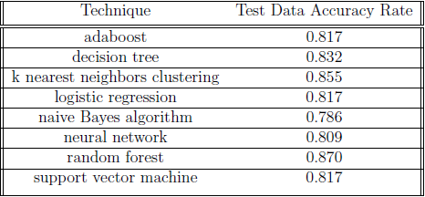

While the existing data is relatively unbiased (it contains all teams from the
2018 season, but I have not tested if the season itself could be biased in a
meaningful way), it is unclear if the data itself is sufficient to generate the
results I desire. If I were to attempt to further improve the model, there
are a number of things we could try to make a more robust training sample:

- Increase sample size: It's likely that increasing the number of seasons
used in the training would result in a more robust model being created.

- Increase the breadth of data: By including other team-level statistics, 
I could build a stronger model. This might include strength of
schedule statistics, win-loss records, and perhaps some information on
coaching staff, for example.

- Increase the depth of data: While I currently have statistics on 5
players within each team, I could certainly pull some stats on the
rest of the team and likely create additional leverage for the model.

In conclusion, I was able to construct several reasonable but not incredibly 
powerful predictors of the top 25 finishers for a football season. Most
techniques performed similarly, with random forest having the strongest out-
of-time validation with 87.0% accuracy. Several data expansion recommendations 
would likely improve the strength of the model and could be considered
for future testing.