# Problem Statement

Traditionally, gene classification is approached through various biological and computational methods, including manual annotation and simpler machine learning models that often require extensive preprocessing of data [4]. Current computational methods leverage sequence alignment and statistical models to predict gene functions, but they struggle with the vast variability and complexity of genomic data [5]. These methods are often limited by their inability to process large datasets efficiently and may not capture the intricate patterns within DNA sequences that deep learning models are potentially capable of [6]. Recently, Magnusson et al. used DNNs to identify gene-regulating sequences, and reported to found 125 ”core” sequences that
the DNN models identified, which was previoulsy thought to be around 1600 different gene sequences [7]. Zhang. et al. recently published a deep-learning model DeepHe to predict gene sequences, which had some improved performance
compared to previous ML models but still lagged behind tradional gene annotting methods [8]. Thus, although progress is being made to implement deep learning models in the processing of genetic data and specifically gene prediction, we are still far from having deep learning models replace traditional manul annotation methods. This project aims to facilitate a deeper understanding of genetic structures across different species—humans, chimpanzees, and dogs—and identify the distinctive genetic markers that define them.

# Data

The gene sequences are classified into 7 distinct classes and the countsf for each class can be found in Table 1. To prepare DNA sequences for the DL models, two crucial preprocessing steps were implemented: padding and one-hot encoding. Here’s a brief description of the methods used:

### 1. Determination of Maximum Sequence Length: 
	The length of the longest DNA sequence in the dataset was first identified to establish a uniform sequence length across all samples. This uniformity is crucial for ensuring consistent input size for the neural network.

### 2. One-Hot Encoding and Padding: 
Each nucleotide in a DNA sequence was converted into a one-hot encoded
format. In this encoding scheme, nucleotides are represented as four-dimensional vectors: adenine (A) as [1, 0, 0, 0], thymine (T) as [0, 1, 0, 0], cytosine (C) as [0, 0, 1, 0], and guanine (G) as [0, 0, 0, 1]. For sequences
shorter than the established maximum length, zero padding was added to the end of the encoded sequence to achieve the required length. 

### 3. Application of Encoding and Padding: This encoding and padding process was applied across all DNA sequences in the dataset, transforming each sequence into a uniformly sized array of one-hot encoded nucleotides, padded as necessary to accommodate variations in the original sequence lengths. This methodology ensures that the neural network receives well-structured and uniform inputs, maintaining the integrity of the biological information in the sequences.

```python
import torch
import torch.nn as nn
import torch.optim as optim
from torch.utils.data import DataLoader, TensorDataset
import pandas as pd
import numpy as np

```

# Data Loading and One-hot encoding


```python
import pandas as pd
data=pd.read_csv("./input.out",sep="\t")
```


```python
df = pd.DataFrame(data)

```


```python
max_length = df['sequence'].str.len().max()

# Define a function to convert and pad sequences
def encode_and_pad(seq):
    mapping = {'A': [1, 0, 0, 0], 'T': [0, 1, 0, 0], 'C': [0, 0, 1, 0], 'G': [0, 0, 0, 1]}
    encoded = np.array([mapping[s] for s in seq] + [[0, 0, 0, 0]] * (max_length - len(seq)))  # pad with zeros
    return encoded

# Apply encoding and padding
df['encoded'] = df['sequence'].apply(encode_and_pad)
```


```python
print(max_length)
```

    9243
    


```python
labels = torch.tensor(df['class'].values)
features = torch.tensor(np.array(df['encoded'].tolist()), dtype=torch.float32)
```


```python
from sklearn.model_selection import train_test_split

# Split data into training, validation, and testing sets
train_val_features, test_features, train_val_labels, test_labels = train_test_split(
    features, labels, test_size=0.2, random_state=42)  #

train_features, val_features, train_labels, val_labels = train_test_split(
    train_val_features, train_val_labels, test_size=0.22, random_state=42)  # 22% of 90% for validation

# Convert to TensorDatasets
train_dataset = TensorDataset(train_features, train_labels)
val_dataset = TensorDataset(val_features, val_labels)
test_dataset = TensorDataset(test_features, test_labels)

torch.save(train_dataset, 'train_dataset.pt')
torch.save(val_dataset, 'val_dataset.pt')
torch.save(test_dataset, 'test_dataset.pt')

```


```python
train_dataset = torch.load('train_dataset.pt')
val_dataset = torch.load('val_dataset.pt')
test_dataset = torch.load('test_dataset.pt')

# Create DataLoaders
batch_size = 8
train_loader = DataLoader(train_dataset, batch_size=batch_size, shuffle=True)
val_loader = DataLoader(val_dataset, batch_size=batch_size, shuffle=True)
test_loader = DataLoader(test_dataset, batch_size=batch_size, shuffle=True)
```

# CNN Models


```python
class DNACNN(nn.Module):
    def __init__(self):
        super(DNACNN, self).__init__()
        self.conv1 = nn.Conv1d(4, 16, kernel_size=3, padding=1)
        self.pool = nn.MaxPool1d(2, 2)
        self.conv2 = nn.Conv1d(16, 32, kernel_size=3, padding=1)
        # Assuming output dimension from conv layers correctly calculated for linear layer
        self.fc1 = nn.Linear(32 * (9243 // 4), 64)
        self.fc2 = nn.Linear(64, 7)  # Change 2 to the actual number of classes you need
        self.activation = nn.ReLU()

    def forward(self, x):
      if x.shape[1] != 4:
        x = x.permute(0, 2, 1)
      x = self.pool(self.activation(self.conv1(x)))
      x = self.pool(self.activation(self.conv2(x)))
      x = x.view(-1, 32 * (max_length // 4))  # Flatten for the fully connected layer
      x = self.activation(self.fc1(x))
      x = self.fc2(x)
      return x
# Check for GPU
# device = "cpu"
device = torch.device("cuda" if torch.cuda.is_available() else "cpu")
print(f"Using {device} device")

# Instantiate the model and move it to the GPU if available
model = DNACNN().to(device)

# Loss and Optimizer
criterion = nn.CrossEntropyLoss()
optimizer = optim.Adam(model.parameters(), lr=0.0001)

```

    Using cuda device
    


```python
# Import required metrics and tools
from sklearn.metrics import accuracy_score, confusion_matrix, recall_score, roc_auc_score, roc_curve
import matplotlib.pyplot as plt

def evaluate(model, loader, device):
    model.eval()
    y_true, y_pred, y_scores = [], [], []
    with torch.no_grad():
        for sequences, labels in loader:
            sequences, labels = sequences.to(device), labels.to(device)
            labels = labels.type(torch.LongTensor)
            outputs = model(sequences)
            _, predicted = torch.max(outputs.data, 1)
            y_true.extend(labels.cpu().numpy())
            y_pred.extend(predicted.cpu().numpy())
            y_scores.extend(outputs.cpu().numpy()[:, 1])  # Probability scores for class 1
    return y_true, y_pred, y_scores


def plot_roc_curve(fpr, tpr, label=None):
    plt.plot(fpr, tpr, linewidth=2, label=label)
    plt.plot([0, 1], [0, 1], 'k--')  # Dashed diagonal
    plt.xlabel('False Positive Rate')
    plt.ylabel('True Positive Rate (Recall)')
    plt.title('ROC Curve')
    plt.show()

# Train the model
# model.train()
# Modify your training loop
for epoch in range(30):  # Run for more epochs depending on your dataset size and complexity
    model.train()
    train_true, train_pred, train_scores = [], [], []
    for sequences, labels in train_loader:
        sequences, labels = sequences.to(device), labels.to(device)
        labels = labels.type(torch.LongTensor).to(device)
        optimizer.zero_grad()
        outputs = model(sequences)
        loss = criterion(outputs, labels)
        loss.backward()
        optimizer.step()

        # Optionally collect predictions to calculate training accuracy
        _, predicted = torch.max(outputs.data, 1)
        train_true.extend(labels.cpu().numpy())
        train_pred.extend(predicted.cpu().numpy())

    # Calculate training accuracy
    train_accuracy = accuracy_score(train_true, train_pred)
    print(f'Epoch {epoch+1}, Training Accuracy: {train_accuracy:.2f}')

    # Validation
    val_true, val_pred, val_scores = evaluate(model, val_loader, device)
    val_accuracy = accuracy_score(val_true, val_pred)
    print(f'Epoch {epoch+1}, Validation Accuracy: {val_accuracy:.2f}')


```

    Epoch 1, Training Accuracy: 0.33
    Epoch 1, Validation Accuracy: 0.35
    Epoch 2, Training Accuracy: 0.38
    Epoch 2, Validation Accuracy: 0.45
    Epoch 3, Training Accuracy: 0.48
    Epoch 3, Validation Accuracy: 0.54
    Epoch 4, Training Accuracy: 0.59
    Epoch 4, Validation Accuracy: 0.60
    Epoch 5, Training Accuracy: 0.67
    Epoch 5, Validation Accuracy: 0.62
    Epoch 6, Training Accuracy: 0.73
    Epoch 6, Validation Accuracy: 0.66
    Epoch 7, Training Accuracy: 0.77
    Epoch 7, Validation Accuracy: 0.71
    Epoch 8, Training Accuracy: 0.81
    Epoch 8, Validation Accuracy: 0.71
    Epoch 9, Training Accuracy: 0.84
    Epoch 9, Validation Accuracy: 0.75
    Epoch 10, Training Accuracy: 0.87
    Epoch 10, Validation Accuracy: 0.75
    Epoch 11, Training Accuracy: 0.88
    Epoch 11, Validation Accuracy: 0.75
    Epoch 12, Training Accuracy: 0.89
    Epoch 12, Validation Accuracy: 0.76
    Epoch 13, Training Accuracy: 0.90
    Epoch 13, Validation Accuracy: 0.77
    Epoch 14, Training Accuracy: 0.92
    Epoch 14, Validation Accuracy: 0.78
    Epoch 15, Training Accuracy: 0.92
    Epoch 15, Validation Accuracy: 0.78
    Epoch 16, Training Accuracy: 0.93
    Epoch 16, Validation Accuracy: 0.78
    Epoch 17, Training Accuracy: 0.94
    Epoch 17, Validation Accuracy: 0.79
    Epoch 18, Training Accuracy: 0.95
    Epoch 18, Validation Accuracy: 0.78
    Epoch 19, Training Accuracy: 0.95
    Epoch 19, Validation Accuracy: 0.78
    Epoch 20, Training Accuracy: 0.96
    Epoch 20, Validation Accuracy: 0.77
    Epoch 21, Training Accuracy: 0.95
    Epoch 21, Validation Accuracy: 0.78
    Epoch 22, Training Accuracy: 0.97
    Epoch 22, Validation Accuracy: 0.79
    Epoch 23, Training Accuracy: 0.97
    Epoch 23, Validation Accuracy: 0.78
    Epoch 24, Training Accuracy: 0.97
    Epoch 24, Validation Accuracy: 0.78
    Epoch 25, Training Accuracy: 0.98
    Epoch 25, Validation Accuracy: 0.77
    Epoch 26, Training Accuracy: 0.98
    Epoch 26, Validation Accuracy: 0.79
    Epoch 27, Training Accuracy: 0.98
    Epoch 27, Validation Accuracy: 0.77
    Epoch 28, Training Accuracy: 0.98
    Epoch 28, Validation Accuracy: 0.78
    Epoch 29, Training Accuracy: 0.99
    Epoch 29, Validation Accuracy: 0.79
    Epoch 30, Training Accuracy: 0.99
    Epoch 30, Validation Accuracy: 0.79
    


```python
# Testing and Metrics
test_true, test_pred, test_scores = evaluate(model, test_loader, device)
test_accuracy = accuracy_score(test_true, test_pred)
conf_matrix = confusion_matrix(test_true, test_pred)


print("Testing Accuracy:", test_accuracy)
print("Confusion Matrix:\n", conf_matrix)


```

    Testing Accuracy: 0.7984615384615384
    Confusion Matrix:
     [[148   3   2   6   6   2   7]
     [  2 125   8   6   3   0  13]
     [  1   5  77   8   4   0  19]
     [  4   4   0 147  10   1  15]
     [ 11   9   2  12 149   2  21]
     [  1   3   1   2   6  59   2]
     [  2  15   4  23  16   1 333]]
    


```python
# Create DataLoaders
batch_size = 16
train_loader = DataLoader(train_dataset, batch_size=batch_size, shuffle=True)
val_loader = DataLoader(val_dataset, batch_size=batch_size, shuffle=True)
test_loader = DataLoader(test_dataset, batch_size=batch_size, shuffle=True)
```


```python
class DNACNN(nn.Module):
    def __init__(self):
        super(DNACNN, self).__init__()
        self.conv1 = nn.Conv1d(4, 16, kernel_size=3, padding=1)
        self.pool = nn.MaxPool1d(2, 2)
        self.conv2 = nn.Conv1d(16, 32, kernel_size=3, padding=1)
        # Assuming output dimension from conv layers correctly calculated for linear layer
        self.fc1 = nn.Linear(32 * (9243 // 4), 64)
        self.fc2 = nn.Linear(64, 7)  # Change 2 to the actual number of classes you need
        self.activation = nn.ReLU()

    def forward(self, x):
      if x.shape[1] != 4:
        x = x.permute(0, 2, 1)
      x = self.pool(self.activation(self.conv1(x)))
      x = self.pool(self.activation(self.conv2(x)))
      x = x.view(-1, 32 * (max_length // 4))  # Flatten for the fully connected layer
      x = self.activation(self.fc1(x))
      x = self.fc2(x)
      return x
# Check for GPU
# device = "cpu"
device = torch.device("cuda" if torch.cuda.is_available() else "cpu")
print(f"Using {device} device")

# Instantiate the model and move it to the GPU if available
model = DNACNN().to(device)

# Loss and Optimizer
criterion = nn.CrossEntropyLoss()
optimizer = optim.Adam(model.parameters(), lr=0.0001)

```

    Using cuda device
    


```python
# Import required metrics and tools
from sklearn.metrics import accuracy_score, confusion_matrix, recall_score, roc_auc_score, roc_curve
import matplotlib.pyplot as plt

def evaluate(model, loader, device):
    model.eval()
    y_true, y_pred, y_scores = [], [], []
    with torch.no_grad():
        for sequences, labels in loader:
            sequences, labels = sequences.to(device), labels.to(device)
            labels = labels.type(torch.LongTensor)
            outputs = model(sequences)
            _, predicted = torch.max(outputs.data, 1)
            y_true.extend(labels.cpu().numpy())
            y_pred.extend(predicted.cpu().numpy())
            y_scores.extend(outputs.cpu().numpy()[:, 1])  # Probability scores for class 1
    return y_true, y_pred, y_scores


def plot_roc_curve(fpr, tpr, label=None):
    plt.plot(fpr, tpr, linewidth=2, label=label)
    plt.plot([0, 1], [0, 1], 'k--')  # Dashed diagonal
    plt.xlabel('False Positive Rate')
    plt.ylabel('True Positive Rate (Recall)')
    plt.title('ROC Curve')
    plt.show()

# Train the model
# model.train()
# Modify your training loop
for epoch in range(30):  # Run for more epochs depending on your dataset size and complexity
    model.train()
    train_true, train_pred, train_scores = [], [], []
    for sequences, labels in train_loader:
        sequences, labels = sequences.to(device), labels.to(device)
        labels = labels.type(torch.LongTensor).to(device)
        optimizer.zero_grad()
        outputs = model(sequences)
        loss = criterion(outputs, labels)
        loss.backward()
        optimizer.step()

        # Optionally collect predictions to calculate training accuracy
        _, predicted = torch.max(outputs.data, 1)
        train_true.extend(labels.cpu().numpy())
        train_pred.extend(predicted.cpu().numpy())

    # Calculate training accuracy
    train_accuracy = accuracy_score(train_true, train_pred)
    print(f'Epoch {epoch+1}, Training Accuracy: {train_accuracy:.2f}')

    # Validation
    val_true, val_pred, val_scores = evaluate(model, val_loader, device)
    val_accuracy = accuracy_score(val_true, val_pred)
    print(f'Epoch {epoch+1}, Validation Accuracy: {val_accuracy:.2f}')
```

    Epoch 1, Training Accuracy: 0.31
    Epoch 1, Validation Accuracy: 0.34
    Epoch 2, Training Accuracy: 0.36
    Epoch 2, Validation Accuracy: 0.39
    Epoch 3, Training Accuracy: 0.41
    Epoch 3, Validation Accuracy: 0.40
    Epoch 4, Training Accuracy: 0.48
    Epoch 4, Validation Accuracy: 0.47
    Epoch 5, Training Accuracy: 0.56
    Epoch 5, Validation Accuracy: 0.57
    Epoch 6, Training Accuracy: 0.64
    Epoch 6, Validation Accuracy: 0.62
    Epoch 7, Training Accuracy: 0.70
    Epoch 7, Validation Accuracy: 0.65
    Epoch 8, Training Accuracy: 0.73
    Epoch 8, Validation Accuracy: 0.67
    Epoch 9, Training Accuracy: 0.78
    Epoch 9, Validation Accuracy: 0.67
    Epoch 10, Training Accuracy: 0.80
    Epoch 10, Validation Accuracy: 0.70
    Epoch 11, Training Accuracy: 0.81
    Epoch 11, Validation Accuracy: 0.73
    Epoch 12, Training Accuracy: 0.84
    Epoch 12, Validation Accuracy: 0.75
    Epoch 13, Training Accuracy: 0.86
    Epoch 13, Validation Accuracy: 0.75
    Epoch 14, Training Accuracy: 0.87
    Epoch 14, Validation Accuracy: 0.75
    Epoch 15, Training Accuracy: 0.88
    Epoch 15, Validation Accuracy: 0.77
    Epoch 16, Training Accuracy: 0.89
    Epoch 16, Validation Accuracy: 0.76
    Epoch 17, Training Accuracy: 0.90
    Epoch 17, Validation Accuracy: 0.78
    Epoch 18, Training Accuracy: 0.90
    Epoch 18, Validation Accuracy: 0.77
    Epoch 19, Training Accuracy: 0.91
    Epoch 19, Validation Accuracy: 0.76
    Epoch 20, Training Accuracy: 0.92
    Epoch 20, Validation Accuracy: 0.77
    Epoch 21, Training Accuracy: 0.92
    Epoch 21, Validation Accuracy: 0.77
    Epoch 22, Training Accuracy: 0.92
    Epoch 22, Validation Accuracy: 0.77
    Epoch 23, Training Accuracy: 0.93
    Epoch 23, Validation Accuracy: 0.78
    Epoch 24, Training Accuracy: 0.94
    Epoch 24, Validation Accuracy: 0.78
    Epoch 25, Training Accuracy: 0.94
    Epoch 25, Validation Accuracy: 0.79
    Epoch 26, Training Accuracy: 0.94
    Epoch 26, Validation Accuracy: 0.79
    Epoch 27, Training Accuracy: 0.95
    Epoch 27, Validation Accuracy: 0.79
    Epoch 28, Training Accuracy: 0.95
    Epoch 28, Validation Accuracy: 0.78
    Epoch 29, Training Accuracy: 0.95
    Epoch 29, Validation Accuracy: 0.80
    Epoch 30, Training Accuracy: 0.96
    Epoch 30, Validation Accuracy: 0.79
    


```python
# Testing and Metrics
test_true, test_pred, test_scores = evaluate(model, test_loader, device)
test_accuracy = accuracy_score(test_true, test_pred)
conf_matrix = confusion_matrix(test_true, test_pred)


print("Testing Accuracy:", test_accuracy)
print("Confusion Matrix:\n", conf_matrix)
```

    Testing Accuracy: 0.7915384615384615
    Confusion Matrix:
     [[134   4   2   6  14   4  10]
     [  1 127   2  11   7   0   9]
     [  1   5  73   2  13   0  20]
     [  1   6   0 142  13   0  19]
     [  5   5   2  12 158   2  22]
     [  2   4   0   4   8  47   9]
     [  2  11   1  14  16   2 348]]
    


```python
# Create DataLoaders
batch_size = 32
train_loader = DataLoader(train_dataset, batch_size=batch_size, shuffle=True)
val_loader = DataLoader(val_dataset, batch_size=batch_size, shuffle=True)
test_loader = DataLoader(test_dataset, batch_size=batch_size, shuffle=True)
```


```python
class DNACNN(nn.Module):
    def __init__(self):
        super(DNACNN, self).__init__()
        self.conv1 = nn.Conv1d(4, 16, kernel_size=3, padding=1)
        self.pool = nn.MaxPool1d(2, 2)
        self.conv2 = nn.Conv1d(16, 32, kernel_size=3, padding=1)
        # Assuming output dimension from conv layers correctly calculated for linear layer
        self.fc1 = nn.Linear(32 * (9243 // 4), 64)
        self.fc2 = nn.Linear(64, 7)  # Change 2 to the actual number of classes you need
        self.activation = nn.ReLU()

    def forward(self, x):
      if x.shape[1] != 4:
        x = x.permute(0, 2, 1)
      x = self.pool(self.activation(self.conv1(x)))
      x = self.pool(self.activation(self.conv2(x)))
      x = x.view(-1, 32 * (max_length // 4))  # Flatten for the fully connected layer
      x = self.activation(self.fc1(x))
      x = self.fc2(x)
      return x
# Check for GPU
# device = "cpu"
device = torch.device("cuda" if torch.cuda.is_available() else "cpu")
print(f"Using {device} device")

# Instantiate the model and move it to the GPU if available
model = DNACNN().to(device)

# Loss and Optimizer
criterion = nn.CrossEntropyLoss()
optimizer = optim.Adam(model.parameters(), lr=0.0001)
```

    Using cuda device
    


```python
# Import required metrics and tools
from sklearn.metrics import accuracy_score, confusion_matrix, recall_score, roc_auc_score, roc_curve
import matplotlib.pyplot as plt

def evaluate(model, loader, device):
    model.eval()
    y_true, y_pred, y_scores = [], [], []
    with torch.no_grad():
        for sequences, labels in loader:
            sequences, labels = sequences.to(device), labels.to(device)
            labels = labels.type(torch.LongTensor)
            outputs = model(sequences)
            _, predicted = torch.max(outputs.data, 1)
            y_true.extend(labels.cpu().numpy())
            y_pred.extend(predicted.cpu().numpy())
            y_scores.extend(outputs.cpu().numpy()[:, 1])  # Probability scores for class 1
    return y_true, y_pred, y_scores


def plot_roc_curve(fpr, tpr, label=None):
    plt.plot(fpr, tpr, linewidth=2, label=label)
    plt.plot([0, 1], [0, 1], 'k--')  # Dashed diagonal
    plt.xlabel('False Positive Rate')
    plt.ylabel('True Positive Rate (Recall)')
    plt.title('ROC Curve')
    plt.show()

# Train the model
# model.train()
# Modify your training loop
for epoch in range(30):  # Run for more epochs depending on your dataset size and complexity
    model.train()
    train_true, train_pred, train_scores = [], [], []
    for sequences, labels in train_loader:
        sequences, labels = sequences.to(device), labels.to(device)
        labels = labels.type(torch.LongTensor).to(device)
        optimizer.zero_grad()
        outputs = model(sequences)
        loss = criterion(outputs, labels)
        loss.backward()
        optimizer.step()

        # Optionally collect predictions to calculate training accuracy
        _, predicted = torch.max(outputs.data, 1)
        train_true.extend(labels.cpu().numpy())
        train_pred.extend(predicted.cpu().numpy())

    # Calculate training accuracy
    train_accuracy = accuracy_score(train_true, train_pred)
    print(f'Epoch {epoch+1}, Training Accuracy: {train_accuracy:.2f}')

    # Validation
    val_true, val_pred, val_scores = evaluate(model, val_loader, device)
    val_accuracy = accuracy_score(val_true, val_pred)
    print(f'Epoch {epoch+1}, Validation Accuracy: {val_accuracy:.2f}')
```

    Epoch 1, Training Accuracy: 0.32
    Epoch 1, Validation Accuracy: 0.34
    Epoch 2, Training Accuracy: 0.34
    Epoch 2, Validation Accuracy: 0.33
    Epoch 3, Training Accuracy: 0.34
    Epoch 3, Validation Accuracy: 0.35
    Epoch 4, Training Accuracy: 0.36
    Epoch 4, Validation Accuracy: 0.34
    Epoch 5, Training Accuracy: 0.37
    Epoch 5, Validation Accuracy: 0.37
    Epoch 6, Training Accuracy: 0.41
    Epoch 6, Validation Accuracy: 0.45
    Epoch 7, Training Accuracy: 0.47
    Epoch 7, Validation Accuracy: 0.46
    Epoch 8, Training Accuracy: 0.51
    Epoch 8, Validation Accuracy: 0.49
    Epoch 9, Training Accuracy: 0.56
    Epoch 9, Validation Accuracy: 0.56
    Epoch 10, Training Accuracy: 0.59
    Epoch 10, Validation Accuracy: 0.59
    Epoch 11, Training Accuracy: 0.64
    Epoch 11, Validation Accuracy: 0.61
    Epoch 12, Training Accuracy: 0.67
    Epoch 12, Validation Accuracy: 0.62
    Epoch 13, Training Accuracy: 0.70
    Epoch 13, Validation Accuracy: 0.65
    Epoch 14, Training Accuracy: 0.72
    Epoch 14, Validation Accuracy: 0.66
    Epoch 15, Training Accuracy: 0.74
    Epoch 15, Validation Accuracy: 0.68
    Epoch 16, Training Accuracy: 0.77
    Epoch 16, Validation Accuracy: 0.65
    Epoch 17, Training Accuracy: 0.78
    Epoch 17, Validation Accuracy: 0.70
    Epoch 18, Training Accuracy: 0.80
    Epoch 18, Validation Accuracy: 0.72
    Epoch 19, Training Accuracy: 0.81
    Epoch 19, Validation Accuracy: 0.72
    Epoch 20, Training Accuracy: 0.82
    Epoch 20, Validation Accuracy: 0.74
    Epoch 21, Training Accuracy: 0.84
    Epoch 21, Validation Accuracy: 0.74
    Epoch 22, Training Accuracy: 0.85
    Epoch 22, Validation Accuracy: 0.73
    Epoch 23, Training Accuracy: 0.85
    Epoch 23, Validation Accuracy: 0.74
    Epoch 24, Training Accuracy: 0.86
    Epoch 24, Validation Accuracy: 0.75
    Epoch 25, Training Accuracy: 0.87
    Epoch 25, Validation Accuracy: 0.73
    Epoch 26, Training Accuracy: 0.87
    Epoch 26, Validation Accuracy: 0.74
    Epoch 27, Training Accuracy: 0.88
    Epoch 27, Validation Accuracy: 0.76
    Epoch 28, Training Accuracy: 0.89
    Epoch 28, Validation Accuracy: 0.76
    Epoch 29, Training Accuracy: 0.90
    Epoch 29, Validation Accuracy: 0.76
    Epoch 30, Training Accuracy: 0.90
    Epoch 30, Validation Accuracy: 0.76
    


```python
# Testing and Metrics
test_true, test_pred, test_scores = evaluate(model, test_loader, device)
test_accuracy = accuracy_score(test_true, test_pred)
conf_matrix = confusion_matrix(test_true, test_pred)


print("Testing Accuracy:", test_accuracy)
print("Confusion Matrix:\n", conf_matrix)
```

    Testing Accuracy: 0.7592307692307693
    Confusion Matrix:
     [[141   2   0   5  12   3  11]
     [  5 114   5   5   6   0  22]
     [  1   3  74   5   6   1  24]
     [  0   5   2 110  21   3  40]
     [ 13   7   4   9 140   0  33]
     [  4   2   3   0   9  44  12]
     [  2   4   3   7  13   1 364]]
    


```python
# Create DataLoaders
batch_size = 64
train_loader = DataLoader(train_dataset, batch_size=batch_size, shuffle=True)
val_loader = DataLoader(val_dataset, batch_size=batch_size, shuffle=True)
test_loader = DataLoader(test_dataset, batch_size=batch_size, shuffle=True)
```


```python
class DNACNN(nn.Module):
    def __init__(self):
        super(DNACNN, self).__init__()
        self.conv1 = nn.Conv1d(4, 16, kernel_size=3, padding=1)
        self.pool = nn.MaxPool1d(2, 2)
        self.conv2 = nn.Conv1d(16, 32, kernel_size=3, padding=1)
        # Assuming output dimension from conv layers correctly calculated for linear layer
        self.fc1 = nn.Linear(32 * (9243 // 4), 64)
        self.fc2 = nn.Linear(64, 7)  # Change 2 to the actual number of classes you need
        self.activation = nn.ReLU()

    def forward(self, x):
      if x.shape[1] != 4:
        x = x.permute(0, 2, 1)
      x = self.pool(self.activation(self.conv1(x)))
      x = self.pool(self.activation(self.conv2(x)))
      x = x.view(-1, 32 * (max_length // 4))  # Flatten for the fully connected layer
      x = self.activation(self.fc1(x))
      x = self.fc2(x)
      return x
# Check for GPU
# device = "cpu"
device = torch.device("cuda" if torch.cuda.is_available() else "cpu")
print(f"Using {device} device")

# Instantiate the model and move it to the GPU if available
model = DNACNN().to(device)

# Loss and Optimizer
criterion = nn.CrossEntropyLoss()
optimizer = optim.Adam(model.parameters(), lr=0.0001)
```

    Using cuda device
    


```python
# Import required metrics and tools
from sklearn.metrics import accuracy_score, confusion_matrix, recall_score, roc_auc_score, roc_curve
import matplotlib.pyplot as plt

def evaluate(model, loader, device):
    model.eval()
    y_true, y_pred, y_scores = [], [], []
    with torch.no_grad():
        for sequences, labels in loader:
            sequences, labels = sequences.to(device), labels.to(device)
            labels = labels.type(torch.LongTensor)
            outputs = model(sequences)
            _, predicted = torch.max(outputs.data, 1)
            y_true.extend(labels.cpu().numpy())
            y_pred.extend(predicted.cpu().numpy())
            y_scores.extend(outputs.cpu().numpy()[:, 1])  # Probability scores for class 1
    return y_true, y_pred, y_scores


def plot_roc_curve(fpr, tpr, label=None):
    plt.plot(fpr, tpr, linewidth=2, label=label)
    plt.plot([0, 1], [0, 1], 'k--')  # Dashed diagonal
    plt.xlabel('False Positive Rate')
    plt.ylabel('True Positive Rate (Recall)')
    plt.title('ROC Curve')
    plt.show()

# Train the model
# model.train()
# Modify your training loop
for epoch in range(30):  # Run for more epochs depending on your dataset size and complexity
    model.train()
    train_true, train_pred, train_scores = [], [], []
    for sequences, labels in train_loader:
        sequences, labels = sequences.to(device), labels.to(device)
        labels = labels.type(torch.LongTensor).to(device)
        optimizer.zero_grad()
        outputs = model(sequences)
        loss = criterion(outputs, labels)
        loss.backward()
        optimizer.step()

        # Optionally collect predictions to calculate training accuracy
        _, predicted = torch.max(outputs.data, 1)
        train_true.extend(labels.cpu().numpy())
        train_pred.extend(predicted.cpu().numpy())

    # Calculate training accuracy
    train_accuracy = accuracy_score(train_true, train_pred)
    print(f'Epoch {epoch+1}, Training Accuracy: {train_accuracy:.2f}')

    # Validation
    val_true, val_pred, val_scores = evaluate(model, val_loader, device)
    val_accuracy = accuracy_score(val_true, val_pred)
    print(f'Epoch {epoch+1}, Validation Accuracy: {val_accuracy:.2f}')
```

    Epoch 1, Training Accuracy: 0.31
    Epoch 1, Validation Accuracy: 0.33
    Epoch 2, Training Accuracy: 0.34
    Epoch 2, Validation Accuracy: 0.33
    Epoch 3, Training Accuracy: 0.34
    Epoch 3, Validation Accuracy: 0.34
    Epoch 4, Training Accuracy: 0.36
    Epoch 4, Validation Accuracy: 0.36
    Epoch 5, Training Accuracy: 0.38
    Epoch 5, Validation Accuracy: 0.36
    Epoch 6, Training Accuracy: 0.40
    Epoch 6, Validation Accuracy: 0.43
    Epoch 7, Training Accuracy: 0.43
    Epoch 7, Validation Accuracy: 0.42
    Epoch 8, Training Accuracy: 0.50
    Epoch 8, Validation Accuracy: 0.42
    Epoch 9, Training Accuracy: 0.52
    Epoch 9, Validation Accuracy: 0.52
    Epoch 10, Training Accuracy: 0.57
    Epoch 10, Validation Accuracy: 0.57
    Epoch 11, Training Accuracy: 0.61
    Epoch 11, Validation Accuracy: 0.55
    Epoch 12, Training Accuracy: 0.65
    Epoch 12, Validation Accuracy: 0.59
    Epoch 13, Training Accuracy: 0.67
    Epoch 13, Validation Accuracy: 0.62
    Epoch 14, Training Accuracy: 0.70
    Epoch 14, Validation Accuracy: 0.64
    Epoch 15, Training Accuracy: 0.72
    Epoch 15, Validation Accuracy: 0.68
    Epoch 16, Training Accuracy: 0.74
    Epoch 16, Validation Accuracy: 0.66
    Epoch 17, Training Accuracy: 0.76
    Epoch 17, Validation Accuracy: 0.67
    Epoch 18, Training Accuracy: 0.77
    Epoch 18, Validation Accuracy: 0.70
    Epoch 19, Training Accuracy: 0.79
    Epoch 19, Validation Accuracy: 0.71
    Epoch 20, Training Accuracy: 0.80
    Epoch 20, Validation Accuracy: 0.71
    Epoch 21, Training Accuracy: 0.81
    Epoch 21, Validation Accuracy: 0.72
    Epoch 22, Training Accuracy: 0.83
    Epoch 22, Validation Accuracy: 0.74
    Epoch 23, Training Accuracy: 0.83
    Epoch 23, Validation Accuracy: 0.75
    Epoch 24, Training Accuracy: 0.84
    Epoch 24, Validation Accuracy: 0.73
    Epoch 25, Training Accuracy: 0.85
    Epoch 25, Validation Accuracy: 0.74
    Epoch 26, Training Accuracy: 0.86
    Epoch 26, Validation Accuracy: 0.76
    Epoch 27, Training Accuracy: 0.86
    Epoch 27, Validation Accuracy: 0.76
    Epoch 28, Training Accuracy: 0.87
    Epoch 28, Validation Accuracy: 0.74
    Epoch 29, Training Accuracy: 0.88
    Epoch 29, Validation Accuracy: 0.76
    Epoch 30, Training Accuracy: 0.88
    Epoch 30, Validation Accuracy: 0.76
    


```python
# Testing and Metrics
test_true, test_pred, test_scores = evaluate(model, test_loader, device)
test_accuracy = accuracy_score(test_true, test_pred)
conf_matrix = confusion_matrix(test_true, test_pred)


print("Testing Accuracy:", test_accuracy)
print("Confusion Matrix:\n", conf_matrix)
```

    Testing Accuracy: 0.7453846153846154
    Confusion Matrix:
     [[140   5   1   2  11   0  15]
     [  9 108   3   9   8   0  20]
     [  4   3  69   2  13   0  23]
     [  3   9   1 111  22   2  33]
     [ 11   2   1  15 142   1  34]
     [  6   2   1   2   5  47  11]
     [  7   5   1   8  21   0 352]]
    

# Transformer Model


```python
class DNA_Transformer(nn.Module):
    def __init__(self, num_classes, d_model=4, nhead=2, num_encoder_layers=3, dim_feedforward=2048, dropout=0.1):
        super(DNA_Transformer, self).__init__()
        self.transformer_encoder_layer = nn.TransformerEncoderLayer(
            d_model=d_model,   # Matched to the number of features in the input data
            nhead=nhead,
            dim_feedforward=dim_feedforward,
            dropout=dropout
        )
        self.transformer_encoder = nn.TransformerEncoder(self.transformer_encoder_layer, num_layers=num_encoder_layers)
        self.output_layer = nn.Linear(d_model, num_classes)

    def forward(self, src):
        src = src.permute(1, 0, 2)  # Transformer expects src in shape [seq_len, batch_size, features]
        transformer_output = self.transformer_encoder(src)
        output = self.output_layer(transformer_output[-1])  # Use the output of the last sequence position
        return output

# Adjust the number of heads if necessary. Since `d_model` is now `4`, `nhead` must be a divisor of `4`.


# Example parameters
batch_size =16
seq_length = 9245
num_features = 4  # One-hot encoded DNA (A, C, G, T)
num_classes = 7
model = DNA_Transformer(num_classes=num_classes, d_model=4, nhead=2)

criterion = nn.CrossEntropyLoss()
optimizer = optim.Adam(model.parameters(), lr=0.001)


```

    /usr/local/lib/python3.10/dist-packages/torch/nn/modules/transformer.py:286: UserWarning: enable_nested_tensor is True, but self.use_nested_tensor is False because encoder_layer.self_attn.batch_first was not True(use batch_first for better inference performance)
      warnings.warn(f"enable_nested_tensor is True, but self.use_nested_tensor is False because {why_not_sparsity_fast_path}")
    


```python
class DNA_Transformer(nn.Module):
    def __init__(self, num_classes, d_model=4, nhead=2, num_encoder_layers=3, dim_feedforward=2048, dropout=0.1):
        super(DNA_Transformer, self).__init__()
        self.transformer_encoder_layer = nn.TransformerEncoderLayer(
            d_model=d_model,   # Matched to the number of features in the input data
            nhead=nhead,
            dim_feedforward=dim_feedforward,
            dropout=dropout
        )
        self.transformer_encoder = nn.TransformerEncoder(self.transformer_encoder_layer, num_layers=num_encoder_layers)
        self.output_layer = nn.Linear(d_model, num_classes)

    def forward(self, src):
        src = src.permute(1, 0, 2)  # Transformer expects src in shape [seq_len, batch_size, features]
        transformer_output = self.transformer_encoder(src)
        output = self.output_layer(transformer_output[-1])  # Use the output of the last sequence position
        return output

# Adjust the number of heads if necessary. Since `d_model` is now `4`, `nhead` must be a divisor of `4`.


# Example parameters
batch_size =16
seq_length = 9245
num_features = 4  # One-hot encoded DNA (A, C, G, T)
num_classes = 7
model = DNA_Transformer(num_classes=num_classes, d_model=4, nhead=2)

criterion = nn.CrossEntropyLoss()
optimizer = optim.Adam(model.parameters(), lr=0.001)

```


```python
# Training Loop
def train_epoch(model, dataloader, criterion, optimizer, device):
    model.train()
    total_loss = 0
    correct = 0
    total = 0

    for x, y in dataloader:
        x, y = x.to(device), y.to(device)
        optimizer.zero_grad()
        outputs = model(x)
        loss = criterion(outputs, y)
        loss.backward()
        optimizer.step()
        torch.cuda.empty_cache()
        total_loss += loss.item()
        _, predicted = torch.max(outputs.data, 1)
        total += y.size(0)
        correct += (predicted == y).sum().item()

    accuracy = 100 * correct / total
    return total_loss / len(dataloader), accuracy

def validate_epoch(model, dataloader, criterion, device):
    model.eval()
    total_loss = 0
    correct = 0
    total = 0
    all_preds = []
    all_labels = []

    with torch.no_grad():
        for x, y in dataloader:
            x, y = x.to(device), y.to(device)
            outputs = model(x)
            loss = criterion(outputs, y)
            total_loss += loss.item()
            torch.cuda.empty_cache()
            _, predicted = torch.max(outputs.data, 1)
            total += y.size(0)
            correct += (predicted == y).sum().item()
            all_preds.extend(predicted.view(-1).tolist())
            all_labels.extend(y.view(-1).tolist())

    accuracy = 100 * correct / total
    return total_loss / len(dataloader), accuracy, all_preds, all_labels

# Set device
device = torch.device("cuda" if torch.cuda.is_available() else "cpu")
model.to(device)

# PATH = "/content/drive/MyDrive"
# checkpoint = torch.load(PATH)
# model.load_state_dict(checkpoint['model_state_dict'])
# optimizer.load_state_dict(checkpoint['optimizer_state_dict'])
# epoch = checkpoint['epoch']


# Run training and validation
num_epochs = 30
for epoch in range(num_epochs):
    train_loss, train_acc = train_epoch(model, train_loader, criterion, optimizer, device)
    val_loss, val_acc, val_preds, val_labels = validate_epoch(model, val_loader, criterion, device)
    print(f'Epoch {epoch+1}, Train Loss: {train_loss:.4f}, Train Acc: {train_acc:.2f}%, Val Loss: {val_loss:.4f}, Val Acc: {val_acc:.2f}%')

# Evaluate the final model on training data
_, train_acc, train_preds, train_labels = validate_epoch(model, train_loader, criterion, device)
print(f'Training Accuracy: {train_acc:.2f}%')

# Confusion Matrix
cm = confusion_matrix(train_labels, train_preds)
print('Confusion Matrix:')
print(cm)

```

    Epoch 1, Train Loss: 1.8381, Train Acc: 30.74%, Val Loss: 1.8157, Val Acc: 32.17%
    Epoch 2, Train Loss: 1.8083, Train Acc: 30.65%, Val Loss: 1.7697, Val Acc: 32.17%
    Epoch 3, Train Loss: 1.8079, Train Acc: 30.74%, Val Loss: 1.7708, Val Acc: 32.87%
    Epoch 4, Train Loss: 1.7801, Train Acc: 31.43%, Val Loss: 1.7883, Val Acc: 28.76%
    Epoch 5, Train Loss: 1.8122, Train Acc: 30.33%, Val Loss: 1.7976, Val Acc: 32.17%
    Epoch 6, Train Loss: 1.7769, Train Acc: 31.95%, Val Loss: 1.7528, Val Acc: 32.60%
    Epoch 7, Train Loss: 1.7777, Train Acc: 31.36%, Val Loss: 1.8230, Val Acc: 26.22%
    Epoch 8, Train Loss: 1.7827, Train Acc: 31.76%, Val Loss: 1.7650, Val Acc: 32.60%
    Epoch 9, Train Loss: 1.7692, Train Acc: 32.22%, Val Loss: 1.7513, Val Acc: 33.48%
    Epoch 10, Train Loss: 1.7704, Train Acc: 32.22%, Val Loss: 1.7730, Val Acc: 32.52%
    Epoch 11, Train Loss: 1.7659, Train Acc: 32.94%, Val Loss: 1.7430, Val Acc: 34.62%
    Epoch 12, Train Loss: 1.7624, Train Acc: 32.96%, Val Loss: 1.7562, Val Acc: 32.87%
    Epoch 13, Train Loss: 1.7664, Train Acc: 33.28%, Val Loss: 1.7790, Val Acc: 31.47%
    Epoch 14, Train Loss: 1.7942, Train Acc: 31.34%, Val Loss: 1.7579, Val Acc: 33.92%
    Epoch 15, Train Loss: 1.7793, Train Acc: 31.66%, Val Loss: 1.8038, Val Acc: 30.59%
    Epoch 16, Train Loss: 1.7724, Train Acc: 31.53%, Val Loss: 1.7514, Val Acc: 33.39%
    Epoch 17, Train Loss: 1.7742, Train Acc: 32.15%, Val Loss: 1.7571, Val Acc: 32.87%
    Epoch 18, Train Loss: 1.7658, Train Acc: 32.77%, Val Loss: 1.7591, Val Acc: 33.57%
    Epoch 19, Train Loss: 1.7604, Train Acc: 33.26%, Val Loss: 1.7463, Val Acc: 33.74%
    Epoch 20, Train Loss: 1.7610, Train Acc: 32.91%, Val Loss: 1.7470, Val Acc: 33.74%
    Epoch 21, Train Loss: 1.7610, Train Acc: 33.28%, Val Loss: 1.7471, Val Acc: 33.65%
    Epoch 22, Train Loss: 1.7583, Train Acc: 32.99%, Val Loss: 1.7590, Val Acc: 32.69%
    Epoch 23, Train Loss: 1.7577, Train Acc: 32.91%, Val Loss: 1.7418, Val Acc: 34.79%
    Epoch 24, Train Loss: 1.7576, Train Acc: 33.23%, Val Loss: 1.7447, Val Acc: 33.92%
    Epoch 25, Train Loss: 1.7524, Train Acc: 33.46%, Val Loss: 1.7439, Val Acc: 34.27%
    Epoch 26, Train Loss: 1.7537, Train Acc: 33.36%, Val Loss: 1.7428, Val Acc: 34.79%
    Epoch 27, Train Loss: 1.7540, Train Acc: 33.26%, Val Loss: 1.7475, Val Acc: 32.95%
    Epoch 28, Train Loss: 1.7500, Train Acc: 33.36%, Val Loss: 1.7631, Val Acc: 32.95%
    Epoch 29, Train Loss: 1.7527, Train Acc: 33.11%, Val Loss: 1.7375, Val Acc: 34.53%
    Epoch 30, Train Loss: 1.7507, Train Acc: 32.86%, Val Loss: 1.7388, Val Acc: 33.65%
    Training Accuracy: 33.60%
    Confusion Matrix:
    [[   0  130   30    0    0    0  368]
     [   0  186    6    0    0    0  286]
     [   0   79   39    0    0    0  201]
     [   0   57    4    0    0    0  520]
     [   0   38    5    0    0    0  613]
     [   0   98   37    0    0    0  108]
     [   0   90   23    0    0    0 1138]]
    

# LSTM Model


```python
import torch
import torch.nn as nn
import torch.nn.functional as F

class Encoder(nn.Module):
    def __init__(self, input_dim, emb_dim, enc_hid_dim, dec_hid_dim, dropout):
        super(Encoder, self).__init__()
        self.embedding = nn.Embedding(input_dim, emb_dim)
        self.rnn = nn.LSTM(4, enc_hid_dim, batch_first=True).cuda()
        # self.rnn = nn.LSTM(4, enc_hid_dim, batch_first=True)

        self.fc1 = nn.Linear(enc_hid_dim, enc_hid_dim)
        self.fc2 = nn.Linear(enc_hid_dim, dec_hid_dim)
        self.dropout = nn.Dropout(dropout)

    def forward(self, src):
        outputs, (hidden, cell) = self.rnn(src)
        hidden = F.relu(self.fc1(hidden))
        hidden = torch.tanh(self.fc2(hidden))

        return outputs, hidden

class Decoder(nn.Module):
    def __init__(self, output_dim, emb_dim, enc_hid_dim, dec_hid_dim, dropout):
        super(Decoder, self).__init__()
        self.embedding = nn.Embedding(output_dim, emb_dim)
        # self.rnn = nn.LSTM(emb_dim + enc_hid_dim, dec_hid_dim, batch_first=True)
        self.rnn = nn.LSTM(emb_dim + enc_hid_dim, dec_hid_dim, batch_first=True).to(device)
        self.fc_out = nn.Linear(dec_hid_dim, output_dim)
        self.dropout = nn.Dropout(dropout)

    def compute_attention(self, hidden, encoder_outputs):
        # Cosine similarity as attention
        hidden = hidden.permute(1, 0, 2)
        attention = torch.cosine_similarity(hidden, encoder_outputs, dim=2)
        return F.softmax(attention, dim=1)

    def forward(self, input, hidden, encoder_outputs):
        input = input.unsqueeze(1)
        # print('input shape is:', input.shape)

        embedded = self.dropout(self.embedding(input))
        # print('embedded shape is:', embedded.shape)
        # print('hidden shape is:', hidden.shape)
        # print('encoder_outputs shape is:', encoder_outputs.shape)
        attention_weights = self.compute_attention(hidden, encoder_outputs)
        attention_applied = torch.bmm(attention_weights.unsqueeze(1), encoder_outputs)
        # print('attention_applied shape is:', attention_applied.shape)
        rnn_input = torch.cat((embedded, attention_applied), dim=2)

        output, (hidden, cell) = self.rnn(rnn_input, (hidden, hidden))
        prediction = self.fc_out(output.squeeze(1))

        return F.log_softmax(prediction, dim=1), hidden, cell

class Seq2Seq(nn.Module):
    def __init__(self, encoder, decoder, device):
        super(Seq2Seq, self).__init__()
        self.encoder = encoder.to(device)
        self.decoder = decoder.to(device)
        # self.encoder = encoder
        # self.decoder = decoder
        self.device = device

    def forward(self, source):
        # Encode


        encoder_outputs, hidden = self.encoder(source)
        # print('encoder_outputs shape is:', encoder_outputs.shape)
        # print('hidden shape is:', hidden.shape)
        batch_size = source.size(0)

        decoder_input = torch.zeros(batch_size, dtype=torch.long, device=self.device)
        # print('decoder_input shape is:', decoder_input.shape)
        # decoder_input = torch.zeros(batch_size, dtype=torch.long)

        outputs = []
        # outputs = torch.zeros(10, batch_size, 2, device=self.device)

        # Decode per timestep
        for t in range(batch_size):

          output, hidden, cell = self.decoder(decoder_input, hidden, encoder_outputs)
          # print('output shape is:', output.shape)
          outputs.append(output)
          # outputs[t] = output.argmax(0)

          top1 = output.argmax(1)
          decoder_input = top1

        # print('outputs shape is:', len(outputs))
        concatenated_output = torch.cat(outputs, dim=1)
        # print(f"Concatenated output requires_grad: {concatenated_output.requires_grad}")
        return concatenated_output


device = torch.device('cuda' if torch.cuda.is_available() else 'cpu')
input_dim = 4
output_dim = 7
emb_dim = 128  # Embedding size
enc_hid_dim = 256  # Encoder hidden dimension
dec_hid_dim = 256  # Decoder hidden dimension (should match LSTM output in encoder)
dropout_rate = 0.2
batch_size = 32

encoder = Encoder(input_dim, emb_dim, enc_hid_dim, dec_hid_dim, dropout_rate)
decoder = Decoder(output_dim, emb_dim, enc_hid_dim, dec_hid_dim, dropout_rate)
model = Seq2Seq(encoder, decoder, device).to(device)
```

# Result Vizualization


```python
from mlxtend.plotting import plot_confusion_matrix
import matplotlib.pyplot as plt
import numpy as np
```


```python
#CNN batch=8
multiclass = np.array([
    [148,   3,   2,   6,   6,   2,   7],
    [  2, 125,   8,   6,   3,   0,  13],
    [  1,   5,  77,   8,   4,   0,  19],
    [  4,   4,   0, 147,  10,   1,  15],
    [ 11,   9,   2,  12, 149,   2,  21],
    [  1,   3,   1,   2,   6,  59,   2],
    [  2,  15,   4,  23,  16,   1, 333]
])


fig, ax = plot_confusion_matrix(conf_mat=multiclass,
                                colorbar=True,
                                show_absolute=False,
                                show_normed=True)
```


    
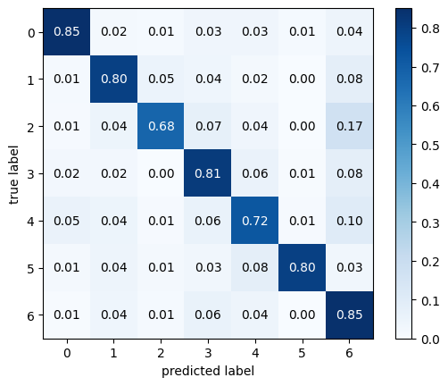
    


```python
from sklearn.metrics import precision_score, recall_score, f1_score, accuracy_score
def calculate_metrics(cm):
    # Extracting TP, FP, FN for each class
    TP = np.diag(cm)
    FP = np.sum(cm, axis=0) - TP
    FN = np.sum(cm, axis=1) - TP
    TN = np.sum(cm) - (FP + FN + TP)

    # Precision, Recall, and F1 Score
    precision = TP / (TP + FP)
    recall = TP / (TP + FN)
    f1 = 2 * (precision * recall) / (precision + recall)

    # Class-wise accuracy
    accuracy = (TP + TN) / np.sum(cm)

    return precision, recall, f1, accuracy

precision, recall, f1_score, class_accuracy = calculate_metrics(multiclass)
print(precision)
print(recall)
print(f1_score)
print(class_accuracy)
```

    [0.87573964 0.76219512 0.81914894 0.72058824 0.76804124 0.90769231
     0.81219512]
    [0.85057471 0.79617834 0.6754386  0.8121547  0.72330097 0.7972973
     0.84517766]
    [0.86297376 0.7788162  0.74038462 0.76363636 0.745      0.84892086
     0.82835821]
    [0.96384615 0.94538462 0.95846154 0.93       0.92153846 0.98384615
     0.89384615]
    


```python
#CNN batch=16
# Create the numpy array from the provided list of lists
multiclass = np.array([
    [145,   5,   1,   8,   4,   3,   8],
    [  5, 123,   4,   6,   5,   3,  11],
    [  5,   4,  73,   8,   4,   1,  19],
    [  2,   7,   1, 139,  14,   3,  15],
    [ 18,   7,   6,  17, 134,   2,  22],
    [  3,   3,   0,   2,   4,  54,   8],
    [  4,   5,   2,  20,  13,   3, 347]
])

fig, ax = plot_confusion_matrix(conf_mat=multiclass,
                                colorbar=True,
                                show_absolute=False,
                                show_normed=True)
```


    
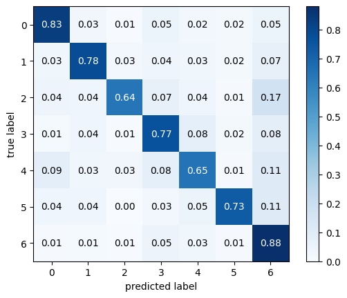
    


```python
from sklearn.metrics import precision_score, recall_score, f1_score, accuracy_score
def calculate_metrics(cm):
    # Extracting TP, FP, FN for each class
    TP = np.diag(cm)
    FP = np.sum(cm, axis=0) - TP
    FN = np.sum(cm, axis=1) - TP
    TN = np.sum(cm) - (FP + FN + TP)

    # Precision, Recall, and F1 Score
    precision = TP / (TP + FP)
    recall = TP / (TP + FN)
    f1 = 2 * (precision * recall) / (precision + recall)

    # Class-wise accuracy
    accuracy = (TP + TN) / np.sum(cm)

    return precision, recall, f1, accuracy

precision, recall, f1_score, class_accuracy = calculate_metrics(multiclass)
print(precision)
print(recall)
print(f1_score)
print(class_accuracy)
```

    [0.7967033  0.7987013  0.83908046 0.695      0.75280899 0.7826087
     0.80697674]
    [0.83333333 0.78343949 0.64035088 0.7679558  0.65048544 0.72972973
     0.88071066]
    [0.81460674 0.79099678 0.72636816 0.72965879 0.69791667 0.75524476
     0.84223301]
    [0.94923077 0.95       0.95769231 0.92076923 0.91076923 0.97307692
     0.9       ]
    


```python
#CNN batch=32
# Create the numpy array from the provided list of lists
# Create the numpy array from the provided list of lists
multiclass = np.array([
    [141,   2,   0,   5,  12,   3,  11],
    [  5, 114,   5,   5,   6,   0,  22],
    [  1,   3,  74,   5,   6,   1,  24],
    [  0,   5,   2, 110,  21,   3,  40],
    [ 13,   7,   4,   9, 140,   0,  33],
    [  4,   2,   3,   0,   9,  44,  12],
    [  2,   4,   3,   7,  13,   1, 364]
])

fig, ax = plot_confusion_matrix(conf_mat=multiclass,
                                colorbar=True,
                                show_absolute=False,
                                show_normed=True)
```


    
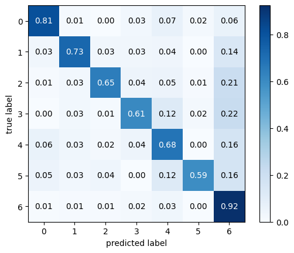
    


```python
from sklearn.metrics import precision_score, recall_score, f1_score, accuracy_score
def calculate_metrics(cm):
    # Extracting TP, FP, FN for each class
    TP = np.diag(cm)
    FP = np.sum(cm, axis=0) - TP
    FN = np.sum(cm, axis=1) - TP
    TN = np.sum(cm) - (FP + FN + TP)

    # Precision, Recall, and F1 Score
    precision = TP / (TP + FP)
    recall = TP / (TP + FN)
    f1 = 2 * (precision * recall) / (precision + recall)

    # Class-wise accuracy
    accuracy = (TP + TN) / np.sum(cm)

    return precision, recall, f1, accuracy

precision, recall, f1_score, class_accuracy = calculate_metrics(multiclass)
print(precision)
print(recall)
print(f1_score)
print(class_accuracy)
```

    [0.84939759 0.83211679 0.81318681 0.78014184 0.6763285  0.84615385
     0.71936759]
    [0.81034483 0.72611465 0.64912281 0.60773481 0.67961165 0.59459459
     0.92385787]
    [0.82941176 0.7755102  0.72195122 0.68322981 0.6779661  0.6984127
     0.80888889]
    [0.95538462 0.94923077 0.95615385 0.92153846 0.89769231 0.97076923
     0.86769231]
    


```python
#CNN batch=64
# Create the numpy array from the provided list of lists
# Create the numpy array from the provided list of lists
# Create the numpy array from the provided list of lists
multiclass = np.array([
    [140,   5,   1,   2,  11,   0,  15],
    [  9, 108,   3,   9,   8,   0,  20],
    [  4,   3,  69,   2,  13,   0,  23],
    [  3,   9,   1, 111,  22,   2,  33],
    [ 11,   2,   1,  15, 142,   1,  34],
    [  6,   2,   1,   2,   5,  47,  11],
    [  7,   5,   1,   8,  21,   0, 352]
])


fig, ax = plot_confusion_matrix(conf_mat=multiclass,
                                colorbar=True,
                                show_absolute=False,
                                show_normed=True)
```


    
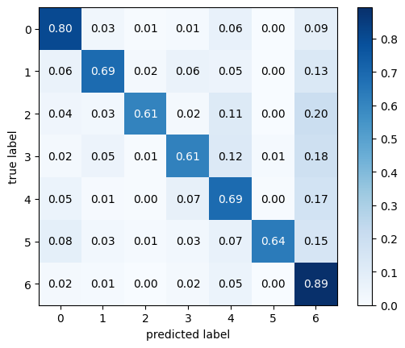
    


```python
from sklearn.metrics import precision_score, recall_score, f1_score, accuracy_score
def calculate_metrics(cm):
    # Extracting TP, FP, FN for each class
    TP = np.diag(cm)
    FP = np.sum(cm, axis=0) - TP
    FN = np.sum(cm, axis=1) - TP
    TN = np.sum(cm) - (FP + FN + TP)

    # Precision, Recall, and F1 Score
    precision = TP / (TP + FP)
    recall = TP / (TP + FN)
    f1 = 2 * (precision * recall) / (precision + recall)

    # Class-wise accuracy
    accuracy = (TP + TN) / np.sum(cm)

    return precision, recall, f1, accuracy

precision, recall, f1_score, class_accuracy = calculate_metrics(multiclass)
print(precision)
print(recall)
print(f1_score)
print(class_accuracy)
```

    [0.77777778 0.80597015 0.8961039  0.74496644 0.63963964 0.94
     0.72131148]
    [0.8045977  0.68789809 0.60526316 0.61325967 0.68932039 0.63513514
     0.89340102]
    [0.79096045 0.74226804 0.72251309 0.67272727 0.6635514  0.75806452
     0.79818594]
    [0.94307692 0.94230769 0.95923077 0.91692308 0.88923077 0.97692308
     0.86307692]
    


```python
#Transformer

multiclass = np.array([
    [0, 130, 30, 0, 0, 0, 368],
    [0, 186, 6, 0, 0, 0, 286],
    [0, 79, 39, 0, 0, 0, 201],
    [0, 57, 4, 0, 0, 0, 520],
    [0, 38, 5, 0, 0, 0, 613],
    [0, 98, 37, 0, 0, 0, 108],
    [0, 90, 23, 0, 0, 0, 1138]
])


fig, ax = plot_confusion_matrix(conf_mat=multiclass,
                                colorbar=True,
                                show_absolute=False,
                                show_normed=True)
```


    
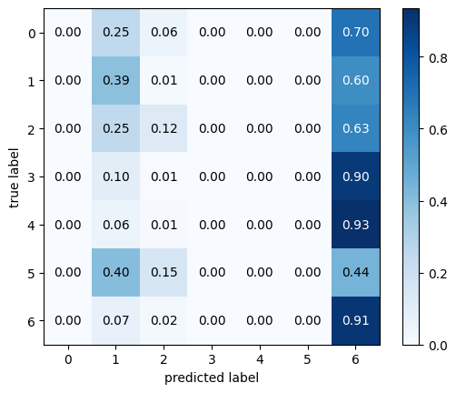
    


```python
from sklearn.metrics import precision_score, recall_score, f1_score, accuracy_score
def calculate_metrics(cm):
    # Extracting TP, FP, FN for each class
    TP = np.diag(cm)
    FP = np.sum(cm, axis=0) - TP
    FN = np.sum(cm, axis=1) - TP
    TN = np.sum(cm) - (FP + FN + TP)

    # Precision, Recall, and F1 Score
    precision = TP / (TP + FP)
    recall = TP / (TP + FN)
    f1 = 2 * (precision * recall) / (precision + recall)

    # Class-wise accuracy
    accuracy = (TP + TN) / np.sum(cm)

    return precision, recall, f1, accuracy

precision, recall, f1_score, class_accuracy = calculate_metrics(multiclass)
print(precision)
print(recall)
print(f1_score)
print(class_accuracy)
```

    [       nan 0.27433628 0.27083333        nan        nan        nan
     0.35188621]
    [0.         0.38912134 0.12225705 0.         0.         0.
     0.90967226]
    [       nan 0.32179931 0.16846652        nan        nan        nan
     0.50746934]
    [0.86982249 0.80670611 0.9050789  0.85675542 0.8382643  0.94008876
     0.45537475]
    

    <ipython-input-37-dada11d08927>:10: RuntimeWarning: invalid value encountered in divide
      precision = TP / (TP + FP)
    


```python
#LSTM
array_data = [
    [0, 0, 0, 0, 0, 0, 86],
    [0, 0, 0, 0, 0, 0, 96],
    [0, 0, 0, 0, 0, 0, 54],
    [0, 0, 0, 0, 0, 0, 91],
    [0, 0, 0, 0, 0, 0, 87],
    [0, 0, 0, 0, 0, 0, 36],
    [0, 0, 0, 0, 0, 0, 201]
]
multiclass = np.array(array_data)
fig, ax = plot_confusion_matrix(conf_mat=multiclass,
                                colorbar=True,
                                show_absolute=False,
                                show_normed=True)
```


    
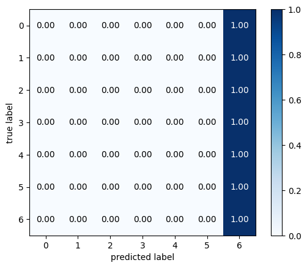
    


```python
metrics_df_full = pd.DataFrame({
    'Class Label': [0, 1, 2, 3, 4, 5, 6,
                    0, 1, 2, 3, 4, 5, 6,
                    0, 1, 2, 3, 4, 5, 6,
                    0, 1, 2, 3, 4, 5, 6],
    'Batch Size': [8, 8, 8, 8, 8, 8, 8,
                   16, 16, 16, 16, 16, 16, 16,
                   32, 32, 32, 32, 32, 32, 32,
                   64, 64, 64, 64, 64, 64, 64],
    'Precision': [0.87573964, 0.76219512, 0.81914894, 0.72058824, 0.76804124, 0.90769231, 0.81219512,
                  0.7967033, 0.7987013, 0.83908046, 0.695, 0.75280899, 0.7826087, 0.80697674,
                  0.84939759, 0.83211679, 0.81318681, 0.78014184, 0.6763285, 0.84615385, 0.71936759,
                  0.77777778, 0.80597015, 0.8961039,0.74496644,0.63963964,0.94,0.72131148],
    'Recall': [0.85057471, 0.79617834, 0.6754386, 0.8121547, 0.72330097, 0.7972973, 0.84517766,
               0.83333333, 0.78343949, 0.64035088, 0.7679558, 0.65048544, 0.72972973, 0.88071066,
               0.81034483, 0.72611465, 0.64912281, 0.60773481, 0.67961165, 0.59459459, 0.92385787,
               0.8045977, 0.68789809, 0.60526316, 0.61325967, 0.68932039, 0.63513514, 0.89340102],
    'F1-score': [0.86297376, 0.7788162, 0.74038462, 0.76363636, 0.745, 0.84892086, 0.82835821,
                 0.81460674, 0.79099678, 0.72636816, 0.72965879, 0.69791667, 0.75524476, 0.84223301,
                 0.82941176, 0.7755102, 0.72195122, 0.68322981, 0.6779661, 0.6984127, 0.80888889,
                 0.79096045, 0.74226804, 0.72251309, 0.67272727, 0.6635514, 0.75806452, 0.79818594],
    'Class Accuracy': [0.96384615, 0.94538462, 0.95846154, 0.93, 0.92153846, 0.98384615, 0.89384615,
                       0.94923077, 0.95, 0.95769231, 0.92076923, 0.91076923, 0.97307692, 0.9,
                       0.95538462, 0.94923077, 0.95615385, 0.92153846, 0.89769231, 0.97076923, 0.86769231,
                       0.94307692, 0.94230769, 0.95923077, 0.91692308, 0.88923077, 0.97692308,0.86307692]
})
```


```python
import pandas as pd
import matplotlib.pyplot as plt
import seaborn as sns

#data=pd.read_csv("results.txt",sep="\t")
# Filter the DataFrame to only include the Precision column and Batch Size for plotting


# Plot
plt.figure(figsize=(4,4))

# Create a bar plot for Precision colored by Batch Size
precision_plot = sns.barplot(x='Class Label', y='Precision', hue='Batch Size', data=metrics_df_full, palette='crest')

#plt.title('Class Labels vs Precision Colored by Batch Size')
#plt.legend(title='Batch Size')
precision_plot.legend_.remove()
plt.ylim(0.5, 1.0)
plt.show()


```


    
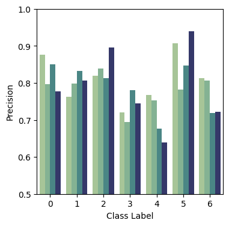
    


```python
# Plot
plt.figure(figsize=(4,4))

# Create a bar plot for Precision colored by Batch Size
precision_plot = sns.barplot(x='Class Label', y='Recall', hue='Batch Size', data=metrics_df_full, palette='crest')

#plt.title('Class Labels vs Recall Colored by Batch Size')
#plt.legend(title='Batch Size')
precision_plot.legend_.remove()
plt.ylim(0.5, 1.0)
plt.show()


```


    
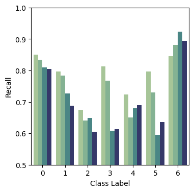
    


```python
# Plot
plt.figure(figsize=(4,4))

# Create a bar plot for Precision colored by Batch Size
precision_plot = sns.barplot(x='Class Label', y='F1-score', hue='Batch Size', data=metrics_df_full, palette='crest')

#plt.title('Class Labels vs F1-score Colored by Batch Size')
#plt.legend(title='Batch Size')
precision_plot.legend_.remove()
plt.ylim(0.5, 1.0)
plt.show()


```


    
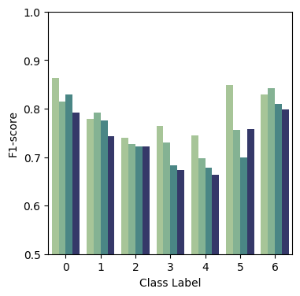
    


```python
# Plot
plt.figure(figsize=(4, 4))

# Create a bar plot for Precision colored by Batch Size
precision_plot = sns.barplot(x='Class Label', y='Class Accuracy', hue='Batch Size', data=metrics_df_full, palette='crest')

#plt.title('Class Labels vs Precision Class Accuracy by Batch Size')
#plt.legend(title='Batch Size')
precision_plot.legend_.remove()
plt.ylim(0.5, 1.0)
plt.show()


```


    
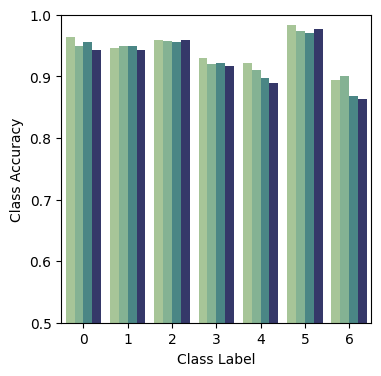
    


```python
#CNN batch=8
df = {
    "Epoch": list(range(1, 31)),
    "Training_Accuracy": [0.33, 0.38, 0.48, 0.59, 0.67, 0.73, 0.77, 0.81, 0.84, 0.87,
                          0.88, 0.89, 0.9, 0.92, 0.92, 0.93, 0.94, 0.95, 0.95, 0.96,
                          0.95, 0.97, 0.97, 0.97, 0.98, 0.98, 0.98, 0.98, 0.99, 0.99],
    "Validation_Accuracy": [0.35, 0.45, 0.54, 0.6, 0.62, 0.66, 0.71, 0.71, 0.75, 0.75,
                            0.75, 0.76, 0.77, 0.78, 0.78, 0.78, 0.79, 0.78, 0.78, 0.77,
                            0.78, 0.79, 0.78, 0.78, 0.77, 0.79, 0.77, 0.78, 0.79, 0.79]
}
```


```python

# Plotting the data
plt.figure(figsize=(4, 4))
plt.plot(df['Epoch'], df['Training_Accuracy'], label='Training Accuracy', marker='o',color="#476A77")
plt.plot(df['Epoch'], df['Validation_Accuracy'], label='Validation Accuracy', marker='x',color="#AEC6CF")
#plt.title('Training and Validation Accuracy over Epochs')
plt.xlabel('Epoch')
plt.ylabel('Accuracy')
plt.legend()
plt.grid(True)
plt.show()

```


    
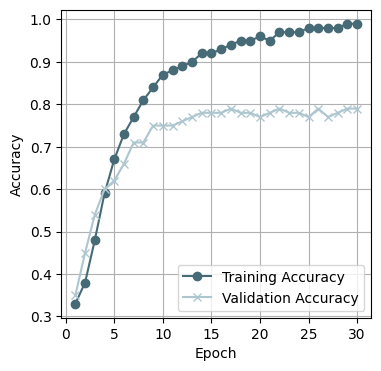
    


```python
#CNN batch =16
df = {
    'Epoch': list(range(1, 31)),
    'Training_Accuracy': [
        0.31, 0.36, 0.41, 0.48, 0.56, 0.64, 0.7, 0.73, 0.78, 0.8,
        0.81, 0.84, 0.86, 0.87, 0.88, 0.89, 0.9, 0.9, 0.91, 0.92,
        0.92, 0.92, 0.93, 0.94, 0.94, 0.94, 0.95, 0.95, 0.95, 0.96
    ],
    'Validation_Accuracy': [
        0.34, 0.39, 0.4, 0.47, 0.57, 0.62, 0.65, 0.67, 0.67, 0.7,
        0.73, 0.75, 0.75, 0.75, 0.77, 0.76, 0.78, 0.77, 0.76, 0.77,
        0.77, 0.77, 0.78, 0.78, 0.79, 0.79, 0.79, 0.78, 0.8, 0.79
    ]
}
```


```python
# Plotting the data
plt.figure(figsize=(4, 4))
plt.plot(df['Epoch'], df['Training_Accuracy'], label='Training Accuracy', marker='o',color="#476A77")
plt.plot(df['Epoch'], df['Validation_Accuracy'], label='Validation Accuracy', marker='x',color="#AEC6CF")
#plt.title('Training and Validation Accuracy over Epochs')
plt.xlabel('Epoch')
plt.ylabel('Accuracy')
plt.legend()
plt.grid(True)
plt.show()
```


    
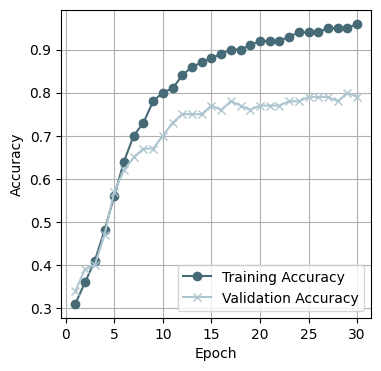
    


```python
#CNN batch =32
df = {
    'Epoch': list(range(1, 31)),
    'Training_Accuracy': [
        0.32, 0.34, 0.34, 0.36, 0.37, 0.41, 0.47, 0.51, 0.56, 0.59,
        0.64, 0.67, 0.7, 0.72, 0.74, 0.77, 0.78, 0.8, 0.81, 0.82,
        0.84, 0.85, 0.85, 0.86, 0.87, 0.87, 0.88, 0.89, 0.9, 0.9
    ],
    'Validation_Accuracy': [
        0.34, 0.33, 0.35, 0.34, 0.37, 0.45, 0.46, 0.49, 0.56, 0.59,
        0.61, 0.62, 0.65, 0.66, 0.68, 0.65, 0.7, 0.72, 0.72, 0.74,
        0.74, 0.73, 0.74, 0.75, 0.73, 0.74, 0.76, 0.76, 0.76, 0.76
    ]
}
```


```python
# Plotting the data
plt.figure(figsize=(4, 4))
plt.plot(df['Epoch'], df['Training_Accuracy'], label='Training Accuracy', marker='o',color="#476A77")
plt.plot(df['Epoch'], df['Validation_Accuracy'], label='Validation Accuracy', marker='x',color="#AEC6CF")
#plt.title('Training and Validation Accuracy over Epochs')
plt.xlabel('Epoch')
plt.ylabel('Accuracy')
plt.legend()
plt.grid(True)
plt.show()
```


    
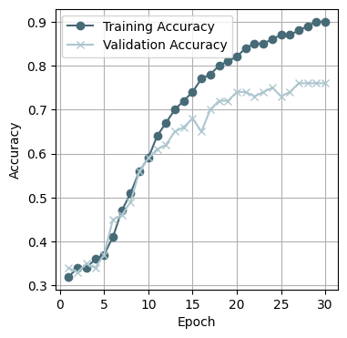
    


```python
#CNN batch =64

df = {
    'Epoch': list(range(1, 31)),
    'Training_Accuracy': [
        0.31, 0.34, 0.34, 0.36, 0.38, 0.40, 0.43, 0.50, 0.52, 0.57,
        0.61, 0.65, 0.67, 0.70, 0.72, 0.74, 0.76, 0.77, 0.79, 0.80,
        0.81, 0.83, 0.83, 0.84, 0.85, 0.86, 0.86, 0.87, 0.88, 0.88
    ],
    'Validation_Accuracy': [
        0.33, 0.33, 0.34, 0.36, 0.36, 0.43, 0.42, 0.42, 0.52, 0.57,
        0.55, 0.59, 0.62, 0.64, 0.68, 0.66, 0.67, 0.70, 0.71, 0.71,
        0.72, 0.74, 0.75, 0.73, 0.74, 0.76, 0.76, 0.74, 0.76, 0.76
    ]
}

```


```python
# Plotting the data
plt.figure(figsize=(4, 4))
plt.plot(df['Epoch'], df['Training_Accuracy'], label='Training Accuracy', marker='o',color="#476A77")
plt.plot(df['Epoch'], df['Validation_Accuracy'], label='Validation Accuracy', marker='x',color="#AEC6CF")
#plt.title('Training and Validation Accuracy over Epochs')
plt.xlabel('Epoch')
plt.ylabel('Accuracy')
plt.legend()
plt.grid(True)
plt.show()
```


    
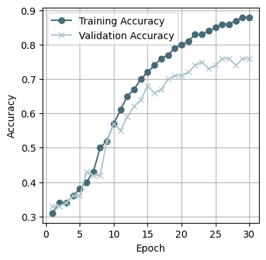
    


```python
#Transormer
df = {
    'Epoch': list(range(1, 31)),
    'Training_Accuracy': [
        30.74, 30.65, 30.74, 31.43, 30.33, 31.95, 31.36, 31.76, 32.22, 32.22,
        32.94, 32.96, 33.28, 31.34, 31.66, 31.53, 32.15, 32.77, 33.26, 32.91,
        33.28, 32.99, 32.91, 33.23, 33.46, 33.36, 33.26, 33.36, 33.11, 32.86
    ],
    'Validation_Accuracy': [
        32.17, 32.17, 32.87, 28.76, 32.17, 32.6, 26.22, 32.6, 33.48, 32.52,
        34.62, 32.87, 31.47, 33.92, 30.59, 33.39, 32.87, 33.57, 33.74, 33.74,
        33.65, 32.69, 34.79, 33.92, 34.27, 34.79, 32.95, 32.95, 34.53, 33.65
    ]
}

```


```python
# Plotting the data
plt.figure(figsize=(4, 4))
plt.plot(df['Epoch'], df['Training_Accuracy'], label='Training Accuracy', marker='o',color="#476A77")
plt.plot(df['Epoch'], df['Validation_Accuracy'], label='Validation Accuracy', marker='x',color="#AEC6CF")
#plt.title('Training and Validation Accuracy over Epochs')
plt.xlabel('Epoch')
plt.ylabel('Accuracy')
plt.legend()
plt.grid(True)
plt.show()
```


    
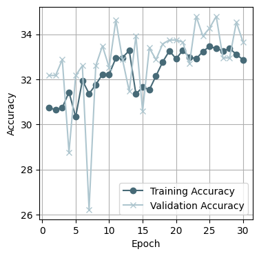
    


```python
#LSTM
# Create a DataFrame with the provided accuracy values over epochs

# Define the data as a dictionary
df = {
    'Epoch': list(range(1, 31)),
    'Training_Accuracy': [13]+ [28] + [31]*28,
    'Validation_Accuracy': [23] + [32]*29
}


```


```python
# Plotting the data
plt.figure(figsize=(4, 4))
plt.plot(df['Epoch'], df['Training_Accuracy'], label='Training Accuracy', marker='o',color="#476A77")
plt.plot(df['Epoch'], df['Validation_Accuracy'], label='Validation Accuracy', marker='x',color="#AEC6CF")
#plt.title('Training and Validation Accuracy over Epochs')
plt.xlabel('Epoch')
plt.ylabel('Accuracy')
plt.legend()
plt.grid(True)
plt.show()
```


    
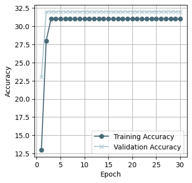
    

